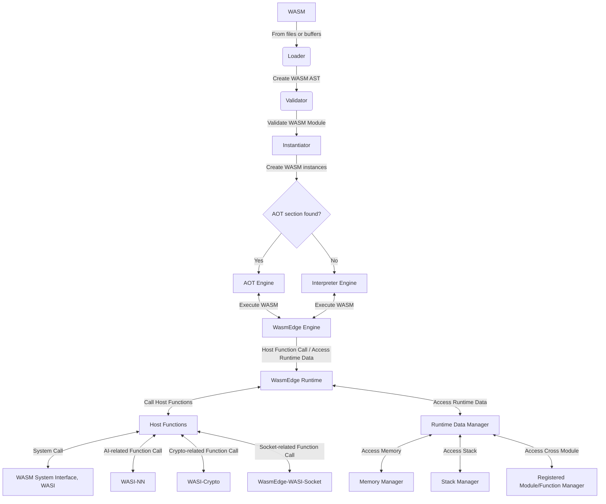

# WasmEdge Internal

## Overview of WasmEdge Execution Flow

```mermaid
graph TD
    A[WASM] -->|From files or buffers| B(Loader)
    B -->|Create WASM AST| C(Validator)
    C -->|Validate WASM Module| D[Instantiator]
    D -->|Create WASM instances| E{AOT section found?}
    E -->|Yes| F[AOT Engine]
    E -->|No| G[Interpreter Engine]
    F <-->|Execute WASM| H[WasmEdge Engine]
    G <-->|Execute WASM| H[WasmEdge Engine]
    H -->|Host Function Call / Access Runtime Data| H1[WasmEdge Runtime]
    H1 <-->|Call Host Functions| I[Host Functions]
    H1 <-->|Access Runtime Data| J[Runtime Data Manager]
    I <-->|System Call| I1[WASM System Interface, WASI]
    I <-->|AI-related Function Call| I2[WASI-NN]
    I <-->|Crypto-related Function Call| I3[WASI-Crypto]
    I <-->|Socket-related Function Call| I4[WasmEdge-WASI-Socket]
    J <-->|Access Memory| J1[Memory Manager]
    J <-->|Access Stack| J2[Stack Manager]
    J <-->|Access Cross Module| J3[Registered Module/Function Manager]
```
