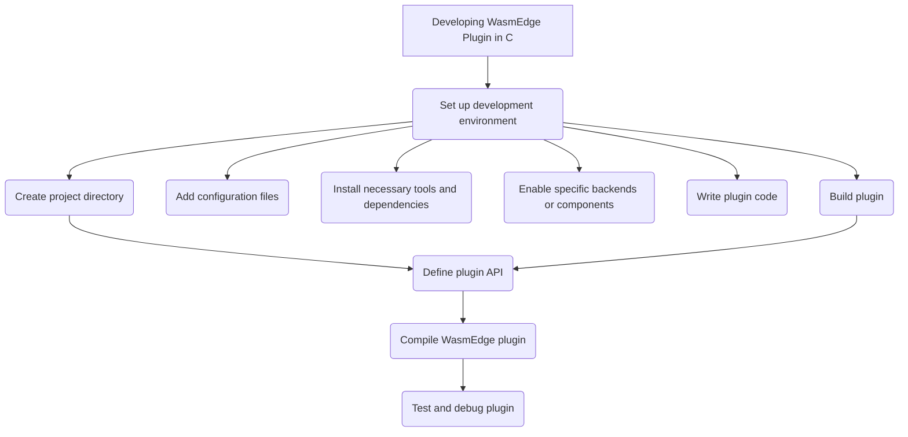

# Develop WasmEdge Plug-in in C API

By developing a plugin, one can extend the functionality of WasmEdge and customize it to suit the specific needs. WasmEdge provides a C++ based API for registering extension modules and host functions. While the WasmEdge language SDKs allow registering host functions from a host (wrapping) application, the plugin API allows such extensions to be incorporated into WasmEdge's own building and releasing process.
Here is a flowchart showing all the steps needed for developing WasmEdge Plugin -



This flowchart illustrates the process of developing a WasmEdge plugin, showcasing the steps involved from choosing a programming language to finalizing and releasing the plugin.

> For existing plugins, please refer to their respective [documentation pages](/contribute/source/plugin) for specific instructions.

## Set up the development environment

To start developing WasmEdge plugins, it is essential to set up the development environment properly. This section provides step-by-step instructions for WasmEdge plugin development -

- **Install a WasmEdge runtime**: You can download the latest version of WasmEdge from [GitHub repository](https://github.com/wasmEdge/wasmEdge). Here are the installation instructions for different operating system for [installing WasmEdge](/develop/build-and-run/install.md).
  
- **Install WasmEdge with plugins (optional)**: Installing WasmEdge with existing plugins can provide you with additional functionality and serve as a reference for your own plugin development. If you want to utilize or test the compatibility of your new plugin with existing plugins, you can install them using the provided installer script. The installed plugins will be available for your development environment.

  To see a list of supported plugins and their specific install commands, see the [Install WasmEdge plugins and dependencies](develop/build-and-run/install/#install-wasmedge-plugins-and-dependencies) section.

- **Install a compatible compiler**: The following compilers can be used to compile C code into WebAssembly bytecode:

  - LLVM: `sudo apt-get install llvm`
  - GCC: `sudo apt-get install gcc`

- **Install necessary tools and dependencies**: You can use any text editor or IDE of your choice to write code. Here are some popular options:

  - [Visual Studio Code](https://code.visualstudio.com/)
  - [Atom](https://atom.io/)
  - [Sublime Text](https://www.sublimetext.com/)

  For debugging, you can use GDB, LLDB, or other debuggers that support WebAssembly. To install GDB, run `sudo apt-get install gdb`.

- **Enable specific backends or additional components (if applicable):** Some plugins may require enabling specific backends or additional components to extend their functionality. The following links provide instructions for enabling specific backends in WasmEdge:

  - [OpenVINO™](https://docs.openvino.ai/2021.4/openvino_docs_install_guides_installing_openvino_linux.html#)(2021)
  - [TensorFlow Lite](../../build-and-run/install#wasi-nn-plugin-with-tensorflow-lite)
  - [PyTorch 1.8.2 LTS](https://pytorch.org/get-started/locally/)

By following these steps, you can set up the development environment for creating WasmEdge plugins effectively. This will allow you to develop, test, and debug your plugins in a Linux environment.

## Create a WasmEdge plugin project

To create a WasmEdge plugin project, follow these steps:

- **Set up the project directory**: Create a directory structure for your plugin project. You can use a standard structure for the chosen language, or create your own structure. To create a project directory structure, use the following commands:

  ```bash
  mkdir myplugin
  cd myplugin
  mkdir src include build
  ```

- **Add configuration files**: Add configuration files specifying the plugin name, version, and dependencies. The specific files and their content depend on the chosen programming language and build system.
  
  Create a `CMakeLists.txt`  file in the root directory with the necessary configuration to specify the plugin name, version, and dependencies. The `find_package(WasmEdge REQUIRED)` line locates the WasmEdge runtime library and makes it available for the project.

    ```cmake
    cmake_minimum_required(VERSION 3.14)
    project(myplugin VERSION 0.1.0)

    find_package(WasmEdge REQUIRED)

    add_library(myplugin SHARED src/myplugin.cpp)
    target_compile_features(myplugin PUBLIC cxx_std_11)
    target_include_directories(myplugin PUBLIC include)
    target_link_libraries(myplugin PRIVATE ${WASMEDGE_LIBRARIES})
    set_target_properties(myplugin PROPERTIES PREFIX "")
    ```

- **Add any necessary libraries or dependencies**: Include any required libraries or dependencies for your plugin. Modify the configuration files created in the previous step to include the necessary dependencies. For example, in the `CMakeLists.txt` file, use the `find_package` command to locate the WasmEdge runtime library and link it to your plugin.

## Write the plugin code

To create a plug-in with host functions and modules, follow these steps:

- **Implement host function definitions**: In this step, you need to define the host functions that will be imported when instantiating the WASM module. These functions will perform specific operations and return results.

  Therefore, developers can implement their plug-in host functions first, as the same as the [host functions in WasmEdge C API](/embed/c/reference/0.12.0.md#host-functions).

> For the more details about the [external data](/embed/c/host_function.md#host-data) and [calling frame context](/embed/c/host_function.md#calling-frame-context), please refer to the host function guide.

  Here's an example of two host functions, `HostFuncAdd` and `HostFuncSub`, that add and subtract two `int32_t` numbers respectively:

  ```c
  #include <wasmedge/wasmedge.h>

  /* The host function definitions. */

  /* The host function to add 2 int32_t numbers. */
  WasmEdge_Result HostFuncAdd(void *Data,
                              const WasmEdge_CallingFrameContext *CallFrameCxt,
                              const WasmEdge_Value *In, WasmEdge_Value *Out) {
    int32_t Val1 = WasmEdge_ValueGetI32(In[0]);
    int32_t Val2 = WasmEdge_ValueGetI32(In[1]);
    Out[0] = WasmEdge_ValueGenI32(Val1 + Val2);
    return WasmEdge_Result_Success;
  }

  /* The host function to sub 2 int32_t numbers. */
  WasmEdge_Result HostFuncSub(void *Data,
                              const WasmEdge_CallingFrameContext *CallFrameCxt,
                              const WasmEdge_Value *In, WasmEdge_Value *Out) {
    int32_t Val1 = WasmEdge_ValueGetI32(In[0]);
    int32_t Val2 = WasmEdge_ValueGetI32(In[1]);
    Out[0] = WasmEdge_ValueGenI32(Val1 - Val2);
    return WasmEdge_Result_Success;
  }
  ```

- **Implement the module creation functions**: In this step, you need to implement the module creation function that creates an instance of the module. This function will be called when the plugin is loaded.

  Here's an example of a module creation function named `CreateTestModule`:

  ```c
  /* The creation function of creating the module instance. */
  WasmEdge_ModuleInstanceContext *
  CreateTestModule(const struct WasmEdge_ModuleDescriptor *Desc) {
    /*
    * The `Desc` is the const pointer to the module descriptor struct:
    *
    *   typedef struct WasmEdge_ModuleDescriptor {
    *     const char *Name;
    *     const char *Description;
    *     WasmEdge_ModuleInstanceContext *(*Create)(
    *         const struct WasmEdge_ModuleDescriptor *);
    *   } WasmEdge_ModuleDescriptor;
    *
    * Developers can get the name and the description from this descriptor.
    */

    /* Exported module name of this module instance. */
    WasmEdge_String ModuleName =
        WasmEdge_StringCreateByCString("wasmedge_plugintest_c_module");
    WasmEdge_ModuleInstanceContext *Mod =
        WasmEdge_ModuleInstanceCreate(ModuleName);
    WasmEdge_StringDelete(ModuleName);

    WasmEdge_String FuncName;
    WasmEdge_FunctionTypeContext *FType;
    WasmEdge_FunctionInstanceContext *FuncCxt;
    enum WasmEdge_ValType ParamTypes[2], ReturnTypes[1];
    ParamTypes[0] = WasmEdge_ValType_I32;
    ParamTypes[1] = WasmEdge_ValType_I32;
    ReturnTypes[0] = WasmEdge_ValType_I32;

    /* Create and add the host function instances into the module instance. */
    FType = WasmEdge_FunctionTypeCreate(ParamTypes, 2, ReturnTypes, 1);
    FuncName = WasmEdge_StringCreateByCString("add");
    FuncCxt = WasmEdge_FunctionInstanceCreate(FType, HostFuncAdd, NULL, 0);
    WasmEdge_ModuleInstanceAddFunction(Mod, FuncName, FuncCxt);
    WasmEdge_StringDelete(FuncName);
    FuncName = WasmEdge_StringCreateByCString("sub");
    FuncCxt = WasmEdge_FunctionInstanceCreate(FType, HostFuncSub, NULL, 0);
    WasmEdge_ModuleInstanceAddFunction(Mod, FuncName, FuncCxt);
    WasmEdge_StringDelete(FuncName);
    WasmEdge_FunctionTypeDelete(FType);

    return Mod;
  }
  ```

  There can be several module instances in a plug-in shared library. Here in above code snippet take a module named as `wasmedge_plugintest_c_module` for the example.

- **Supply the plugin descriptions**- In this step, you need to provide the descriptions of the plugin and the modules it contains. These descriptions will be used for searching and creating the plugin and module instances.

  Here's an example of the plugin and module descriptors:

    ```c
    /* The module descriptor array. There can be multiple modules in a plug-in. */
    static WasmEdge_ModuleDescriptor ModuleDesc[] = {{
        /*
        * Module name. This is the name for searching and creating the module
        * instance context by the `WasmEdge_PluginCreateModule()` API.
        */
        .Name = "wasmedge_plugintest_c_module",
        /* Module description. */
        .Description = "This is for the plugin tests in WasmEdge C API.",
        /* Creation function pointer. */
        .Create = CreateTestModule,
    }};

    /* The plug-in descriptor */
    static WasmEdge_PluginDescriptor Desc[] = {{
        /*
        * Plug-in name. This is the name for searching the plug-in context by the
        * `WasmEdge_PluginFind()` API.
        */
        .Name = "wasmedge_plugintest_c",
        /* Plug-in description. */
        .Description = "",
        /* Plug-in API version. */
        .APIVersion = WasmEdge_Plugin_CurrentAPIVersion,
        /* Plug-in version. Developers can define the version of this plug-in. */
        .Version =
            {
                .Major = 0,
                .Minor = 1,
                .Patch = 0,
                .Build = 0,
            },
        /* Module count in this plug-in. */
        .ModuleCount = 1,
        /* Plug-in option description count in this plug-in (Work in progress). */
        .ProgramOptionCount = 0,
        /* Pointer to the module description array. */
        .ModuleDescriptions = ModuleDesc,
        /* Pointer to the plug-in option description array (Work in progress). */
        .ProgramOptions = NULL,
    }};
    ```

  These descriptions define the name, description, version, and creation function of the plugin, as well as the name and description of the module it contains.

Remember to implement any additional functions or structures that your plugin requires to fulfill its functionality.

By following these steps and implementing the necessary functions and descriptors, you can create a plug-in with host functions and modules in WasmEdge C API. You can continue developing your plugin by adding functionality and implementing the desired behavior.

## Build your plugin

To build the WasmEdge plug-in shared library, you have two options: building it directly using the compiler or using CMake. Here are the instructions for both methods:

- **Build with Command**: if you choose to build the plug-in using the command line, run the following command in terminal:

  This command compiles the `myplugin.c` file into a shared library named `libwasmedgePluginTest.so`. The `-std=c11` flag sets the C language standard to C11, and the `-DWASMEDGE_PLUGIN` flag defines the WASMEDGE_PLUGIN macro, which can be used in your code.

- **Build with CMake**: If you prefer to use CMake to build the plug-in, create a `CMakeLists.txt` file in the root directory of your project and add the following content to the CMakeLists.txt file:

    ```cmake
    add_library(wasmedgePluginTest
      SHARED
      myplugin.c
    )

    set_target_properties(wasmedgePluginTest PROPERTIES
      C_STANDARD 11
    )

    target_compile_options(wasmedgePluginTest
      PUBLIC
      -DWASMEDGE_PLUGIN
    )

    target_link_libraries(wasmedgePluginTest
      PRIVATE
      wasmedge
    )
    ```

  This CMake configuration sets up a build target called `wasmedgePluginTest`. It compiles the `myplugin.c` file into a shared library. The `C_STANDARD 11` property sets the C language standard to C11. The `target_compile_options` command defines the `WASMEDGE_PLUGIN` macro using the `-DWASMEDGE_PLUGIN` flag. Finally, the `target_link_libraries` command links the wasmedge library to the plug-in.

Once you have set up either the command-line build or the CMake build, you can execute the corresponding build command or generate build files using CMake. This will compile your plug-in source code and produce the shared library file `(libwasmedgePluginTest.so)`.  

## Test and debug the plugin

Once you have compiled the plugin, you can test it using the following steps:

- **Test the plugin with WasmEdge**: Load and execute the plugin using the WasmEdge runtime, and ensure it works as expected. To test the plugin with WasmEdge, you can use the following command:

  ```bash
  wasmedge --dir=./build myplugin.so
  ```

- **Debug any issues**: To launch a debugger for a WasmEdge binary file, run the following command:

  ```bash
  wasmedge debug my-plugin.wasm
  ```

This will launch a debugger for the WasmEdge binary file, and allow you to step through the code and inspect the values of variables.

Finally, compile the WasmEdge plugin.
