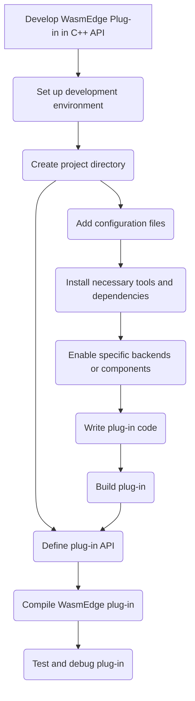

# Develop WasmEdge Plug-in in C++ API

By developing a plug-in, one can extend the functionality of WasmEdge and customize it to suit specific needs. WasmEdge provides a C based API for registering extension modules and host functions. While the WasmEdge language SDKs allow registering host functions from a host (wrapping) application, the plug-in API allows such extensions to be incorporated into WasmEdge's building and releasing process.

<!-- prettier-ignore -->
:::note
It is recommended that developers choose the WasmEdge [C API](develop_plugin_c.md) for plug-in development because of the support, compatibility, and flexibility the WasmEdge runtime provides.
:::

Here is a flowchart showing all the steps needed for developing WasmEdge Plug-in -



This flowchart illustrates developing a WasmEdge plug-in, showcasing the steps from choosing a programming language to finalizing and releasing the plug-in.

## Set up a development environment

To start developing WasmEdge plug-ins, it is essential to correctly set up the development environment. This section provides step-by-step instructions for WasmEdge plug-in development -

**Build WasmEdge from source**: For developing the WasmEdge plug-in in C++, you must build WasmEdge from source. Follow the[build WasmEdge from source](../source/build_from_src.md) for instructions.

After installing WasmEdge, you need to set up the build environment. If you're using Linux or other platforms, you can follow the instructions in the [build environment setup guide](../source/os/linux.md).

## Create a WasmEdge plug-in project

To create a WasmEdge plug-in project, follow these steps:

- **Set up the project directory**: Create a directory structure for your plug-in project. You can use a standard structure for the chosen language or create your structure. To create a project directory structure, use the following commands:

  ```bash
  mkdir testplugin
  cd testplugin
  mkdir src include build
  ```

- **Add necessary libraries or dependencies**: Include any required libraries or dependencies for your plug-in. Modify the configuration files created in the previous step to include the required dependencies.

## Write plug-in code

To create a plug-in with host functions and modules, follow these steps:

- **Host Functions and Modules**: The plug-in aims to provide the host functions that can be imported when instantiating WASM. Therefore, developers should first implement their plug-in host functions in WasmEdge internal C++. Assume that the host function implementations are in the `testplugin.h`.

  ```cpp
  #pragma once

  #include "plugin/plugin.h"

  #include <cstdint>
  #include <string>

  namespace WasmEdge {
  namespace Host {

  // The environment class. For the register object.
  class WasmEdgePluginTestEnv {
  public:
    WasmEdgePluginTestEnv() noexcept = default;

    static Plugin::PluginRegister Register;
  };

  // The host function base template class. For inheriting the environment class
  // reference.
  template <typename T>
  class WasmEdgePluginTestFunc : public Runtime::HostFunction<T> {
  public:
    WasmEdgePluginTestFunc(WasmEdgePluginTestEnv &HostEnv)
        : Runtime::HostFunction<T>(0), Env(HostEnv) {}

  protected:
    WasmEdgePluginTestEnv &Env;
  };

  // The host function to add 2 int32_t numbers.
  class WasmEdgePluginTestFuncAdd
      : public WasmEdgePluginTestFunc<WasmEdgePluginTestFuncAdd> {
  public:
    WasmEdgePluginTestFuncAdd(WasmEdgePluginTestEnv &HostEnv)
        : WasmEdgePluginTestFunc(HostEnv) {}
    Expect<uint32_t> body(const Runtime::CallingFrame &, uint32_t A, uint32_t B) {
      return A + B;
    }
  };

  // The host function to sub 2 int32_t numbers.
  class WasmEdgePluginTestFuncSub
      : public WasmEdgePluginTestFunc<WasmEdgePluginTestFuncSub> {
  public:
    WasmEdgePluginTestFuncSub(WasmEdgePluginTestEnv &HostEnv)
        : WasmEdgePluginTestFunc(HostEnv) {}
    Expect<uint32_t> body(const Runtime::CallingFrame &, uint32_t A, uint32_t B) {
      return A - B;
    }
  };

  // The host module class. There can be several modules in a plug-in.
  class WasmEdgePluginTestModule : public Runtime::Instance::ModuleInstance {
  public:
    WasmEdgePluginTestModule()
        : Runtime::Instance::ModuleInstance("wasmedge_plugintest_cpp_module") {
      addHostFunc("add", std::make_unique<WasmEdgePluginTestFuncAdd>(Env));
      addHostFunc("sub", std::make_unique<WasmEdgePluginTestFuncSub>(Env));
    }

    WasmEdgePluginTestEnv &getEnv() { return Env; }

  private:
    WasmEdgePluginTestEnv Env;
  };

  } // namespace Host
  } // namespace WasmEdge
  ```

- **Creation Functions for Modules**: Then developers should implement the module creation functions. Assume the following implementations are all in the `testplugin.cpp`.

  ```cpp
  #include "testplugin.h"

  namespace WasmEdge {
  namespace Host {
  namespace {

  Runtime::Instance::ModuleInstance *
  create(const Plugin::PluginModule::ModuleDescriptor *) noexcept {
    // There can be several modules in a plug-in. For that, developers should
    // implement several `create` functions for each module.
    return new WasmEdgePluginTestModule;
  }

  } // namespace
  } // namespace Host
  } // namespace WasmEdge
  ```

- **Plug-in Descriptions**: For constructing the plug-in, developers should supply the descriptions of this plug-in and the modules.

  ```cpp
  namespace WasmEdge {
  namespace Host {
  namespace {

  Plugin::Plugin::PluginDescriptor Descriptor{
      //Plug-in name - for searching the plug-in context by the
      // `WasmEdge_PluginFind()` C API.
      .Name = "wasmedge_plugintest_cpp",
      //Plug-in description.
      .Description = "",
      //Plug-in API version.
      .APIVersion = Plugin::Plugin::CurrentAPIVersion,
      //Plug-in version.
      .Version = {0, 10, 0, 0},
      // Module count in this plug-in.
      .ModuleCount = 1,
      // Pointer to module description array.
      .ModuleDescriptions =
          // The module descriptor array.
          (Plugin::PluginModule::ModuleDescriptor[]){
              {
                  // Module name. This is the name for searching and creating the
                  // module instance context by the
                  // `WasmEdge_PluginCreateModule()` C API.
                  .Name = "wasmedge_plugintest_cpp_module",
                  // Module description.
                  .Description = "This is for the plugin tests in WasmEdge.",
                  // Creation function pointer.
                  .Create = create,
              },
          },
      //Plug-in options (Work in progress).
      .AddOptions = nullptr,
  };

  } // namespace
  } // namespace Host
  } // namespace WasmEdge
  ```

- **Plug-in Options**: WORK IN PROGRESS. This section is reserved for the feature in the future.

- **Implement Plug-in Descriptor Registration**: The final step is to implement the `Plugin::PluginRegister` initialization with the plug-in descriptor.

```cpp
namespace WasmEdge {
namespace Host {

Plugin::PluginRegister WasmEdgePluginTestEnv::Register(&Descriptor);

} // namespace Host
} // namespace WasmEdge
```

Remember to implement any additional functions or structures your plug-in requires to fulfill its functionality.

Following these steps and implementing the necessary functions and descriptors, you can create a plug-in with host functions and modules in WasmEdge C++ API. You can continue developing your plug-in by adding functionality and implementing the desired behavior.

## Build plug-in

To build the plug-in shared library, developers should build in CMake with the WasmEdge source.

- Assume that the' test' folder is created under the `<PATH_TO_WASMEDGE_SOURCE>/plug-ins`. Add this line in the `<PATH_TO_WASMEDGE_SOURCE>/plugins/CMakeLists.txt`:

  ```cmake
  add_subdirectory(test)
  ```

- Copy the `testplugin.h` and `testplugin.cpp` into the `<PATH_TO_WASMEDGE_SOURCE>/plugins/test` directory. And then edit the file `<PATH_TO_WASMEDGE_SOURCE>/plugins/test/CMakeLists.txt`:

  ```cmake
  wasmedge_add_library(wasmedgePluginTest
    SHARED
    testplugin.cpp
  )

  target_compile_options(wasmedgePluginTest
    PUBLIC
    -DWASMEDGE_PLUGIN
  )

  target_include_directories(wasmedgePluginTest
    PUBLIC
    $<TARGET_PROPERTY:wasmedgePlugin,INCLUDE_DIRECTORIES>
    ${CMAKE_CURRENT_SOURCE_DIR}
  )

  if(WASMEDGE_LINK_PLUGINS_STATIC)
    target_link_libraries(wasmedgePluginTest
      PRIVATE
      wasmedgeCAPI
    )
  else()
    target_link_libraries(wasmedgePluginTest
      PRIVATE
      wasmedge_shared
    )
  endif()

  install(TARGETS wasmedgePluginTest DESTINATION ${CMAKE_INSTALL_LIBDIR}/wasmedge)
  ```

Follow the guide to [build WasmEdge from source](../source/os/linux.md), according to your specific operating system (e.g., Linux), which will include building the plug-in shared library along with WasmEdge.
