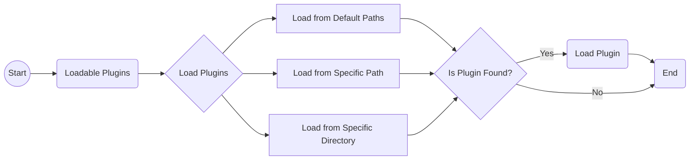

# WasmEdge Plug-in System Introduction

While the WasmEdge language SDKs allow registering host functions from a host (wrapping) application, developers should implement the host functions before compilation.

For the other solutions, WasmEdge provides the plug-in architecture to load the plug-in shared library for easier extending of the host functions.

With developing the plug-ins, WasmEdge SDKs in the supported languages can load and register the host functions from the plug-in shared libraries.

In current, developers can follow the guides to implement the plug-ins in [C API (recommended)](develop_plugin_c.md) or [C++](develop_plugin_cpp.md).

## Loadable Plug-in

Loadable plugins are standalone shared libraries (`.so`/`.dylib`/`.dll` files) that can be loaded by the WasmEdge runtime environment at runtime. These plugins can provide additional functionality to the WasmEdge runtime environment, such as new modules that can be imported by WebAssembly modules.

### Creating Loadable Plug-in

To create a loadable plugin for WasmEdge, developers can use the WasmEdge Plugin SDK, which provides a set of Rust, C and C++ APIs for creating and registering plugins. The SDK also includes [example code](https://github.com/WasmEdge/WasmEdge/tree/master/examples/plugin/get-string) that demonstrates how to create a simple plugin that returns a string. By following the provided examples and leveraging the SDK's APIs, developers can easily build custom plugins tailored to their specific needs.

### Loading plug-in from paths

To make use of the loadable plugins, developers need to load them from specific paths into the WasmEdge runtime environment. The loading process involves the following steps:

-   Loadable plugins can be loaded from default paths by calling the `WasmEdge_PluginLoadWithDefaultPaths()` API. The default paths include:

    -   The path specified in the environment variable `WASMEDGE_PLUGIN_PATH`.
    -   The `../plugin/` directory relative to the WasmEdge installation path.
    -   The `./wasmedge/` directory located under the library path if WasmEdge is installed in a system directory such as `/usr` and `/usr/local`.

-   If the plugins are located in a specific path or directory, developers can use the `WasmEdge_PluginLoadFromPath("PATH_TO_PLUGIN/plugin.so")` API to load the plugins from that particular location.

The WasmEdge runtime environment will search for the loadable plugins in the specified paths and load them if found.

### Plugin Loading Flowchart

The following flowchart depicts the process of loading loadable plugins into the WasmEdge runtime environment from specific paths:

The flowchart shows the process of loading loadable plugins into the WasmEdge runtime environment. The process involves searching for plugins in default paths, a specific path, or a specific directory. If a plugin is found in any of these locations, it is loaded into the runtime environment. The flowchart enables developers to easily load plugins and extend the capabilities of the WasmEdge runtime.

By following this flowchart, developers can effectively load loadable plugins into the WasmEdge runtime environment from specific paths, expanding the runtime's functionality according to their requirements.

## WasmEdge Currently Released Plug-ins

There are several plug-in releases with the WasmEdge official releases. Please check the following table to check the release status and how to build from source with the plug-ins.

> The `WasmEdge-Process` plug-in is attached in the WasmEdge release tarballs.

| Plug-in | Rust Crate | Released Platforms | Build Steps |
| --- | --- | --- | --- |
| WasmEdge-Process | [wasmedge_process_interface][] | `manylinux2014 x86_64`, `manylinux2014 aarch64`, and `ubuntu 20.04 x86_64` (since `0.10.0`) | [Default](/contribute/source/os/linux) |
| [WASI-Crypto] | [wasi-crypto][] | `manylinux2014 x86_64`, `manylinux2014 aarch64`, and `ubuntu 20.04 x86_64` (since `0.10.1`) | [Build With WASI-Crypto](/contribute/source/plugin/wasi_crypto) |
| [WASI-NN with OpenVINO backend](/develop/rust/ai_inference/openvino) | [wasi-nn][] | `ubuntu 20.04 x86_64` (since `0.10.1`) | [Build With WASI-NN](/contribute/source/plugin/was_nn#get-wasmedge-with-wasi-nn-plug-in-openvino-backend) |
| [WASI-NN with PyTorch backend](/develop/rust/ai_inference/pytorch) | [wasi-nn][] | `ubuntu 20.04 x86_64` (since `0.11.1`) | [Build With WASI-NN](/contribute/source/plugin/was_nn#build-wasmedge-with-wasi-nn-pytorch-backend) |
| [WASI-NN with TensorFlow-Lite backend](/develop/rust/ai_inference/pytorch) | [wasi-nn][] | `manylinux2014 x86_64`, `manylinux2014 aarch64`, and `ubuntu 20.04 x86_64` (since `0.11.2`) | [Build With WASI-NN](/contribute/source/plugin/was_nn#build-wasmedge-with-wasi-nn-tensorflow-lite-backend) |
| [WasmEdge-HttpsReq] | [wasmedge_http_req][] | `manylinux2014 x86_64`, and `manylinux2014 aarch64` (since `0.11.1`) | [Build With WasmEdge-HttpsReq](/contribute/source/plugin/httpsreq) |

> Due to the `OpenVINO` and `PyTorch` dependencies, we only release the WASI-NN plug-in on `Ubuntu 20.04 x86_64` now. We'll work with `manylinux2014` versions in the future.

[wasmedge_process_interface]: https://crates.io/crates/wasmedge_process_interface
[wasi-crypto]: https://crates.io/crates/wasi-crypto
[wasi-nn]: https://crates.io/crates/wasi-nn
[wasmedge_http_req]: https://crates.io/crates/wasmedge_http_req
