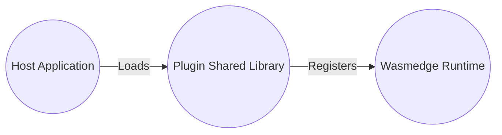
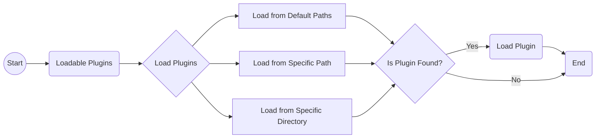

# WasmEdge Plug-in System Introduction

While the WasmEdge language SDKs allow registering host functions from a host (wrapping) application, developers should implement the host functions before compilation. However, for a more flexible and dynamic extension of the host functions, WasmEdge provides a plug-in architecture to load the plug-in shared library.

A WasmEdge plugin is a software component that extends the functionality of the WasmEdge runtime. Currently, developers can follow the guides to implement the plug-ins in [C API](develop_plugin_c.md) (recommended) or [C++](develop_plugin_cpp.md). With the help of the WasmEdge SDKs in the supported languages, developers can load and register the host functions from the plug-in shared libraries, allowing them to seamlessly integrate the plugins into the WasmEdge runtime as if they were part of the core runtime.

In this diagram, the _Host Application_ represents the application or environment where the Wasmedge runtime is embedded or used. The _Plugin Shared Library_ refers to the library containing the plugin code and functions that extend the functionality of the Wasmedge runtime. The _Wasmedge Runtime_ represents the runtime environment that executes WebAssembly modules, including the core runtime and any registered plugins.

## Usages of WasmEdge Plugin

WasmEdge plugins can be used in various scenarios, such as high-performance domain-specific languages, cloud-native JavaScript runtime, edge computing, serverless, SaaS, service mesh, and blockchain applications. Moreover, WasmEdge plugins can be used in microservices, providing a lightweight, secure, and high-performance runtime compatible with frameworks like Dapr and Kubernetes.

In addition, WasmEdge plugins can support serverless functions for SaaS applications, allowing users to extend and customize their experience without operating their API callback servers. They can also be embedded into smart device applications as middleware runtime, rendering interactive content on the UI, connecting to native device drivers, and accessing specialized hardware features. WasmEdge plugins can be used for managing application state, exchanging dynamic data (e.g., strings and arrays) with Wasm programs, and providing native host functions to manipulate data.

## Benefits of Using WasmEdge Plugin

WasmEdge plugins are designed to extend the functionality of the WasmEdge runtime, and can be useful for developers and end-users in several ways:

- **Versatility:** WasmEdge plugins can be developed in multiple programming languages that can compile to WebAssembly, allowing developers to write plugins in the language they're most comfortable with.

- **Customization:** WasmEdge plugins can be customized to suit the specific needs of a project. Developers can create plugins that integrate with other systems or tools, or that provide unique functionality that's not available in the core WasmEdge runtime.

- **Performance:** WasmEdge plugins are designed to work seamlessly with the core runtime, minimizing overhead and maximizing performance. This means that they can provide additional functionality without sacrificing performance.

- **Ease of use:** WasmEdge plugins are easy to use and integrate with the WasmEdge runtime. Developers can simply load the plugin into the runtime and use its functions as if they were part of the core runtime.

- **Scalability:** WasmEdge plugins can be used to scale applications by offloading compute-intensive tasks to edge devices. This can reduce the load on central servers and improve performance.

- **Security:** WasmEdge plugins run in a sandboxed environment, which helps to reduce the risk of security vulnerabilities. Additionally, plugins can be digitally signed to ensure authenticity and integrity.

WasmEdge plugins can provide developers and users with a versatile, customizable, high-performance, and secure way to extend the functionality of the WasmEdge runtime. WasmEdge plugins can also improve scalability and ease of use, making it easier to build and deploy complex applications on edge devices.

## Loadable Plug-in

Loadable plugins are standalone shared libraries (`.so`/`.dylib`/`.dll` files) that can be loaded by the WasmEdge runtime environment at runtime. These plugins can provide additional functionality to the WasmEdge runtime environment, such as new modules that can be imported by WebAssembly modules.

### Creating Loadable Plug-in

To create a loadable plugin for WasmEdge, developers can use the WasmEdge Plugin SDK, which provides a set of Rust, C, and C++ APIs for creating and registering plugins. The SDK also includes [example code](https://github.com/WasmEdge/WasmEdge/tree/master/examples/plugin/get-string) that demonstrates how to create a simple plugin that returns a string. By following the provided examples and leveraging the SDK's APIs, developers can easily build custom plugins tailored to their specific needs.

### Loading plug-in from paths

To make use of the loadable plugins, developers need to load them from specific paths into the WasmEdge runtime environment. The loading process involves the following steps:

- Loadable plugins can be loaded from default paths by calling the `WasmEdge_PluginLoadWithDefaultPaths()` API. The default paths include:

  - The path specified in the environment variable `WASMEDGE_PLUGIN_PATH`.
  - The `../plugin/` directory relative to the WasmEdge installation path.
  - The `./wasmedge/` directory is located under the library path if WasmEdge is installed in a system directory such as `/usr` and `/usr/local`.

- If the plugins are located in a specific path or directory, developers can use the `WasmEdge_PluginLoadFromPath("PATH_TO_PLUGIN/plugin.so")` API to load the plugins from that particular location.

The WasmEdge runtime environment will search for the loadable plugins in the specified paths and load them if found.

The following flowchart shows the process of loading loadable plugins into the WasmEdge runtime environment from specific paths:

The flowchart shows the process of loading loadable plugins into the WasmEdge runtime environment. The process involves searching for plugins in default paths, a specific path, or a specific directory. If a plugin is found in any of these locations, it is loaded into the runtime environment. The flowchart enables developers to easily load plugins and extend the capabilities of the WasmEdge runtime.

By following this flowchart, developers can effectively load loadable plugins into the WasmEdge runtime environment from specific paths, expanding the runtime's functionality according to their requirements.

## WasmEdge Currently Released Plug-ins

There are several plug-in releases with the WasmEdge official releases. Please check the following table to check the release status and how to build from the source with the plug-ins.

| Plug-in | Rust Crate | Description | Released Platforms | Build Steps |
| --- | --- | --- | --- | --- |
| WasmEdge-Process | [wasmedge_process_interface][] | WasmEdge-Process is a utility plugin for the WasmEdge Runtime, providing functionality related to process handling. | `manylinux2014 x86_64`, `manylinux2014 aarch64`, and `ubuntu 20.04 x86_64` (since `0.10.0`) | [Build With WasmEdge-Process](/contribute/source/plugin/process) |
| [WASI-Crypto][] | [wasi-crypto][] | WASI-Crypto is a module that provides a set of APIs for cryptographic operations and key management. | `manylinux2014 x86_64`, `manylinux2014 aarch64`, and `ubuntu 20.04 x86_64` (since `0.10.1`) | [Build With WASI-Crypto](/contribute/source/plugin/wasi_crypto) |
| [WASI-NN with OpenVINO backend](/develop/rust/ai_inference/openvino) | [wasi-nn][] | WASI-NN with OpenVINO backend is a machine learning-oriented module for WebAssembly. | `ubuntu 20.04 x86_64` (since `0.10.1`) | [Build With WASI-NN](/contribute/source/plugin/wasi_nn#get-wasmedge-with-wasi-nn-plug-in-openvino-backend) |
| [WASI-NN with PyTorch backend](/develop/rust/ai_inference/pytorch) | [wasi-nn][] | WASI-NN with PyTorch backend allows running of PyTorch models in WebAssembly. | `ubuntu 20.04 x86_64` (since `0.11.1`) | [Build With WASI-NN](/contribute/source/plugin/wasi_nn#build-wasmedge-with-wasi-nn-pytorch-backend) |
| [WASI-NN with TensorFlow-Lite backend](/develop/rust/ai_inference/pytorch) | [wasi-nn][] | WASI-NN with TensorFlow-Lite backend allows running of TensorFlow-Lite models in WebAssembly. | `manylinux2014 x86_64`, `manylinux2014 aarch64`, and `ubuntu 20.04 x86_64` (since `0.11.2`) | [Build With WASI-NN](/contribute/source/plugin/wasi_nn#build-wasmedge-with-wasi-nn-tensorflow-lite-backend) |
| WasmEdge-Image | [wasmedge_tensorflow_interface][] | WasmEdge-Image is a plugin that provides image processing and manipulation capabilities in WasmEdge. | `manylinux2014 x86_64`, `manylinux2014 aarch64`, `ubuntu 20.04 x86_64`, `darwin x86_64`, and `darwin arm64` (since `0.13.0`) | [Build With WasmEdge-Image](/contribute/source/plugin/image) |
| WasmEdge-Tensorflow | [wasmedge_tensorflow_interface][] | WasmEdge-Tensorflow integrates TensorFlow with WasmEdge for running machine learning models. | `manylinux2014 x86_64`, `manylinux2014 aarch64`, `ubuntu 20.04 x86_64`, `darwin x86_64`, and `darwin arm64` (since `0.13.0`) | [Build With WasmEdge-Tensorflow](/contribute/source/plugin/tensorflow) |
| WasmEdge-TensorflowLite | [wasmedge_tensorflow_interface][] | WasmEdge-TensorflowLite is a plugin for running TensorFlow Lite models in WasmEdge. | `manylinux2014 x86_64`, `manylinux2014 aarch64`, `ubuntu 20.04 x86_64`, `darwin x86_64`, and `darwin arm64` (since `0.13.0`) | [Build With WasmEdge-TensorflowLite](/contribute/source/plugin/tensorflowlite) |

<!-- prettier-ignore -->
:::note
Due to the `OpenVINO` dependency, we only release the WASI-NN plug-in for the `OpenVINO` backend on `Ubuntu 20.04 x86_64` now. We'll work with `manylinux2014` versions in the future.
:::

[wasmedge_process_interface]: https://crates.io/crates/wasmedge_process_interface
[wasmedge_tensorflow_interface]: https://crates.io/crates/wasmedge_tensorflow_interface
[wasi-crypto]: https://crates.io/crates/wasi-crypto
[wasi-nn]: https://crates.io/crates/wasi-nn
