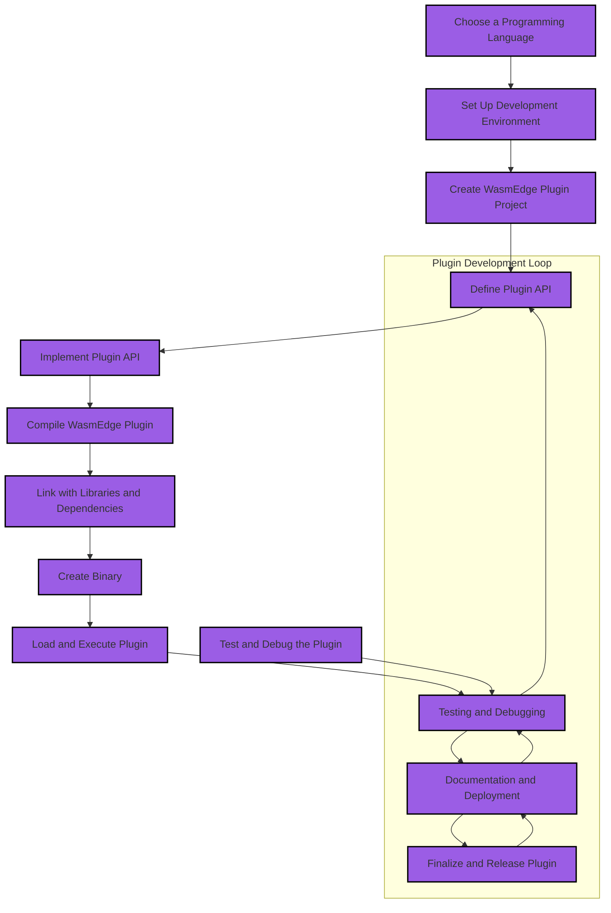

# Requirements for Developing WasmEdge Plugin

By developing a plugin, one can extend the functionality of WasmEdge and customize it to suit the specific needs. There are some steps needs to be followed for developing WasmEdge Plugin: 

## Choose a programming language

The first step in developing a WasmEdge plugin is to choose the programming language one wants to use. Currently, C, C++, and Rust are supported by the WasmEdge runtime.

- **C:** For developing the WasmEdge plug-in in C API, please [install WasmEdge](/develop/build-and-run/install.md) first.
  
- **C++:** For developing the WasmEdge plug-in in internal C++, developers should [build WasmEdge from source](../source/build_from_src.md) before starting. On the other hand, to build a plugin using internal C++, they should build WasmEdge from source.

- **Rust:** Rust is another option that has gained popularity due to its safety features and performance. It is a systems programming language designed for safe, concurrent, and fast execution.

The choice of programming language will depend on the developer's familiarity and skill with the language. However, C and C++ are popular choices for developers who want to create high-performance plugins with low-level control over system resources. Rust is another popular choice for its safety features and performance.

> We recommend developers to develop plug-ins in WasmEdge [C API](develop_plugin_c.md).

## Set up the development environment

To set up your development environment for WasmEdge plugin development, follow these steps:

- **Install a WasmEdge runtime**: Choose a runtime environment that can execute WebAssembly modules. Options include WasmEdge, WASM3, or WAVM, depending on your requirements.
  
- **Install a compatible compiler**: Install a compiler that can compile your chosen programming language into WebAssembly bytecode. For example, LLVM or GCC can be used for compiling C and C++ code, while Rust has its own built-in compiler.

- **Install necessary tools and dependencies**: Install the required tools, such as a text editor, a debugger, and a build system. Additionally, ensure you have the necessary runtime headers and libraries.

Setting up the development environment is crucial to ensure you can create and test WasmEdge plugins effectively.

## Create a WasmEdge plugin project

To create a WasmEdge plugin project, follow these steps:

- **Set up the project directory structure**: Create a directory structure for your plugin project. You can use a standard structure for the chosen language, or create your own structure. To create a project directory structure, you can use the following commands:

```bash
mkdir myplugin
cd myplugin
mkdir src include build
```

- **Add any necessary configuration files**: Add configuration files specifying the plugin name, version, and dependencies. For C/C++, this might include a CMakeLists.txt file.

- **Add any necessary libraries or dependencies**: Include any required libraries or dependencies for your plugin, such as the WasmEdge runtime library..

This project will serve as the foundation for developing the WasmEdge plugin and will contain the necessary files and directories.

### Define the plugin API

The plugin API is a set of functions that the WasmEdge runtime will call to interact with the plugin. The specific functions that are required in the plugin API depend on the features that your plugin provides.

- **Define the interaction between the plugin and the WasmEdge runtime**: Specify how the plugin will receive input and provide output to the runtime.

- **Provide a set of functions that the runtime can call to perform specific tasks**: Define functions that the plugin will expose to the runtime, such as initialization, execution, and cleanup functions.

This is an essential step in developing a WasmEdge plugin.

## Implement the plugin API

The plugin API is implemented in the `main` file. The specific implementation of each function depends on the features that your plugin provides.

- **Write the code for each of the functions defined in the API**: Implement the initialization, execution, cleanup functions, and any other functions required by the plugin.

- **Ensure that they are correctly integrated with the WasmEdge runtime**: Enable communication between the functions and the runtime, and handle any errors appropriately.  For example, if you are implementing an initialization function in C++, you might include the following code:

```cpp
#include "wasmedge/wasmedge.h"

extern "C" {
  WasmEdge_Result initialize(const WasmEdge_ConfigureContext *Conf) {
    // Plugin initialization code
    return WasmEdge_Result_Success;
  }
}
```

After defining the plugin API, the next step is to implement it.

## Compile the WasmEdge plugin

Once you have implemented the plugin API, you can compile the plugin using the following steps:

- **Compile the plugin code**: Use the installed compiler to compile the plugin code into WebAssembly bytecode. To compile the plugin code, you can use the following command:

```bash
clang --target=wasm32 -O3 -nostdlib \
  -Wl,--export-all -Wl,--allow-undefined \
  -o build/myplugin.wasm src/myplugin.c
```

- **Link it with the necessary libraries and dependencies**: Link the bytecode with any required libraries or dependencies, such as the WasmEdge runtime library. For example, if you are using the WasmEdge C API in your plugin, you might include the following linker flags:

```
-L/usr/local/lib -lwasmedgeC
```

- **Create the binary that can be loaded and executed by the WasmEdge runtime**: Generate the binary file that can be loaded and executed by the WasmEdge runtime, such as a shared object file for Linux or a dynamic-link library for Windows. For example, to create a shared object file on Linux, you can run the following command:
  
```bash
clang -shared -o build/myplugin.so build/myplugin.wasm
```

## Test and debug the plugin

Once you have compiled the plugin, you can test it using the following steps:

- **Test the plugin with WasmEdge**: Load and execute the plugin using the WasmEdge runtime, and ensure it works as expected. To test the plugin with WasmEdge, you can use the following command:

```bash
wasmedge --dir=./build myplugin.so
```

- **Debug any issues**: To launch a debugger for a WasmEdge binary file, run the following command:

```bash
wasmedge debug my-plugin.wasm
```

This will launch a debugger for the WasmEdge binary file, and allow you to step through the code and inspect the values of variables.

Finally, compile the WasmEdge plugin.

Here is a flowchart describing all the steps mentioned above - 



This flowchart illustrates the process of developing a WasmEdge plugin, showcasing the steps involved from choosing a programming language to finalizing and releasing the plugin.

> For existing plugins, please refer to their respective [documentation pages](/contribute/source/plugin) for specific instructions.

## Additional Resources

Here are some additional resources that can help you during the development of WasmEdge plugins:

- [WasmEdge Plugin Examples](https://github.com/WasmEdge/WasmEdge/tree/main/example/plugins): Explore a collection of example plugins to learn more about their implementation.
- [WasmEdge Plugin Development Guide](https://docs.wasmedge.org/contribute/source/plugin): Refer to the official WasmEdge documentation for detailed instructions on developing plugins.
- [WasmEdge GitHub Repository](https://github.com/WasmEdge/WasmEdge): Visit the official WasmEdge GitHub repository for the latest updates, issues, and discussions related to plugin development.
- [WasmEdge Community Forum](https://forum.wasmedge.org/): Join the WasmEdge community forum to connect with other developers and get assistance with your plugin development questions.

Feel free to explore these resources to enhance your understanding and proficiency in developing WasmEdge plugins.
