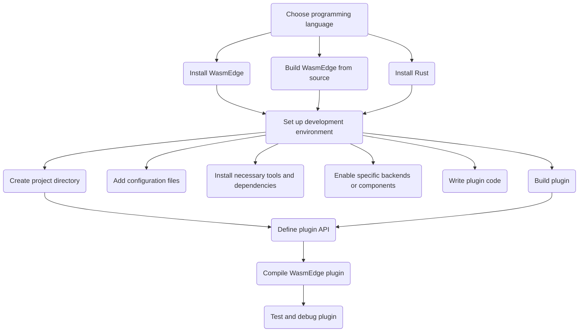

# Requirements for Developing WasmEdge Plugin

By developing a plugin, one can extend the functionality of WasmEdge and customize it to suit the specific needs. Here is a flowchart showing all the steps needed for developing WasmEdge Plugin -



This flowchart illustrates the process of developing a WasmEdge plugin, showcasing the steps involved from choosing a programming language to finalizing and releasing the plugin.

> For existing plugins, please refer to their respective [documentation pages](/contribute/source/plugin) for specific instructions.

## Choose programming language

The first step in developing a WasmEdge plugin is to choose the programming language one wants to use. Currently, C, C++, and Rust are supported by the WasmEdge runtime.

- **C:** Developers who choose to develop WasmEdge plugins using the C API need to install WasmEdge before starting the development process. Detailed instructions on installing WasmEdge can be found in the [install WasmEdge](/develop/build-and-run/install.md) guide.
  
- **C++:** For developers interested in developing WasmEdge plugins using the internal C++ API, they should first build WasmEdge from source. The process for building WasmEdge from source is outlined in th [build WasmEdge from source](../source/build_from_src.md) before starting.Once WasmEdge is successfully built, they can proceed with developing plugins using the internal C++ API.

- **Rust:** To develop WasmEdge plugins using Rust, developers need to have Rust installed on their system. Instructions for installing Rust can be found in the [e Rust Setup Guide](/develop/rust/setup.md). Once Rust is installed, developers can start developing WasmEdge plugins using the Rust programming language.

The choice of programming language depends on the developer's familiarity and skill with the language. C and C++ are commonly chosen for their low-level control over system resources and the ability to create high-performance plugins. Rust, on the other hand, is known for its safety features and performance.

> It is recommended that developers choose the WasmEdge [C API](develop_plugin_c.md) for plugin development.

## Set up the development environment

To start developing WasmEdge plugins, it is essential to set up the development environment properly. This section provides step-by-step instructions for WasmEdge plugin development -

- **Install a WasmEdge runtime**: You can download the latest version of WasmEdge from [GitHub repository](https://github.com/wasmEdge/wasmEdge). Here are the installation instructions for different operating system for [installing WasmEdge](/develop/build-and-run/install.md).
  
- **Install WasmEdge with plugins (optional)**: Installing WasmEdge with existing plugins can provide you with additional functionality and serve as a reference for your own plugin development. If you want to utilize or test the compatibility of your new plugin with existing plugins, you can install them using the provided installer script. The installed plugins will be available for your development environment.

  To see a list of supported plugins and their specific install commands, see the [Install WasmEdge plugins and dependencies](develop/build-and-run/install/#install-wasmedge-plugins-and-dependencies) section.

- **Install a compatible compiler**: The following compilers can be used to compile C and C++ code into WebAssembly bytecode:

  - LLVM: `sudo apt-get install llvm`
  - GCC: `sudo apt-get install gcc`

  Rust has its own built-in compiler, which can be installed using rustup:

  ```bash
  curl --proto '=https' --tlsv1.2 -sSf https://sh.rustup.rs | sh
  source $HOME/.cargo/env
  ```

- **Install necessary tools and dependencies**: You can use any text editor or IDE of your choice to write code. Here are some popular options:

  - [Visual Studio Code](https://code.visualstudio.com/)
  - [Atom](https://atom.io/)
  - [Sublime Text](https://www.sublimetext.com/)

  For debugging, you can use GDB, LLDB, or other debuggers that support WebAssembly. To install GDB, run `sudo apt-get install gdb`.

- **Enable specific backends or additional components (if applicable):** Some plugins may require enabling specific backends or additional components to extend their functionality. The following links provide instructions for enabling specific backends in WasmEdge:

  - [OpenVINO™](https://docs.openvino.ai/2021.4/openvino_docs_install_guides_installing_openvino_linux.html#)(2021)
  - [TensorFlow Lite](../../build-and-run/install#wasi-nn-plugin-with-tensorflow-lite)
  - [PyTorch 1.8.2 LTS](https://pytorch.org/get-started/locally/)

By following these steps, you can set up the development environment for creating WasmEdge plugins effectively. This will allow you to develop, test, and debug your plugins in a Linux environment.

## Create a WasmEdge plugin project

To create a WasmEdge plugin project, follow these steps:

- **Set up the project directory**: Create a directory structure for your plugin project. You can use a standard structure for the chosen language, or create your own structure. To create a project directory structure, use the following commands:

  ```bash
  mkdir myplugin
  cd myplugin
  mkdir src include build
  ```

- **Add configuration files**: Add configuration files specifying the plugin name, version, and dependencies. The specific files and their content depend on the chosen programming language and build system.
  
  - For C/C++ plugins, create a `CMakeLists.txt`  file in the root directory with the necessary configuration to specify the plugin name, version, and dependencies. The `find_package(WasmEdge REQUIRED)` line locates the WasmEdge runtime library and makes it available for the project.

    ```cmake
    cmake_minimum_required(VERSION 3.14)
    project(myplugin VERSION 0.1.0)

    find_package(WasmEdge REQUIRED)

    add_library(myplugin SHARED src/myplugin.cpp)
    target_compile_features(myplugin PUBLIC cxx_std_11)
    target_include_directories(myplugin PUBLIC include)
    target_link_libraries(myplugin PRIVATE ${WASMEDGE_LIBRARIES})
    set_target_properties(myplugin PROPERTIES PREFIX "")
    ```

  - For Rust plugins, create a `Cargo.toml` file in the root directory with the necessary configuration to specify the plugin name, version, and dependencies. The `wasmedge-runtime` dependency is added with the appropriate version and features.

    ```toml
    [package]
    name = "myplugin"
    version = "0.1.0"
    edition = "2018"

    [lib]
    crate-type = ["cdylib"]

    [dependencies]
    wasmedge-runtime = { version = ">=0.9", features = ["cranelift"] }
    ```

- **Add any necessary libraries or dependencies**: Include any required libraries or dependencies for your plugin. Modify the configuration files created in the previous step to include the necessary dependencies. For example, in the `CMakeLists.txt` file, use the `find_package` command to locate the WasmEdge runtime library and link it to your plugin.

- **Write the plugin code**: Start writing your plugin code in the `src` directory. Create one or more source files that define the functionality of your plugin. For example, in C++, you might create `myplugin.cpp` file with following code:
  
  ```cpp
  #include <wasmedge/wasmedge.h>

  extern "C" {
      WasmEdge_Result initializePlugin() {
          // Plugin initialization code
          return WasmEdge_Result_Success;
      }

      WasmEdge_Result finalizePlugin() {
          // Plugin finalization code
          return WasmEdge_Result_Success;
      }
  }

  ```

  Modify the above code according to your plugin's functionality. In this example, the plugin defines two external functions, `initializePlugin` and `finalizePlugin`, which are the entry points for the plugin's initialization and finalization code.

- **Build your plugin**: Depending on your build system, use the appropriate commands to build the plugin.
  
  - For C/C++ plugins, run the following commands from the `build` directory:

    ```bash
    cd build
    cmake ..
    make
    ```

  - For Rust plugins, run the following commands from the project root directory:

    ```bash
    cargo build --release --target wasm32-wasi
    wasm-bindgen target/wasm32-wasi/release/myplugin.wasm --out-dir .
    ```

  These commands will generate the plugin binary based on the provided configuration.

Your compiled plugin should be located in the `build` directory for C/C++ or in the project root directory for Rust.

By following these steps, you will have a WasmEdge plugin project set up with the necessary directory structure, configuration files, and initial code. You can continue developing your plugin by adding functionality and implementing the desired behavior.

## Define the plugin API

The plugin API is a set of functions that the WasmEdge runtime will call to interact with the plugin. The specific functions that are required in the plugin API depend on the features that your plugin provides.

- **Specify interaction**: Specify how the plugin will receive input and provide output to the runtime. This can be done through function parameters, return values, or other means of communication.

- **Provide functions**: Define functions that the plugin will expose to the runtime, such as initialization, execution, and cleanup functions. These functions should perform specific tasks related to the plugin's functionality.

### Define the plugin API for C/C++

Here's an example of how to define the plugin API for a C/C++ WasmEdge plugin:

- **Create a header file for your plugin**: In the include directory, create a header file (e.g., `myplugin.h`) that declares the plugin API functions. For example:

  ```c
  #pragma once

  #include <stdint.h>

  class MyPlugin {
  public:
      MyPlugin();
      ~MyPlugin();

      void init();
      void execute(uint32_t input);
      void cleanup();
  };
  ```

- **Implement the plugin API functions**: In your plugin's source file (e.g., `src/myplugin.cpp`), implement the declared API functions. For example:

  ```c
  #include "myplugin.h"
  #include <wasmedge/core/plugin.h>

  class MyPlugin : public wasmedge::Plugin {
  public:
      MyPlugin() {
          // Initialization code
      }

      ~MyPlugin() {
          // Cleanup code
      }

      void init() override {
          // Initialization code
      }

      void execute(uint32_t input) override {
          // Execution code
      }

      void cleanup() override {
          // Cleanup code
      }
  };
  ```

- **Expose the plugin API functions**: In the myplugin.cpp file, you'll also need to expose the plugin API functions to the WasmEdge runtime using the `wasm_export_ prefix`. For example:

  ```c  
  extern "C" {
      void wasm_export_myplugin_init(const struct wasm_export_myplugin_init_args_t* args) {
          // Initialization code
      }

      void wasm_export_myplugin_execute(const struct wasm_export_myplugin_execute_args_t* args) {
          // Execution code
      }

      void wasm_export_myplugin_cleanup(const struct wasm_export_myplugin_cleanup_args_t* args) {
          // Cleanup code
      }
  }
  ```

By following these steps, you can define the plugin API for a C/C++ WasmEdge plugin.

### Define the plugin API for RUST

For Rust, you would define the plugin API using Rust's traits and methods.

For example, in `myplugin.rs`:

  ```toml
  use wasmedge::core::plugin::{Plugin, PluginExecuteArgs, PluginInitArgs, PluginCleanupArgs};

  pub struct MyPlugin;

  impl Plugin for MyPlugin {
      fn init(&mut self) {
          // Initialization code
      }

      fn execute(&mut self, input: u32) {
          // Execution code
      }

      fn cleanup(&mut self) {
          // Cleanup code
      }
  }
  ```

Then, you would expose the plugin API functions to the WasmEdge runtime using the `wasm_export_ prefix`, similar to the C/C++ example.

By defining the plugin API, you can establish a clear interface between your plugin and the WasmEdge runtime, making it easier to develop and maintain your plugin.

## Compile the WasmEdge plugin

Once you have implemented the plugin API, you can compile the plugin using the following steps:

- **Compile the plugin code**: Use the installed compiler to compile the plugin code into WebAssembly bytecode. Replace `myplugin.c` with the name of your plugin's source file, and build `myplugin.wasm` with the desired output path and filename.

  ```bash
  clang --target=wasm32 -O3 -nostdlib \
  -Wl,--export-all -Wl,--allow-undefined \
  -o build/myplugin.wasm src/myplugin.c
  ```

  This command compiles the plugin code into WebAssembly bytecode using the Clang compiler. Adjust the compiler flags as needed for your specific requirements.

- **Link with necessary dependencies**:  If your plugin depends on external libraries or the WasmEdge runtime, you need to link them with the bytecode. For example, if you are using the WasmEdge C API in your plugin, include the following linker flags:

  ```bash
  -L/usr/local/lib -lwasmedgeC
  ```
  
  Modify these flags to match the location and name of the required libraries on your system.

- **Create the binary for execution**: Generate the binary file that can be loaded and executed by the WasmEdge runtime. The specific command depends on the target platform and the desired output format. For example, to create a shared object file (`.so`) on Linux, use the following command:
  
  ```bash
  clang -shared -o build/myplugin.so build/myplugin.wasm
  ```

  Adjust the output path and filename as needed for your project.

By following these steps, you can compile your WasmEdge plugin and create a binary that can be loaded and executed by the WasmEdge runtime.

## Test and debug the plugin

Once you have compiled the plugin, you can test it using the following steps:

- **Test the plugin with WasmEdge**: Load and execute the plugin using the WasmEdge runtime, and ensure it works as expected. To test the plugin with WasmEdge, you can use the following command:

  ```bash
  wasmedge --dir=./build myplugin.so
  ```

- **Debug any issues**: To launch a debugger for a WasmEdge binary file, run the following command:

  ```bash
  wasmedge debug my-plugin.wasm
  ```

This will launch a debugger for the WasmEdge binary file, and allow you to step through the code and inspect the values of variables.

Finally, compile the WasmEdge plugin.
