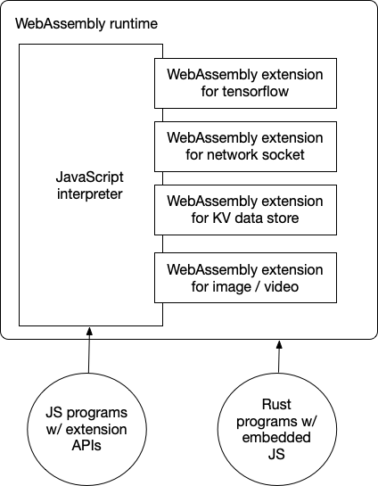

# Introduction

WebAssembly started as a "JavaScript alternative for browsers". The idea is to run high-performance applications compiled from languages like C/C++ or Rust safely in browsers. In the browser, WebAssembly runs side by side with JavaScript.

As WebAssembly is increasingly used in the cloud, it is now a universal runtime for cloud-native applications. Compared with Linux containers, WebAssembly runtimes achieve higher performance with lower resource consumption.

In cloud-native use cases, developers often want to use JavaScript to write business applications. That means we must now support JavaScript in WebAssembly. Furthermore, we should support calling C/C++ or Rust functions from JavaScript in a WebAssembly runtime to take advantage of WebAssembly's computational efficiency. The WasmEdge WebAssembly runtime allows you to do exactly that.

## Why run JavaScript in WasmEdge

-   Lightweight and secure JS runtime. Compared with V8 and Node.js, WasmEdge itself is a lightweight， high performance JavaScript runtime。
-   No need for Linux containers. WasmEdge could be a secure container without tons of dependencies.
-   Node.js compatible. See the status [here](https://github.com/WasmEdge/WasmEdge/issues/1535).
-   Use Rust to implement JS APIs. See the tutorial here.

In this section, we will demonstrate how to run and enhance JavaScript in WasmEdge.

-   [Getting started](hello_world) demonstrates how to run simple JavaScript programs in WasmEdge.
-   [Networking sockets](networking) shows how to create non-blocking (async) HTTP clients, including the `fetch` API, and server applications in JavaScript.
-   [Node.js compatibility](nodejs) describes Node.js APIs support in WasmEdge QuickJS.
-   [ES6 modules](es6) shows how to incorporate ES6 modules in WasmEdge.
-   [Node.js and NPM modules](npm) shows how to incorporate NPM modules in WasmEdge.
-   [Built-in modules](modules) shows how to add JavaScript functions into the WasmEdge runtime as built-in API functions.
-   [Use Rust to implement JS API](rust) discusses how to use Rust to implement and support a JavaScript API.
-   [React SSR](ssr) shows example React SSR applications, including streaming SSR support.

## A note on v8

Now, the choice of QuickJS as our JavaScript engine might raise the question of performance. Isn't QuickJS [a lot slower](https://bellard.org/quickjs/bench.html) than v8 due to a lack of JIT support? Yes, but ...

First of all, QuickJS is a lot smaller than v8. In fact, it only takes 1/40 (or 2.5%) of the runtime resources v8 consumes. You can run a lot more QuickJS functions than v8 functions on a single physical machine.

Second, for most business logic applications, raw performance is not critical. The application may have computationally intensive tasks, such as AI inference on the fly. WasmEdge allows the QuickJS applications to drop to high-performance WebAssembly for these tasks while it is not so easy with v8 to add such extensions modules.

Third, WasmEdge is [itself an OCI compliant container](../deploy/intro). It is secure by default, supports resource isolation, and can be managed by container tools to run side by side with Linux containers in a single k8s cluster.

Finally, v8 has a very large attack surface and requires [major efforts](https://blog.cloudflare.com/mitigating-spectre-and-other-security-threats-the-cloudflare-workers-security-model/) to run securely in a public cloud environment. It is known that [many JavaScript security issues arise from JIT](https://www.theregister.com/2021/08/06/edge_super_duper_security_mode/). Maybe turning off JIT in the cloud-native environment is not such a bad idea!

In the end, running v8 in a cloud-native environment often requires a full stack of software tools consisting of "Linux container + guest OS + node or deno + v8", which makes it much heavier and slower than a simple WasmEdge + QuickJS container runtime.
