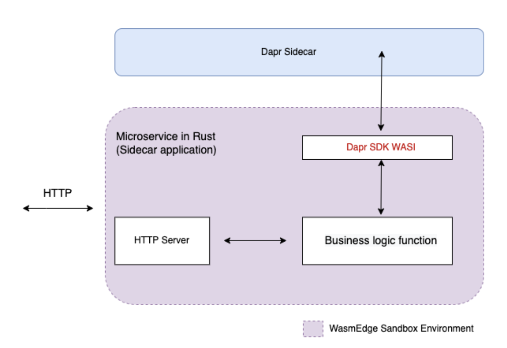
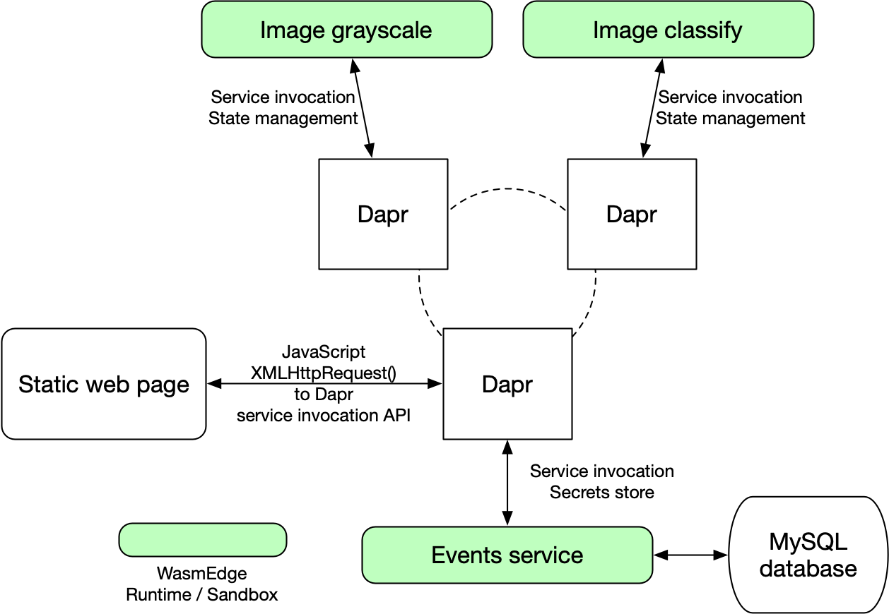

# Dapr services

Second State launched a new [WebAssembly-based SDK for the Dapr API](https://github.com/second-state/dapr-sdk-wasi), which provides an easy way for Rust-based microservices in WasmEdge to interact with Dapr APIs and sidecar services.

The figure below shows a Dapr-enabled microservice running inside the WasmEdge sandbox.



## Prerequisites

Before we start, ensure [you have Rust and WasmEdge installed](setup.md).

You also need to install the following tools.

- [Dapr CLI installed](https://docs.dapr.io/getting-started/install-dapr-cli/)
- An [MySQL](https://dev.mysql.com/doc/mysql-installation-excerpt/5.7/en/) or [MariaDB](https://mariadb.com/kb/en/getting-installing-and-upgrading-mariadb/) or [TiDB](https://docs.pingcap.com/tidb/dev/quick-start-with-tidb) database installed

## The template project explanation

The template application showcases how [Dapr](https://dapr.io/) and [WasmEdge](https://github.com/WasmEdge/) work together to support [lightweight WebAssembly-based microservices](https://github.com/second-state/microservice-rust-mysql) in a cloud-native environment. The microservices are all written in Rust and compiled into WebAssembly.

This application consists of three microservices and a standalone web page that enables users to interact with the microservices using an HTML+JavaScript UI. It is a very typical JAMstack setup. Each microservice is attached to a Dapr sidecar, which provides a suite of valuable services commonly required by cloud-native microservices.



The WasmEdge's Dapr SDK is used to access Dapr sidecars from the microservice apps. Specifically, the [grayscale](https://github.com/second-state/dapr-wasm/tree/main/image-api-grayscale) microservice takes an image from an HTTP POST, turns it into grayscale, and returns the result image data in the HTTP response.

- It uses Dapr to discover and invoke the [events](https://github.com/second-state/dapr-wasm/tree/main/events-service) microservice to record every successful user request.
- It also stores each user’s IP address and last timestamp data in its Dapr sidecar’s state database. That allows the service to rate limit users if needed.

The [classify](https://github.com/second-state/dapr-wasm/tree/main/image-api-classify) microservices takes an image from an HTTP POST, runs a Tensorflow model against it to classify the object on the image, and returns the result as a text label in the HTTP response. You can learn more about AI inference in Rust and WasmEdge [here](/category/ai-inference). It uses its own Dapr sidecar like the [grayscale](https://github.com/second-state/dapr-wasm/tree/main/image-api-grayscale) microservice.

The [events](https://github.com/second-state/dapr-wasm/tree/main/events-service) microservice takes JSON data from an HTTP POST and saves it to an external MySQL database for later analysis.

- It uses Dapr to make itself discoverable by name by other microservices that need to record events.
- It also uses its Dapr sidecar to store secrets such as MySQL database credentials.

Ok, enough concepts for the template project. Let's go ahead.

[Live Demo](http://dapr-demo.secondstate.co) | [Tutorial video](https://www.youtube.com/watch?v=3v37pAT9iK8)

## Build and deploy these microservices in Dapr

First, start the database and place the connection string in the [config/secrets.json](https://github.com/second-state/dapr-wasm/blob/main/config/secrets.json) file under `DB_URL:MYSQL`.

Next, start Dapr with the following commands.

```bash
dapr init
```

### The image grayscale microservice

Build.

```bash
cd image-api-grayscale
cargo build --target wasm32-wasi --release
wasmedgec ./target/wasm32-wasi/release/image-api-grayscale.wasm image-api-grayscale.wasm
```

Deploy.

```bash
dapr run --app-id image-api-grayscale \
        --app-protocol http \
        --app-port 9005 \
        --dapr-http-port 3503 \
        --components-path ../config \
        --log-level debug \
 wasmedge image-api-grayscale.wasm
```

### The image classification microservice

Build.

```bash
cd image-api-classify
cargo build --target wasm32-wasi --release
wasmedgec target/wasm32-wasi/release/wasmedge_hyper_server_tflite.wasm wasmedge_hyper_server_tflite.wasm
```

Deploy.

```bash
dapr run --app-id image-api-classify \
        --app-protocol http \
        --app-port 9006 \
        --dapr-http-port 3504 \
        --log-level debug \
        --components-path ../config \
        wasmedge-tensorflow-lite wasmedge_hyper_server_tflite.wasm
```

### The events recorder microservice

Build.

```bash
cd events-service
cargo build --target wasm32-wasi --release
wasmedgec target/wasm32-wasi/release/events_service.wasm events_service.wasm
```

Deploy.

```bash
dapr run --app-id events-service \
        --app-protocol http \
        --app-port 9007 \
        --dapr-http-port 3505 \
        --log-level debug \
        --components-path ../config \
        wasmedge events_service.wasm
```

## Test

To test the services, you can use the [static web page UI](http://dapr-demo.secondstate.co/) or `curl`.

Initialize the events database table.

```bash
$ curl http://localhost:9007/init
{"status":true}

$ curl http://localhost:9007/events
[]
```

Use the grayscale microservice. The return data is base64 encoded grayscale image.

```bash
$ cd docs
$ curl http://localhost:9005/grayscale -X POST --data-binary '@food.jpg'
ABCDEFG ...
```

Use the image classification microservice.

```bash
$ cd docs
$ curl http://localhost:9006/classify -X POST --data-binary '@food.jpg'
hotdog is detected with 255/255 confidence
```

Query the events database again.

```bash
$ curl http://localhost:9007/events
[{"id":1,"event_ts":1665358852918,"op_type":"grayscale","input_size":68016},{"id":2,"event_ts":1665358853114,"op_type":"classify","input_size":68016}]
```

Next, you could use WasmEdge and WasmEdge's Dapr Rust API to create lightweight microservices with better security, faster performance, and smaller footprints.
