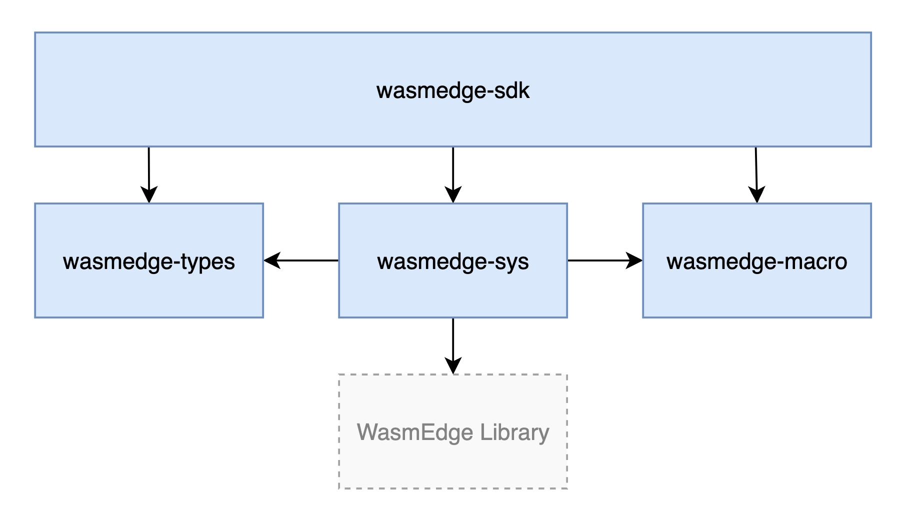

# WasmEdge Rust SDK

## Overview

WasmEdge Rust SDK consists of four crates. In the diagram below, the blue rectangles represent the crates, and the arrows show the dependency relation.

<div align="center">
  
</div>

- `wasmedge-sdk` crate defines a group of safe, ergonomic high-level APIs, which are used by developers to build up their own business applications.

- `wasmedge-sys` crate is a wrapper of WasmEdge C-API and provides the safe counterparts. It is not recommended to use it directly by application developers. `wasmedge-sys`, `wasmedge-types` and `wasmedge-macro` constitute the low-level layer of WasmEdge Rust SDK.

- `wasmedge-types` crate defines the data structures that are commonly used in `wasmedge-sdk` and `wasmedge-sys`.

- `wasmedge-macro` crate defines the macros that are commonly used in `wasmedge-sdk` and `wasmedge-sys` to declare [host functions](https://webassembly.github.io/spec/core/exec/runtime.html#:~:text=A%20host%20function%20is%20a,a%20module%20as%20an%20import.).

## Usage

- Deploy WasmEdge library in your local environment.

    Since this crate depends on the WasmEdge C API, it needs to be installed in your system first. Please refer to [WasmEdge Installation and Uninstallation](https://wasmedge.org/book/en/quick_start/install.html) to install the WasmEdge library. The versioning table below shows the version of the WasmEdge library required by each version of the `wasmedge-sdk` crate.

    | wasmedge-sdk | WasmEdge lib | wasmedge-sys | wasmedge-types | wasmedge-macro |
    | :-: | :-: | :-: | :-: | :-: |
    | 0.8.1 | 0.12.1 | 0.13.1 | 0.4.1 | 0.3.0 |
    | 0.8.0 | 0.12.0 | 0.13.0 | 0.4.1 | 0.3.0 |
    | 0.7.1 | 0.11.2 | 0.12.2 | 0.3.1 | 0.3.0 |
    | 0.7.0 | 0.11.2 | 0.12 | 0.3.1 | 0.3.0 |
    | 0.6.0 | 0.11.2 | 0.11 | 0.3.0 | 0.2.0 |
    | 0.5.0 | 0.11.1 | 0.10 | 0.3.0 | 0.1.0 |
    | 0.4.0 | 0.11.0 | 0.9 | 0.2.1 | - |
    | 0.3.0 | 0.10.1 | 0.8 | 0.2 | - |
    | 0.1.0 | 0.10.0 | 0.7 | 0.1 | - |

    WasmEdge Rust SDK can automatically search the following paths for the WasmEdge library:

  - `/usr/local` (Linux/macOS)
  - `$HOME/.wasmedge` (Linux/macOS)

    Note that if you have installed the WasmEdge library in a different path, you can set the `WASMEDGE_INCLUDE_DIR` and `WASMEDGE_LIB_DIR` environment variables to the path of the WasmEdge library.

- Add `wasmedge-sdk` crate to your `Cargo.toml` file. Note that, according to the version table, the version of `wasmedge-sdk` matching `WasmEdge v0.12.0` is `0.8.0`.

    ```toml
    wasmedge-sdk = "0.8.0"
    ```

**Notice:** The minimum supported Rust version is 1.67.

## Examples

[wasmedge-rustsdk-examples](https://github.com/second-state/wasmedge-rustsdk-examples/tree/main) provides a set of examples to demonstrate how to use `wasmedge-sdk` to, for example, create host functions, create WebAssembly libraries, create plugins, and etc.
