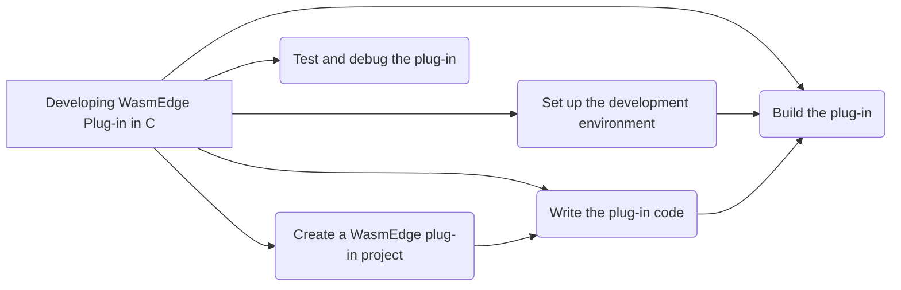

# 使用 C API 開發 WasmEdge 外掛

藉由開發外掛,可以擴充 WasmEdge 的功能並依特定需求進行自訂。WasmEdge 提供了以 C 為基礎的 API 來註冊擴充模組與主機函式。雖然 WasmEdge 語言 SDK 允許從主機 (包裝) 應用程式註冊主機函式,但外掛 API 可讓這類擴充功能納入 WasmEdge 的建置與發行流程。以下流程圖顯示開發 WasmEdge 外掛所需的所有步驟 -



此流程圖說明開發 WasmEdge 外掛的過程,展示從選擇程式語言到完成並發行外掛的各個步驟。

## 設定開發環境

要開始開發 WasmEdge 外掛,正確設定開發環境是不可或缺的。本節提供 WasmEdge 外掛開發的逐步說明 -

**安裝 WasmEdge 執行環境**: 您可以從 [GitHub 儲存庫](https://github.com/wasmEdge/wasmEdge) 下載最新版本的 WasmEdge。依照[安裝指南](../../start/install.md) 中針對您特定作業系統的說明進行。

安裝 WasmEdge 後,您需要設定建置環境。如果您使用 Linux 或其他平台,您可以遵循[建置環境設定指南](../source/os/linux.md)中的說明。

## 建立 WasmEdge 外掛專案

要建立 WasmEdge 外掛專案,請依照下列步驟:

- **設定專案目錄**: 為您的外掛專案建立目錄結構。您可以為所選語言使用標準結構,或建立自己的結構。要建立專案目錄結構,使用下列指令:

  ```bash
  mkdir testplugin
  cd testplugin
  mkdir src include build
  ```

- **新增設定檔**: 新增指定外掛名稱、版本與相依套件的設定檔。具體的檔案與內容取決於所選的程式語言與建置系統。

- **新增任何必要的函式庫或相依套件**: 將您外掛所需的函式庫或相依套件納入其中。修改先前步驟中建立的設定檔,以納入所需的相依套件。

## 撰寫外掛程式碼

要建立包含主機函式與模組的外掛,請依照下列步驟:

- **實作主機函式定義**: 在此步驟中,您必須定義將在 WASM 模組實例化時匯入的主機函式。這些函式將執行特定操作並回傳結果。

  因此,開發者可以先實作其外掛主機函式,如 [WasmEdge C API 中的主機函式](/embed/c/reference/latest.md#host-functions)。

<!-- prettier-ignore -->
:::note
有關[外部資料](/embed/c/host_function.md#host-data) 與[呼叫框架上下文](/embed/c/host_function.md#calling-frame-context) 的詳細資訊,請參閱主機函式指南。
:::

以下是兩個主機函式的範例,`HostFuncAdd` 與 `HostFuncSub`,分別執行兩個 `int32_t` 數字的加法與減法:

```c
#include <wasmedge/wasmedge.h>

/* The host function definitions. */

/* The host function to add 2 int32_t numbers. */
WasmEdge_Result HostFuncAdd(void *Data,
                            const WasmEdge_CallingFrameContext *CallFrameCxt,
                            const WasmEdge_Value *In, WasmEdge_Value *Out) {
  int32_t Val1 = WasmEdge_ValueGetI32(In[0]);
  int32_t Val2 = WasmEdge_ValueGetI32(In[1]);
  Out[0] = WasmEdge_ValueGenI32(Val1 + Val2);
  return WasmEdge_Result_Success;
}

/* The host function to sub 2 int32_t numbers. */
WasmEdge_Result HostFuncSub(void *Data,
                            const WasmEdge_CallingFrameContext *CallFrameCxt,
                            const WasmEdge_Value *In, WasmEdge_Value *Out) {
  int32_t Val1 = WasmEdge_ValueGetI32(In[0]);
  int32_t Val2 = WasmEdge_ValueGetI32(In[1]);
  Out[0] = WasmEdge_ValueGenI32(Val1 - Val2);
  return WasmEdge_Result_Success;
}
```

- **實作模組建立函式**: 在此步驟中,您需要實作建立模組實例的模組建立函式。此函式將在外掛載入時被呼叫。

  以下是名為 `CreateTestModule` 的模組建立函式範例:

  ```c
  /* The creation function of creating the module instance. */
  WasmEdge_ModuleInstanceContext *
  CreateTestModule(const struct WasmEdge_ModuleDescriptor *Desc) {
    /*
     * The `Desc` is the const pointer to the module descriptor struct:
     *
     *   typedef struct WasmEdge_ModuleDescriptor {
     *     const char *Name;
     *     const char *Description;
     *     WasmEdge_ModuleInstanceContext *(*Create)(
     *         const struct WasmEdge_ModuleDescriptor *);
     *   } WasmEdge_ModuleDescriptor;
     *
     * Developers can get the name and description from this descriptor.
     */

    /* Exported module name of this module instance. */
    WasmEdge_String ModuleName =
        WasmEdge_StringCreateByCString("wasmedge_plugintest_c_module");
    WasmEdge_ModuleInstanceContext *Mod =
        WasmEdge_ModuleInstanceCreate(ModuleName);
    WasmEdge_StringDelete(ModuleName);

    WasmEdge_String FuncName;
    WasmEdge_FunctionTypeContext *FType;
    WasmEdge_FunctionInstanceContext *FuncCxt;
    WasmEdge_ValType ParamTypes[2], ReturnTypes[1];
    ParamTypes[0] = WasmEdge_ValTypeGenI32();
    ParamTypes[1] = WasmEdge_ValTypeGenI32();
    ReturnTypes[0] = WasmEdge_ValTypeGenI32();

    /* Create and add the host function instances into the module instance. */
    FType = WasmEdge_FunctionTypeCreate(ParamTypes, 2, ReturnTypes, 1);
    FuncName = WasmEdge_StringCreateByCString("add");
    FuncCxt = WasmEdge_FunctionInstanceCreate(FType, HostFuncAdd, NULL, 0);
    WasmEdge_ModuleInstanceAddFunction(Mod, FuncName, FuncCxt);
    WasmEdge_StringDelete(FuncName);
    FuncName = WasmEdge_StringCreateByCString("sub");
    FuncCxt = WasmEdge_FunctionInstanceCreate(FType, HostFuncSub, NULL, 0);
    WasmEdge_ModuleInstanceAddFunction(Mod, FuncName, FuncCxt);
    WasmEdge_StringDelete(FuncName);
    WasmEdge_FunctionTypeDelete(FType);

    return Mod;
  }
  ```

  在一個外掛共用函式庫中可以有多個模組實例。以上方的程式碼片段為例,使用名為 `wasmedge_plugintest_c_module` 的模組進行說明。

- **提供外掛描述**- 在此步驟中,您需要提供外掛及其所含模組的描述。這些描述將用於搜尋與建立外掛和模組實例。

  以下是外掛與模組描述子的範例:

  ```c
  /* The module descriptor array. There can be multiple modules in a plug-in. */
  static WasmEdge_ModuleDescriptor ModuleDesc[] = {{
      /*
       * Module name. This is the name for searching and creating the module
       * instance context by the `WasmEdge_PluginCreateModule()` API.
       */
      .Name = "wasmedge_plugintest_c_module",
      /* Module description. */
      .Description = "This is for the plugin tests in WasmEdge C API.",
      /* Creation function pointer. */
      .Create = CreateTestModule,
  }};

  /* The plug-in descriptor */
  static WasmEdge_PluginDescriptor Desc[] = {{
      /*
       * Plug-in name. This is the name for searching the plug-in context by the
       * `WasmEdge_PluginFind()` API.
       */
      .Name = "wasmedge_plugintest_c",
      /* Plug-in description. */
      .Description = "",
      /* Plug-in API version. */
      .APIVersion = WasmEdge_Plugin_CurrentAPIVersion,
      /* Plug-in version. Developers can define the version of this plug-in. */
      .Version =
          {
              .Major = 0,
              .Minor = 1,
              .Patch = 0,
              .Build = 0,
          },
      /* Module count in this plug-in. */
      .ModuleCount = 1,
      /* Plug-in option description count in this plug-in (Work in progress). */
      .ProgramOptionCount = 0,
      /* Pointer to the module description array. */
      .ModuleDescriptions = ModuleDesc,
      /* Pointer to the plug-in option description array (Work in progress). */
      .ProgramOptions = NULL,
  }};

  /* Ensure the Plugin Descriptor is exported */
  WASMEDGE_CAPI_PLUGIN_EXPORT const WasmEdge_PluginDescriptor *
  WasmEdge_Plugin_GetDescriptor(void) {
    return &Desc;
  }
  ```

  這些描述定義了外掛的名稱、描述、版本與建立函式,以及其所含模組的名稱與描述。

請記得實作您外掛所需的任何其他函式或結構,以完成其功能。

藉由遵循這些步驟並實作必要的函式與描述子,您可以在 WasmEdge C API 中建立包含主機函式與模組的外掛。您可以繼續開發您的外掛,新增功能並實作所需的行為。

- **外掛選項** - _進行中。本節為未來功能保留。_

## 建置您的外掛

要建置 WasmEdge 外掛共用函式庫,您有兩種選擇:直接使用編譯器建置,或使用 CMake 建置。以下是兩種方法的說明:

- **以指令建置**: 如果您選擇使用命令列建置外掛,請在終端機中執行下列指令:

  ```bash
  gcc -std=c11 -DWASMEDGE_PLUGIN -shared -o libwasmedgePluginTest.so testplugin.c
  ```

  此指令會將 `testplugin.c` 檔案編譯為名為 `libwasmedgePluginTest.so` 的共用函式庫。`-std=c11` 旗標將 C 語言標準設定為 C11,`-DWASMEDGE_PLUGIN` 旗標定義了可在程式碼中使用的 WASMEDGE_PLUGIN 巨集。

- **以 CMake 建置**: 如果您偏好使用 CMake 建置外掛,請在專案的根目錄中建立 `CMakeLists.txt` 檔案並加入下列內容至 CMakeLists.txt 檔案中:

  ```cmake
  add_library(wasmedgePluginTest
    SHARED
    testplugin.c
  )

  set_target_properties(wasmedgePluginTest PROPERTIES
    C_STANDARD 11
  )

  target_compile_options(wasmedgePluginTest
    PUBLIC
    -DWASMEDGE_PLUGIN
  )

  target_link_libraries(wasmedgePluginTest
    PRIVATE
    wasmedge
  )
  ```

  此 CMake 設定建立了名為 `wasmedgePluginTest` 的建置目標。它會將 `testplugin.c` 檔案編譯為共用函式庫。`C_STANDARD 11` 屬性將 C 語言標準設定為 C11。`target_compile_options` 指令使用 `-DWASMEDGE_PLUGIN` 旗標定義 `WASMEDGE_PLUGIN` 巨集。最後,`target_link_libraries` 指令將 wasmedge 函式庫連結至外掛。

一旦您設定好命令列建置或 CMake 建置,即可執行對應的建置指令或使用 CMake 產生建置檔案,這將編譯您的外掛原始碼並產生共用函式庫檔案 `(libwasmedgePluginTest.so)`。
