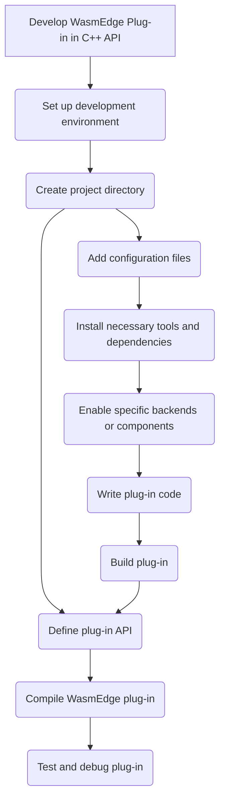

# 使用 C++ API 開發 WasmEdge 外掛

藉由開發外掛,可以擴充 WasmEdge 的功能並依特定需求進行自訂。WasmEdge 提供了以 C 為基礎的 API 來註冊擴充模組與主機函式。雖然 WasmEdge 語言 SDK 允許從主機 (包裝) 應用程式註冊主機函式,但外掛 API 可讓這類擴充功能納入 WasmEdge 的建置與發行流程。

<!-- prettier-ignore -->
:::note
建議開發者選擇 WasmEdge [C API](develop_plugin_c.md) 進行外掛開發,因為 WasmEdge 執行環境提供了支援、相容性與彈性。
:::

以下流程圖顯示開發 WasmEdge 外掛所需的所有步驟 -



此流程圖說明開發 WasmEdge 外掛的過程,展示從選擇程式語言到完成並發行外掛的各個步驟。

## 設定開發環境

要開始開發 WasmEdge 外掛,正確設定開發環境是不可或缺的。本節提供 WasmEdge 外掛開發的逐步說明 -

**從原始碼建置 WasmEdge**: 要以 C++ 開發 WasmEdge 外掛,您必須從原始碼建置 WasmEdge。請依照[從原始碼建置 WasmEdge](../source/build_from_src.md) 中的說明進行。

安裝 WasmEdge 後,您需要設定建置環境。如果您使用 Linux 或其他平台,您可以遵循[建置環境設定指南](../source/os/linux.md)中的說明。

## 建立 WasmEdge 外掛專案

要建立 WasmEdge 外掛專案,請依照下列步驟:

- **設定專案目錄**: 為您的外掛專案建立目錄結構。您可以為所選語言使用標準結構,或建立自己的結構。要建立專案目錄結構,使用下列指令:

  ```bash
  mkdir testplugin
  cd testplugin
  mkdir src include build
  ```

- **新增必要的函式庫或相依套件**: 將您外掛所需的函式庫或相依套件納入其中。修改先前步驟中建立的設定檔,以納入所需的相依套件。

## 撰寫外掛程式碼

要建立包含主機函式與模組的外掛,請依照下列步驟:

- **主機函式與模組**: 外掛旨在提供可在 WASM 實例化時匯入的主機函式。因此,開發者應該先在 WasmEdge 內部 C++ 中實作其外掛主機函式。假設主機函式實作位於 `testplugin.h`。

  ```cpp
  #pragma once

  #include "plugin/plugin.h"

  #include <cstdint>
  #include <string>

  namespace WasmEdge {
  namespace Host {

  // The environment class. For the register object.
  class WasmEdgePluginTestEnv {
  public:
    WasmEdgePluginTestEnv() noexcept = default;

    static Plugin::PluginRegister Register;
  };

  // The host function base template class. For inheriting the environment class
  // reference.
  template <typename T>
  class WasmEdgePluginTestFunc : public Runtime::HostFunction<T> {
  public:
    WasmEdgePluginTestFunc(WasmEdgePluginTestEnv &HostEnv)
        : Runtime::HostFunction<T>(0), Env(HostEnv) {}

  protected:
    WasmEdgePluginTestEnv &Env;
  };

  // The host function to add 2 int32_t numbers.
  class WasmEdgePluginTestFuncAdd
      : public WasmEdgePluginTestFunc<WasmEdgePluginTestFuncAdd> {
  public:
    WasmEdgePluginTestFuncAdd(WasmEdgePluginTestEnv &HostEnv)
        : WasmEdgePluginTestFunc(HostEnv) {}
    Expect<uint32_t> body(const Runtime::CallingFrame &, uint32_t A, uint32_t B) {
      return A + B;
    }
  };

  // The host function to sub 2 int32_t numbers.
  class WasmEdgePluginTestFuncSub
      : public WasmEdgePluginTestFunc<WasmEdgePluginTestFuncSub> {
  public:
    WasmEdgePluginTestFuncSub(WasmEdgePluginTestEnv &HostEnv)
        : WasmEdgePluginTestFunc(HostEnv) {}
    Expect<uint32_t> body(const Runtime::CallingFrame &, uint32_t A, uint32_t B) {
      return A - B;
    }
  };

  // The host module class. There can be several modules in a plug-in.
  class WasmEdgePluginTestModule : public Runtime::Instance::ModuleInstance {
  public:
    WasmEdgePluginTestModule()
        : Runtime::Instance::ModuleInstance("wasmedge_plugintest_cpp_module") {
      addHostFunc("add", std::make_unique<WasmEdgePluginTestFuncAdd>(Env));
      addHostFunc("sub", std::make_unique<WasmEdgePluginTestFuncSub>(Env));
    }

    WasmEdgePluginTestEnv &getEnv() { return Env; }

  private:
    WasmEdgePluginTestEnv Env;
  };

  } // namespace Host
  } // namespace WasmEdge
  ```

- **模組的建立函式**: 接著開發者應該實作模組建立函式。假設以下實作全部位於 `testplugin.cpp` 中。

  ```cpp
  #include "testplugin.h"

  namespace WasmEdge {
  namespace Host {
  namespace {

  Runtime::Instance::ModuleInstance *
  create(const Plugin::PluginModule::ModuleDescriptor *) noexcept {
    // There can be several modules in a plug-in. For that, developers should
    // implement several `create` functions for each module.
    return new WasmEdgePluginTestModule;
  }

  } // namespace
  } // namespace Host
  } // namespace WasmEdge
  ```

- **外掛描述**: 為了建構外掛,開發者應提供此外掛與模組的描述。

  ```cpp
  namespace WasmEdge {
  namespace Host {
  namespace {

  Plugin::Plugin::PluginDescriptor Descriptor{
      //Plug-in name - for searching the plug-in context by the
      // `WasmEdge_PluginFind()` C API.
      .Name = "wasmedge_plugintest_cpp",
      //Plug-in description.
      .Description = "",
      //Plug-in API version.
      .APIVersion = Plugin::Plugin::CurrentAPIVersion,
      //Plug-in version.
      .Version = {0, 10, 0, 0},
      // Module count in this plug-in.
      .ModuleCount = 1,
      // Pointer to module description array.
      .ModuleDescriptions =
          // The module descriptor array.
          (Plugin::PluginModule::ModuleDescriptor[]){
              {
                  // Module name. This is the name for searching and creating the
                  // module instance context by the
                  // `WasmEdge_PluginCreateModule()` C API.
                  .Name = "wasmedge_plugintest_cpp_module",
                  // Module description.
                  .Description = "This is for the plugin tests in WasmEdge.",
                  // Creation function pointer.
                  .Create = create,
              },
          },
      //Plug-in options (Work in progress).
      .AddOptions = nullptr,
  };

  } // namespace
  } // namespace Host
  } // namespace WasmEdge
  ```

- **外掛選項**: 進行中。本節為未來功能保留。

- **實作外掛描述子註冊**: 最後一個步驟是以外掛描述子實作 `Plugin::PluginRegister` 初始化。

```cpp
namespace WasmEdge {
namespace Host {

Plugin::PluginRegister WasmEdgePluginTestEnv::Register(&Descriptor);

} // namespace Host
} // namespace WasmEdge
```

請記得實作您外掛所需的任何其他函式或結構,以完成其功能。

藉由遵循這些步驟並實作必要的函式與描述子,您可以在 WasmEdge C++ API 中建立包含主機函式與模組的外掛。您可以繼續開發您的外掛,新增功能並實作所需的行為。

## 建置外掛

要建置外掛共用函式庫,開發者應該使用 CMake 並搭配 WasmEdge 原始碼來建置。

- 假設 `test` 資料夾建立於 `<PATH_TO_WASMEDGE_SOURCE>/plug-ins` 之下。在 `<PATH_TO_WASMEDGE_SOURCE>/plugins/CMakeLists.txt` 中加入此行:

  ```cmake
  add_subdirectory(test)
  ```

- 將 `testplugin.h` 與 `testplugin.cpp` 複製至 `<PATH_TO_WASMEDGE_SOURCE>/plugins/test` 目錄中。然後編輯檔案 `<PATH_TO_WASMEDGE_SOURCE>/plugins/test/CMakeLists.txt`:

  ```cmake
  wasmedge_add_library(wasmedgePluginTest
    SHARED
    testplugin.cpp
  )

  target_compile_options(wasmedgePluginTest
    PUBLIC
    -DWASMEDGE_PLUGIN
  )

  target_include_directories(wasmedgePluginTest
    PUBLIC
    $<TARGET_PROPERTY:wasmedgePlugin,INCLUDE_DIRECTORIES>
    ${CMAKE_CURRENT_SOURCE_DIR}
  )

  if(WASMEDGE_LINK_PLUGINS_STATIC)
    target_link_libraries(wasmedgePluginTest
      PRIVATE
      wasmedgeCAPI
    )
  else()
    target_link_libraries(wasmedgePluginTest
      PRIVATE
      wasmedge_shared
    )
  endif()

  install(TARGETS wasmedgePluginTest DESTINATION ${CMAKE_INSTALL_LIBDIR}/wasmedge)
  ```

依照您的特定作業系統 (例如 Linux) 遵循[從原始碼建置 WasmEdge](../source/os/linux.md) 指南,其中將包含與 WasmEdge 一同建置外掛共用函式庫。
