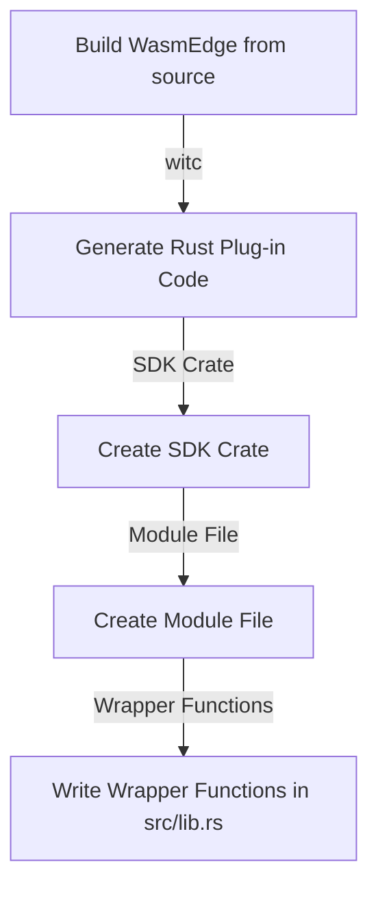

# 使用 Rust SDK 與 witc 開發 WasmEdge 外掛

藉由開發外掛,可以擴充 WasmEdge 的功能並依特定需求進行自訂。WasmEdge 提供了以 Rust 為基礎的 API 來註冊擴充模組與主機函式。



<!-- prettier-ignore -->
:::note
建議開發者選擇 WasmEdge [C API](develop_plugin_c.md) 進行外掛開發,因為 WasmEdge 執行環境提供了支援、相容性與彈性。
:::

## 設定開發環境

要開始開發 WasmEdge 外掛,正確設定開發環境是不可或缺的。本節提供 WasmEdge 外掛開發的逐步說明 -

- **從原始碼建置 WasmEdge**: 要以 C++ 開發 WasmEdge 外掛,您必須從原始碼建置 WasmEdge。請依照[從原始碼建置 WasmEdge](../source/build_from_src.md) 中的說明進行。一旦完成 C++ 外掛程式碼後,您可以使用 witc[^1] 來產生 Rust 外掛 SDK。

安裝 WasmEdge 後,您需要設定建置環境。如果您使用 Linux 或其他平台,您可以遵循[建置環境設定指南](../source/os/linux.md)中的說明。

## 撰寫外掛程式碼

要使用 witc 工具以 Rust 開發 WasmEdge 外掛,您可以依照下列步驟:

- **產生 Rust 外掛程式碼**: 假設您有一個名為 `wasmedge_opencvmini.wit` 的檔案,包含下列內容:

  ```wit
  imdecode: func(buf: list<u8>) -> u32
  imshow: func(window-name: string, mat-key: u32) -> unit
  waitkey: func(delay: u32) -> unit
  ```

  您可以使用 witc 工具透過執行下列指令為其產生 Rust 外掛程式碼:

  ```shell
  witc plugin wasmedge_opencvmini.wit
  ```

- **建立 SDK Crate**: 您需要為您的外掛建立 SDK crate。執行下列指令以建立名為 `opencvmini-sdk` 的新 crate:

  ```shell
  cargo new --lib opencvmini-sdk && cd opencvmini-sdk
  ```

- **建立模組檔案**: witc 工具會將 Rust 程式碼輸出至 stdout。要擷取產生的程式碼,請建立名為 `src/generated.rs` 的新模組檔案,並執行下列指令:

  ```shell
  witc plugin wasmedge_opencvmini.wit > src/generated.rs
  ```

- **撰寫包裝函式**: 在您 crate 的 `src/lib.rs` 檔案中,撰寫下列 `mod generated` 程式碼以存取產生的程式碼並建立包裝函式:

  ```rust
  mod generated;

  pub fn imdecode(buf: &[u8]) -> u32 {
      unsafe { generated::imdecode(buf.as_ptr(), buf.len()) }
  }
  pub fn imshow(window_name: &str, mat_key: u32) -> () {
      unsafe { generated::imshow(window_name.as_ptr(), window_name.len(), mat_key) }
  }
  pub fn waitkey(delay: u32) -> () {
      unsafe { generated::waitkey(delay) }
  }
  ```

  此程式碼匯入產生的模組並為每個產生的函式提供安全的包裝函式。

[^1]: <https://github.com/second-state/witc>
