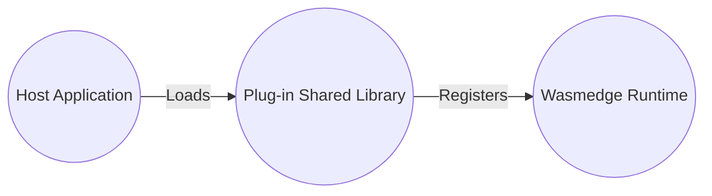
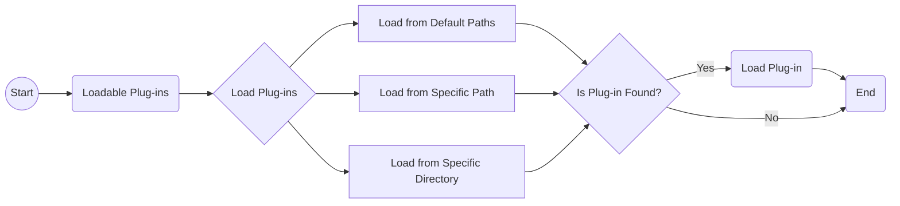

# WasmEdge 外掛系統介紹

雖然 WasmEdge 語言 SDK 允許從主機 (包裝) 應用程式註冊主機函式,但開發者必須在編譯前實作主機函式。為了讓主機函式擴充更具彈性與動態性,WasmEdge 提供了外掛架構以載入外掛共用函式庫。

WasmEdge 外掛是擴充 WasmEdge 執行環境功能的軟體元件。目前,開發者可遵循以下指南以 [C API](develop_plugin_c.md) (建議)、[C++](develop_plugin_cpp.md) 與 [Rust](develop_plugin_rustsdk.md) 實作外掛。藉由支援語言的 WasmEdge SDK,開發者可從外掛共用函式庫載入並註冊主機函式,讓他們能夠將外掛無縫整合至 WasmEdge 執行環境中,如同它們是核心執行環境的一部分一般。

## 使用 WasmEdge 外掛的優點

WasmEdge 外掛旨在擴充 WasmEdge 執行環境的功能,且能在多方面對開發者與終端使用者有所助益:

- **可自訂性:** WasmEdge 外掛可依專案的特定需求進行自訂。開發者可以建立與其他系統或工具整合的外掛,或提供核心 WasmEdge 執行環境中無法取得的獨特功能。

- **效能:** WasmEdge 外掛旨在與核心執行環境無縫運作,將額外負擔最小化並使效能最大化,這意味著它們可在不犧牲效能的情況下提供額外功能。

- **易用性:** WasmEdge 外掛容易使用,並可與 WasmEdge 執行環境整合。開發者可以將外掛載入執行環境並將其函式作為核心執行環境的一部分使用。

- **可擴展性:** 開發者可以將計算密集型函式編譯為主機函式並封裝為外掛,以提供如同以原生程式碼執行的更佳效能。

WasmEdge 外掛能為開發者與使用者提供一種多功能、可自訂、高效能且安全的方式來擴充 WasmEdge 執行環境的功能。WasmEdge 外掛還能改善可擴展性與易用性,使在邊緣裝置上建構與部署複雜應用程式變得更容易。

## 可載入外掛

可載入外掛是獨立的共用函式庫 (`.so`/`.dylib`/`.dll` 檔案),WasmEdge 執行環境可在執行時載入。這些外掛可為 WasmEdge 執行環境提供額外功能,例如可由 WebAssembly 模組匯入的新模組。

### 建立可載入外掛

要為 WasmEdge 建立可載入外掛,開發者可使用 WasmEdge 外掛 SDK,該 SDK 提供一組用於建立與註冊外掛的 Rust、C 與 C++ API。SDK 也包含[範例程式碼](https://github.com/WasmEdge/WasmEdge/tree/master/examples/plugin/get-string),展示如何建立會回傳字串的簡單外掛。透過遵循所提供的範例並運用 SDK 的 API,開發者可以快速建構符合其特定需求的自訂外掛。

### 從路徑載入外掛

要使用可載入外掛,開發者需從特定路徑將它們載入 WasmEdge 執行環境中。載入流程包含下列步驟:

- 可呼叫 `WasmEdge_PluginLoadWithDefaultPaths()` API 從預設路徑載入可載入外掛。預設路徑包括:

  - 環境變數 `WASMEDGE_PLUGIN_PATH` 中指定的路徑。
  - 相對於 WasmEdge 安裝路徑的 `./plugin/` 目錄。
  - 若 WasmEdge 安裝於系統目錄 (例如 `/usr` 與 `/usr/local`),則為函式庫路徑下的 `./wasmedge/` 目錄。

- 如果外掛位於特定路徑或目錄,開發者可使用 `WasmEdge_PluginLoadFromPath("PATH_TO_PLUGIN/plug-in.so")` API 從該特定位置載入外掛。

WasmEdge 執行環境將在指定路徑搜尋可載入外掛,如有找到則載入。

下方流程圖顯示了從特定路徑將可載入外掛載入 WasmEdge 執行環境的流程:

流程圖顯示將可載入外掛載入 WasmEdge 執行環境的流程。此流程包括在預設路徑、特定路徑或特定目錄中搜尋外掛。如果在這些位置中的任一處找到外掛,則會將其載入執行環境。此流程圖可協助開發者快速載入外掛並擴充 WasmEdge 執行環境的功能。

藉由遵循此流程圖,開發者可有效地從特定路徑將可載入外掛載入 WasmEdge 執行環境,依其需求擴充執行環境的功能。

## WasmEdge 目前已發行的外掛

使用者可從安裝程式安裝 [WasmEdge 官方發行的外掛](../../start/wasmedge/extensions/plugins.md),或從原始碼建置。
