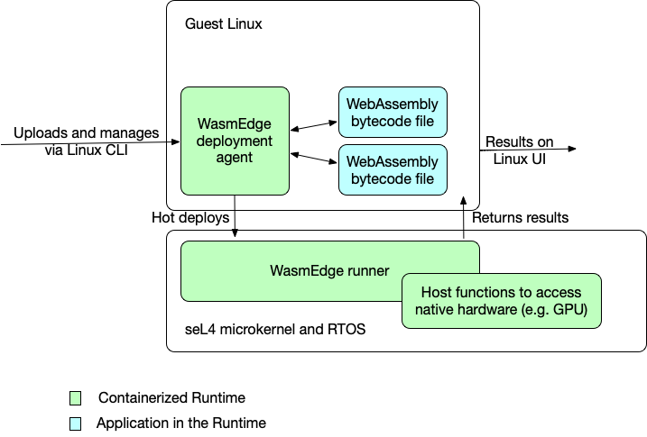

# 在 seL4 RTOS 上建置

[影片示範](https://youtu.be/2Qu-Trtkspk) | [建置記錄](https://github.com/second-state/wasmedge-seL4/runs/3982081148?check_suite_focus=true) | [建置產出](https://github.com/second-state/wasmedge-seL4/actions/runs/1374510169)

在本文中,我們示範如何在 seL4 RTOS 上執行 WasmEdge,包含兩個部分:

1. seL4 上的客體 Linux 作業系統:這是 WasmEdge 執行環境的控制器,會將 wasm 程式傳送至作為 seL4 上代理者的 WasmEdge 執行程式以執行。
2. seL4 上的 WasmEdge 執行程式:這是 wasm 程式執行環境,會執行由客體 Linux 作業系統送來的 wasm 程式。

下圖說明系統架構。



此示範以 Linux 上的 seL4 模擬器為基礎。

## 開始使用

### 系統需求

硬體:

- 至少 4GB RAM
- 至少 20GB 磁碟儲存空間 (完成下列安裝後,wasmedge_sel4 目錄將包含超過 11 GB 的資料)

軟體:已安裝開發工具套件 (例如 Python) 的 Ubuntu 20.04。我們建議使用 [GitHub Actions Ubuntu 20.04 VM](https://github.com/actions/virtual-environments/blob/main/images/linux/Ubuntu2004-README.md) (請參閱[已安裝的 apt 套件清單](https://github.com/actions/virtual-environments/blob/main/images/linux/Ubuntu2004-README.md#installed-apt-packages))。或者,您可以使用我們的 Docker 映像檔 (請參閱 [Dockerfile](https://github.com/second-state/wasmedge-seL4/blob/main/docs/Dockerfile.sel4_build))。

```bash
$ docker pull wasmedge/sel4_build
$ docker run --rm -v $(pwd):/app -it wasmedge/sel4_build
(docker) root#
```

<!-- prettier-ignore -->
:::note
如果您不想自行建置 seL4 系統模擬器,可以從我們的 GitHub Actions 下載 [建置產出](https://github.com/second-state/wasmedge-seL4/actions/runs/1374510169),並直接跳至 [Boot wasmedge-seL4](#boot-wasmedge-sel4)
:::

### 自動安裝:一鍵式指令稿

使用我們的一鍵式建置指令稿:

```bash
wget -qO- https://raw.githubusercontent.com/second-state/wasmedge-seL4/main/build.sh | bash
```

這將會 clone 並建置我們在 seL4 上的 wasmedge 為映像檔。

建置指令稿完成後,您會有一個 `sel4_wasmedge` 資料夾。

如果此自動安裝順利完成,請跳過手動安裝資訊,並前往 [boot wasmedge-sel4](https://github.com/second-state/wasmedge-seL4#boot-wasmedge-sel4)

### 手動安裝:管理記憶體使用量

上方的一鍵式指令稿在大多數情況下都能運作。然而,如果您的系統資源吃緊並遇到例如 `ninja: build stopped: subcommand failed` 的錯誤,請注意您可以藉由明確地將 `-j` 參數傳遞至 `ninja` 指令 (位於 `build.sh` 檔案的最後一行) 來降低安裝的平行度。您看,Ninja 預設會執行最大量的平行處理程序,因此下列流程是一種明確設定/減少平行度的方式。

手動取得 `wasmedge-sel4` 儲存庫。

```bash
cd ~
git clone https://github.com/second-state/wasmedge-seL4.git
cd wasmedge-seL4
```

手動編輯 `build.sh` 檔案。

```bash
vi build.sh
```

將下列 `-j` 參數加入檔案最後一行,即:

```bash
ninja -j 2
```

讓 `build.sh` 檔案可執行。

```bash
sudo chmod a+x build.sh
```

執行編輯後的 `build.sh` 檔案。

```bash
./build.sh
```

此手動安裝完成後,請依照下列步驟操作;啟動 wasmedge-sel4

### 啟動 wasmedge-seL4

```bash
cd sel4_wasmedge/build
./simulate
```

預期輸出:

```bash
$ ./simulate: qemu-system-aarch64 -machine virt,virtualization=on,highmem=off,secure=off -cpu cortex-a53 -nographic  -m size=2048  -kernel images/capdl-loader-image-arm-qemu-arm-virt
ELF-loader started on CPU: ARM Ltd. Cortex-A53 r0p4
  paddr=[6abd8000..750cf0af]
No DTB passed in from boot loader.
Looking for DTB in CPIO archive...found at 6ad18f58.
Loaded DTB from 6ad18f58.
   paddr=[60243000..60244fff]
ELF-loading image 'kernel' to 60000000
  paddr=[60000000..60242fff]
  vaddr=[ff8060000000..ff8060242fff]
  virt_entry=ff8060000000
ELF-loading image 'capdl-loader' to 60245000
  paddr=[60245000..6a7ddfff]
  vaddr=[400000..a998fff]
  virt_entry=408f38
Enabling hypervisor MMU and paging
Jumping to kernel-image entry point...

Bootstrapping kernel
Warning: Could not infer GIC interrupt target ID, assuming 0.
Booting all finished, dropped to user space
<<seL4(CPU 0) [decodeUntypedInvocation/205 T0xff80bf85d400 "rootserver" @4006f8]: Untyped Retype: Insufficient memory (1 * 2097152 bytes needed, 0 bytes available).>>
Loading Linux: 'linux' dtb: 'linux-dtb'

...(omitted)...

Starting syslogd: OK
Starting klogd: OK
Running sysctl: OK
Initializing random number generator... [    3.512482] random: dd: uninitialized urandom read (512 bytes read)
done.
Starting network: OK
[    4.086059] connection: loading out-of-tree module taints kernel.
[    4.114686] Event Bar (dev-0) initalised
[    4.123771] 2 Dataports (dev-0) initalised
[    4.130626] Event Bar (dev-1) initalised
[    4.136096] 2 Dataports (dev-1) initalised

Welcome to Buildroot
buildroot login:
```

### 在客體 Linux 上登入

輸入 `root` 登入

```bash
buildroot login: root
```

預期輸出:

```bash
buildroot login: root
#
```

### 執行 wasm 範例

#### 範例 A:nbody-c.wasm

執行 nbody 模擬。

```bash
wasmedge_emit /usr/bin/nbody-c.wasm 10
```

預期輸出:

```bash
[1900-01-00 00:00:00.000] [info] executing wasm file
-0.169075164
-0.169073022
[1900-01-00 00:00:00.000] [info] execution success, exit code:0
```

#### 範例 B:hello.wasm

執行一個簡單的應用程式以印出 `hello, sel4` 與一個簡單計算。

```bash
wasmedge_emit /usr/bin/hello.wasm
```

預期輸出:

```bash
[1900-01-00 00:00:00.000] [info] executing wasm file
hello, sel4
1+2-3*4 = -9
[1900-01-00 00:00:00.000] [info] execution success, exit code:0
```
