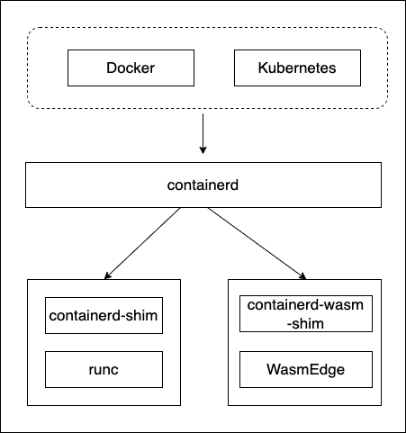
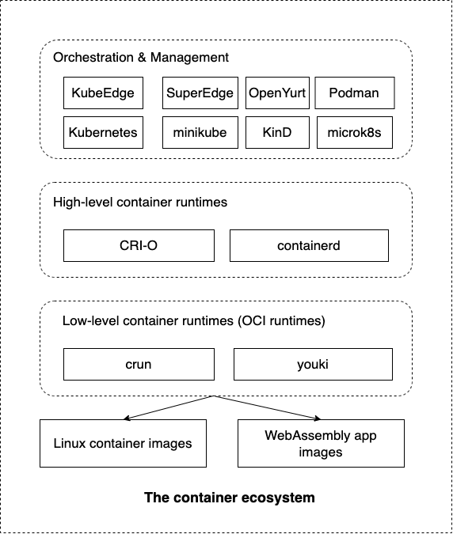

# 簡介

WasmEdge 可以無縫整合至既有的雲端原生基礎架構中。因此開發者可以運用 Kubernetes、Docker 與 CRI-O 等容器工具來部署、管理並執行輕量化的 WebAssembly 應用程式。本章將示範 Kubernetes 生態系工具如何與 WasmEdge WebAssembly 應用程式協同運作。

在 Kubernetes 之下,管理 WASM 應用程式作為「容器」有數種選項可用。這兩種方式都會給你一個能同時並行執行 Linux 容器與 WASM 容器的 Kubernetes 叢集。

## 透過 containerd-shim

選項 #1 是使用 containerd-shim 透過 runwasi 來啟動 WASM「容器」。基本上 containerd 會檢視映像檔的目標平台。若映像檔為 wasm32 就會使用 runwasi,若是 x86 / arm 則使用 runc。目前 Docker 與 Microsoft 偏好此方式,這也是 [Docker + WASM preview](https://www.docker.com/blog/docker-wasm-technical-preview/) 的基礎。以 containerd 為基礎。

下圖說明其運作方式。

## 透過 crun

選項 #2 是使用名為 crun 的 OCI 執行環境(runc 的 C 語言版本,主要由 Red Hat 支援)。crun 會根據映像檔註記判斷 OCI 映像檔是 wasm 還是 Linux。若映像檔被註記為 wasm32,crun 就會建立一個容器並使用內嵌的 WasmEdge 來執行它。基於 crun,我們可以讓整個 Kubernetes 技術堆疊(CRI-O、containerd、Podman、kind、micro k8s、k8s 等)能搭配 WASM 映像檔運作。

## 透過 youki

選項 #3 是使用名為 youki 的 OCI 執行環境(runc 的 Rust 版本)。如同 crun,youki 會依據映像檔註記判斷 OCI 映像檔是 wasm 還是 Linux。若映像檔被註記為 wasm32,youki 就會建立一個容器並使用內嵌的 WasmEdge 來執行它。基於 youki,我們可以讓整個 Kubernetes 技術堆疊(CRI-O、containerd、Podman、kind、micro k8s、k8s 等)能搭配 WASM 映像檔運作。

crun 與 youki 兩者都可以用下圖來說明其運作方式。

## 我們涵蓋的範例

本節將以三種不同方式示範如何管理 WASM 應用程式。目標是在整個 Kubernetes 技術堆疊中,讓 WebAssembly OCI 映像檔能與 Linux OCI 映像檔(例如目前的 Docker 容器)一同載入與執行。

在大多數情況下,我們會涵蓋兩個不同的示範。我們以 Rust 原始碼建置它們,圍繞它們建構 OCI 映像檔,然後將其發佈至 Docker Hub。你可以在[此處](https://github.com/second-state/wasmedge-containers-examples)找到更多容器範例。

- [一個簡單的 WASI 範例](https://github.com/second-state/wasmedge-containers-examples/blob/main/simple_wasi_app.md)
- [一個 HTTP 伺服器範例](https://github.com/second-state/wasmedge-containers-examples/blob/main/http_server_wasi_app.md)

由於我們已經建置並發佈這些示範應用程式至 Docker Hub,你也可以直接從 Docker Hub 拉取映像檔。若你想建置自己的 WASM 映像檔,請參考此文章。

由於我們已經建置並發佈這些示範應用程式至 Docker Hub,你也可以直接跳到容器執行環境章節來使用這些映像檔。

讓我們開始吧。
