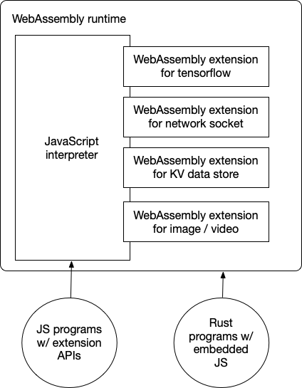

# 介紹

WebAssembly 最初是作為「瀏覽器中的 JavaScript 替代方案」而誕生。其理念是在瀏覽器中安全地執行由 C/C++ 或 Rust 等語言編譯而成的高效能應用程式。在瀏覽器中，WebAssembly 與 JavaScript 並肩執行。

隨著 WebAssembly 在雲端的應用日益廣泛，現在它已成為雲端原生應用程式的通用執行環境。相較於 Linux 容器，WebAssembly 執行環境能以更低的資源消耗達成更高的效能。

在雲端原生的使用情境中，開發者通常希望使用 JavaScript 來撰寫商業應用程式。這意味著我們現在必須在 WebAssembly 中支援 JavaScript。此外，為了最大化 WebAssembly 的運算效率，我們也應該支援在 WebAssembly 執行環境中從 JavaScript 呼叫 C/C++ 或 Rust 函式。WasmEdge WebAssembly 執行環境讓您能夠做到這些事情。

## 為何在 WasmEdge 中執行 JavaScript

- 輕量且安全的 JS 執行環境。相較於 V8 與 Node.js，WasmEdge 本身就是一個輕量、高效能的 JavaScript 執行環境。
- 不需要 Linux 容器。WasmEdge 可作為一個沒有大量相依性的安全容器。
- 相容於 Node.js。可在[這裡](https://github.com/WasmEdge/WasmEdge/issues/1535)查看相容狀態。
- 使用 Rust 實作 JS API。請參閱此處的教學。

本節將示範如何在 WasmEdge 中執行並強化 JavaScript。

- [入門指南](hello_world)示範如何在 WasmEdge 中執行簡單的 JavaScript 程式。
- [網路 socket](networking) 示範如何在 JavaScript 中建立非阻塞（非同步）HTTP 用戶端（包括 `fetch` API）以及伺服器應用程式。
- [Node.js 相容性](nodejs)說明 WasmEdge QuickJS 對 Node.js API 的支援。
- [ES6 模組](es6)示範如何在 WasmEdge 中加入 ES6 模組。
- [Node.js 與 NPM 模組](npm)示範如何在 WasmEdge 中加入 NPM 模組。
- [內建模組](modules)示範如何將 JavaScript 函式作為內建 API 函式加入 WasmEdge 執行環境。
- [使用 Rust 實作 JS API](rust) 討論如何使用 Rust 實作並支援 JavaScript API。
- [React SSR](ssr) 示範包含串流 SSR 支援的 React SSR 應用程式範例。

## 關於 v8 的說明

選擇 QuickJS 作為我們的 JavaScript 引擎可能會引發效能上的疑問。由於缺乏 JIT 支援，QuickJS 不是[比 v8 慢很多嗎](https://bellard.org/quickjs/bench.html)？是的，但是……

首先，QuickJS 比 v8 小得多。它只佔用 v8 所消耗執行環境資源的 1/40（或 2.5%）。在單一實體機器上，您可以執行的 QuickJS 函式數量遠多於 v8 函式。

其次，對於大多數商業邏輯應用程式而言，原始效能並非關鍵。應用程式可能會有運算密集的任務，例如即時 AI 推論。WasmEdge 允許 QuickJS 應用程式對這些任務下放至高效能的 WebAssembly，而在 v8 中加入此類擴充模組則更具挑戰性。

第三，WasmEdge 本身就是[一個符合 OCI 規範的容器](../deploy/intro)。它預設安全、支援資源隔離，並可由容器工具管理，與 Linux 容器一起在單一 k8s 叢集中執行。

最後，v8 的攻擊面非常大，要在公有雲環境中安全執行它需要[相當的努力](https://blog.cloudflare.com/mitigating-spectre-and-other-security-threats-the-cloudflare-workers-security-model/)。眾所周知，[許多 JavaScript 安全性問題源自 JIT](https://www.theregister.com/2021/08/06/edge_super_duper_security_mode/)。或許在雲端原生環境中關閉 JIT 並不是壞主意！

最終，要在雲端原生環境中執行 v8，往往需要由「Linux 容器 + 客體作業系統 + node 或 deno + v8」組成的整套軟體工具，這使得它比簡單的 WasmEdge + QuickJS 容器執行環境更加沉重且緩慢。
