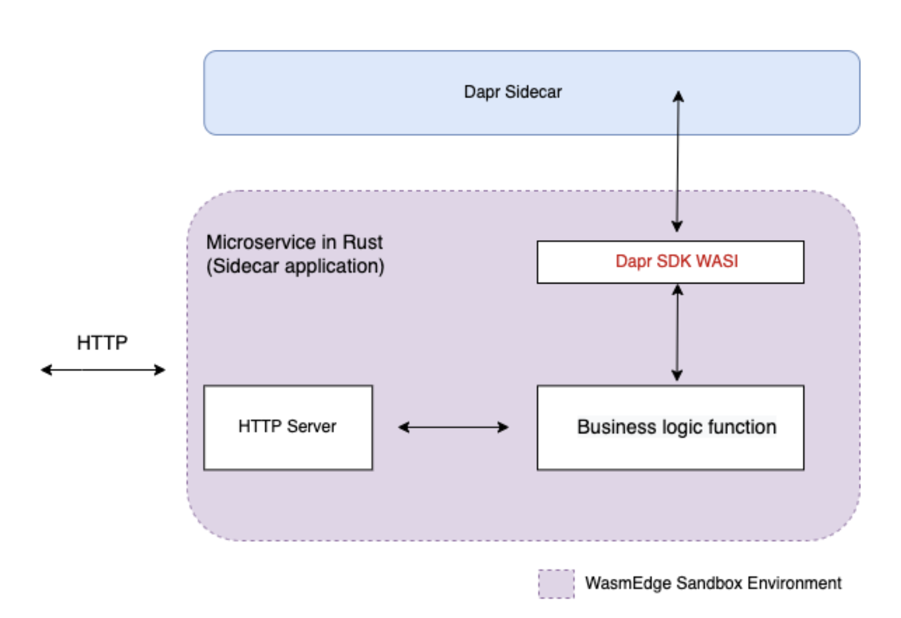
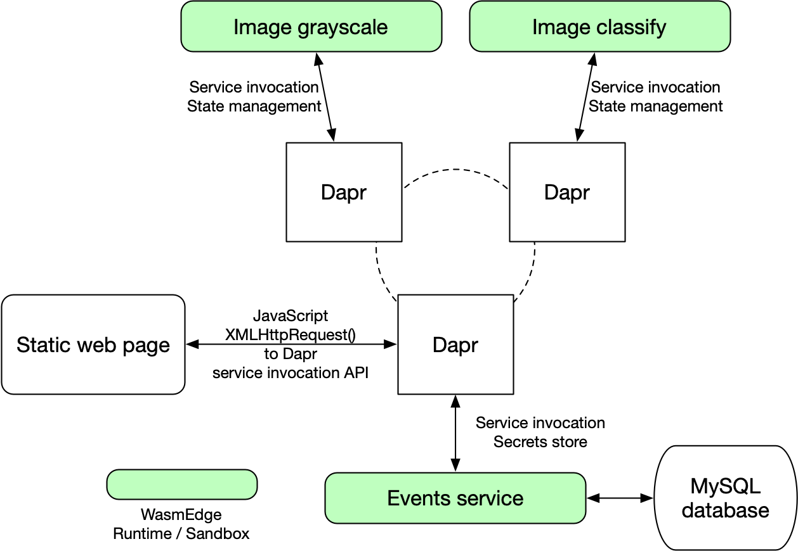

# Dapr 服務

Second State 推出了一個全新的[基於 WebAssembly 的 Dapr API SDK](https://github.com/second-state/dapr-sdk-wasi)，提供了一種簡單的方式讓 WasmEdge 中以 Rust 撰寫的微服務能與 Dapr API 及 sidecar 服務互動。

下圖顯示了一個執行在 WasmEdge 沙箱中、且具備 Dapr 能力的微服務。



## 必要條件

開始之前，請確認[您已安裝 Rust 與 WasmEdge](setup.md)。

您還需要安裝下列工具：

- [安裝 Dapr CLI](https://docs.dapr.io/getting-started/install-dapr-cli/)
- 安裝 [MySQL](https://dev.mysql.com/doc/mysql-installation-excerpt/5.7/en/) 或 [MariaDB](https://mariadb.com/kb/en/getting-installing-and-upgrading-mariadb/) 或 [TiDB](https://docs.pingcap.com/tidb/dev/quick-start-with-tidb) 資料庫

## 範本專案說明

這個範本應用程式展示了 [Dapr](https://dapr.io/) 與 [WasmEdge](https://github.com/WasmEdge/) 如何在雲端原生環境中協同合作，以支援[基於 WebAssembly 的輕量級微服務](https://github.com/second-state/microservice-rust-mysql)。所有的微服務皆以 Rust 撰寫並編譯為 WebAssembly。

此應用程式由三個微服務與一個獨立的網頁所組成，使用者可透過 HTML+JavaScript UI 與這些微服務互動。這是一個非常典型的 JAMstack 配置。每個微服務都會附加一個 Dapr sidecar，由其提供雲端原生微服務常用的一系列有用服務。



WasmEdge 的 Dapr SDK 用於從微服務應用程式存取 Dapr sidecar。具體而言，[grayscale](https://github.com/second-state/dapr-wasm/tree/main/image-api-grayscale) 微服務會從 HTTP POST 接收圖片、將其轉換為灰階，並在 HTTP 回應中回傳結果圖片資料。

- 它使用 Dapr 來探索並呼叫 [events](https://github.com/second-state/dapr-wasm/tree/main/events-service) 微服務，以記錄每次成功的使用者請求。
- 它還會在其 Dapr sidecar 的狀態資料庫中儲存每位使用者的 IP 位址與最後時間戳記資料。如此一來，必要時可以對使用者進行頻率限制。

[classify](https://github.com/second-state/dapr-wasm/tree/main/image-api-classify) 微服務會從 HTTP POST 接收圖片，並對其執行 Tensorflow 模型以分類圖片中的物件，然後在 HTTP 回應中以文字標籤回傳結果。您可以在[此處](/category/ai-inference)進一步了解 Rust 與 WasmEdge 的 AI 推論。它使用自己的 Dapr sidecar，方式與 [grayscale](https://github.com/second-state/dapr-wasm/tree/main/image-api-grayscale) 微服務相同。

[events](https://github.com/second-state/dapr-wasm/tree/main/events-service) 微服務會從 HTTP POST 接收 JSON 資料，並將其儲存至外部的 MySQL 資料庫供日後分析。

- 它使用 Dapr 讓其他需要記錄事件的微服務可透過名稱發現它。
- 它也使用其 Dapr sidecar 來儲存 MySQL 資料庫憑證之類的機密。

好，這個範本專案的概念就介紹到這裡。我們接著開始實作。

[線上範例](http://dapr-demo.secondstate.co) | [教學影片](https://www.youtube.com/watch?v=3v37pAT9iK8)

## 在 Dapr 中建置與部署這些微服務

首先，啟動資料庫，並將連線字串放入 [config/secrets.json](https://github.com/second-state/dapr-wasm/blob/main/config/secrets.json) 檔案中 `DB_URL:MYSQL` 之下。

接著，使用下列命令啟動 Dapr。

```bash
dapr init
```

### 圖片灰階微服務

建置。

```bash
cd image-api-grayscale
cargo build --target wasm32-wasip1 --release
wasmedgec ./target/wasm32-wasip1/release/image-api-grayscale.wasm image-api-grayscale.wasm
```

部署。

```bash
dapr run --app-id image-api-grayscale \
        --app-protocol http \
        --app-port 9005 \
        --dapr-http-port 3503 \
        --components-path ../config \
        --log-level debug \
 wasmedge image-api-grayscale.wasm
```

### 圖片分類微服務

建置。

```bash
cd image-api-classify
cargo build --target wasm32-wasip1 --release
wasmedgec target/wasm32-wasip1/release/wasmedge_hyper_server_tflite.wasm wasmedge_hyper_server_tflite.wasm
```

部署。

```bash
dapr run --app-id image-api-classify \
        --app-protocol http \
        --app-port 9006 \
        --dapr-http-port 3504 \
        --log-level debug \
        --components-path ../config \
        wasmedge-tensorflow-lite wasmedge_hyper_server_tflite.wasm
```

### 事件記錄微服務

建置。

```bash
cd events-service
cargo build --target wasm32-wasip1 --release
wasmedgec target/wasm32-wasip1/release/events_service.wasm events_service.wasm
```

部署。

```bash
dapr run --app-id events-service \
        --app-protocol http \
        --app-port 9007 \
        --dapr-http-port 3505 \
        --log-level debug \
        --components-path ../config \
        wasmedge events_service.wasm
```

## 測試

若要測試這些服務，您可以使用[靜態網頁 UI](http://dapr-demo.secondstate.co/) 或 `curl`。

初始化事件資料庫表格。

```bash
$ curl http://localhost:9007/init
{"status":true}

$ curl http://localhost:9007/events
[]
```

使用灰階微服務。回傳的資料是經過 base64 編碼的灰階圖片。

```bash
$ cd docs
$ curl http://localhost:9005/grayscale -X POST --data-binary '@food.jpg'
ABCDEFG ...
```

使用圖片分類微服務。

```bash
$ cd docs
$ curl http://localhost:9006/classify -X POST --data-binary '@food.jpg'
hotdog is detected with 255/255 confidence
```

再次查詢事件資料庫。

```bash
$ curl http://localhost:9007/events
[{"id":1,"event_ts":1665358852918,"op_type":"grayscale","input_size":68016},{"id":2,"event_ts":1665358853114,"op_type":"classify","input_size":68016}]
```

接下來，您可以使用 WasmEdge 與 WasmEdge 的 Dapr Rust API 來建立具有更佳安全性、更快效能與更小體積的輕量級微服務。
