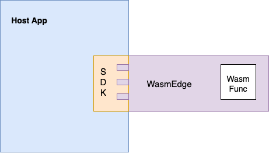

# 在你的應用程式中嵌入 WasmEdge

如同前面提到的,WasmEdge 最重要的使用情境是在軟體產品中安全地執行使用者自訂或社群貢獻的程式碼作為外掛。這讓第三方開發者、廠商、供應商與社群成員能夠擴充並客製化軟體產品。

我們可以將 WasmEdge 當作獨立容器使用,並透過既有的容器工具來部署 WasmEdge。另一種方式是把 WasmEdge 當作嵌入式執行環境,並透過主機應用程式來管理 WasmEdge。

WasmEdge 提供多種程式語言的 SDK。WasmEdge 函式庫讓開發者能將 WasmEdge 嵌入到自己的主機應用程式中,如此一來 WebAssembly 應用程式便可以在 WasmEdge 沙箱中安全地執行。此外,開發者還可以利用 WasmEdge 函式庫實作主機函式來延伸功能。

在本章中,我們將帶你了解如何在不同語言中嵌入 WasmEdge。我們會涵蓋以下內容:

- [快速開始](/category/quick-start)
- [傳遞複雜資料](/category/passing-complex-data)
- [使用 witc 開發元件](witc.md)
- [在 C/C++ 中嵌入 WasmEdge](/category/c-sdk-for-embedding-wasmedge)
- [在 Rust 中嵌入 WasmEdge](/category/rust-sdk-for-embedding-wasmedge)
- [在 Go 中嵌入 WasmEdge](/category/go-sdk-for-embedding-wasmedge)
- [在 Java 中嵌入 WasmEdge](/category/java-sdk-for-embedding-wasmedge)
- [在 Python 中嵌入 WasmEdge](/category/python-sdk-for-embedding-wasmedge)
- [使用案例](/category/use-cases)

除此之外,我們還提供另外兩份指南:[開發 WASM 應用程式](../develop/overview.md)以及[貢獻 WasmEdge](../contribute/overview.md)。
