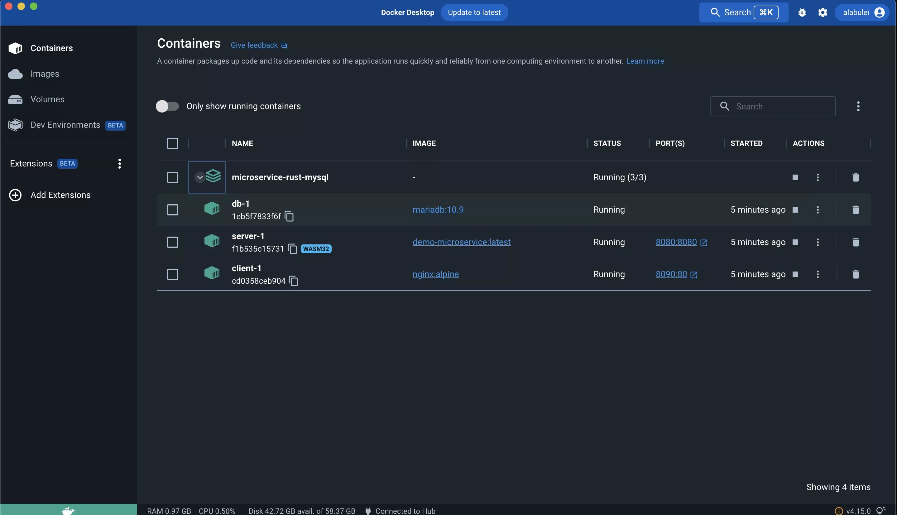

# Docker + WASM

Docker Desktop 內建了 WasmEdge Runtime,讓開發者可以透過 Docker 工具建置、分享並執行極為輕量的容器(例如一個僅包含 `.wasm` 檔案、不含任何 Linux OS 函式庫或檔案的 `scratch` 空容器)。這些「WASM 容器」完全符合 OCI 規範,因此可透過 Docker Hub 管理。它們是跨平台的,可以在 Docker 支援的任何 OS / CPU 上執行(OS 與 CPU 平台為 `wasi/wasm`)。但最重要的是,它們的大小只有相同 Linux 容器的 1/10,啟動時間也只有 1/10,因為 WASM 容器不需要打包並啟動 Linux 函式庫與服務。

結合 Docker 將開發與部署環境容器化的能力,您可以建立並部署複雜的應用程式,而無需安裝任何相依套件。例如,您可以設定一個完整的 Rust 與 WasmEdge 開發環境,而無需在本機開發機器上安裝任何工具。您也可以部署一個需要連接 MySQL 資料庫的複雜 WasmEdge 應用程式,而無需在本機安裝 MySQL。

在本指南中,我們將說明如何:

- [建立並執行 Rust 程式](#create-and-run-a-rust-program)
- [建立並執行 node.js 伺服器](#create-and-run-a-nodejs-server)
- [以 Rust 建立並部署資料庫驅動的微服務](#create-and-deploy-a-database-driven-microservice-in-rust)

## 先決條件

安裝 [Docker Desktop](https://www.docker.com/products/docker-desktop/),並在 Docker Desktop 設定中開啟 containerd 映像檔儲存功能。


## 建立並執行 Rust 程式

透過 Docker + WASM,您可以在 Docker 容器中使用整套 Rust 工具鏈來建置 WASM 位元組碼應用程式,然後發行並執行該 WASM 應用程式。[Rust 範例原始碼與建置說明請參考此處](https://github.com/second-state/rust-examples/tree/main/hello)。

### 建置 Rust 範例

在專案目錄中,執行以下指令將 Rust 原始碼建置為 WASM,然後把 WASM 檔案打包為空的容器映像檔。注意您不需要在此安裝 Rust 編譯器工具鏈。

```bash
docker buildx build --platform wasi/wasm -t secondstate/rust-example-hello .
```

[Dockerfile](https://github.com/second-state/rust-examples/blob/main/hello/Dockerfile) 展示了如何完成此操作。此 Dockerfile 分為三個部分。第一個部分為 Rust 建置環境設定 Docker 容器。

```dockerfile
FROM --platform=$BUILDPLATFORM rust:1.64 AS buildbase
WORKDIR /src
RUN <<EOT bash
    set -ex
    apt-get update
    apt-get install -y \
        git \
        clang
    rustup target add wasm32-wasip1
EOT
```

第二個部分使用 Rust 建置環境編譯 Rust 原始碼並產生 WASM 檔案。

```dockerfile
FROM buildbase AS build
COPY Cargo.toml .
COPY src ./src
# Build the WASM binary
RUN cargo build --target wasm32-wasip1 --release
```

第三個部分是核心。它將 WASM 檔案複製到空的 `scratch` 容器中,然後將 WASM 檔案設為容器的 `ENTRYPOINT`。這就是本節指令所建置的容器映像檔 `rust-example-hello`。

```dockerfile
FROM scratch
ENTRYPOINT [ "hello.wasm" ]
COPY --link --from=build /src/target/wasm32-wasip1/release/hello.wasm /hello.wasm
```

此 WASM 容器映像檔只有 0.5MB,比在最小化 Linux 容器中以原生方式編譯的 Rust 程式小得多。

### 發行 Rust 範例

若要將 WASM 容器映像檔發行到 Docker Hub,請執行以下指令。

```bash
docker push secondstate/rust-example-hello
```

### 執行 Rust 範例

您可以使用一般的 Docker `run` 指令來執行 WASM 容器應用程式。請注意,您需要指定 `runtime` 與 `platform` 旗標,讓 Docker 知道這不是 Linux 容器,需要由 WasmEdge 執行。

```bash
$ docker run --rm --runtime=io.containerd.wasmedge.v1 --platform=wasi/wasm secondstate/rust-example-hello:latest
Hello WasmEdge!
```

就是這樣。

### Rust 範例的延伸閱讀

若要查看更多 WasmEdge 的 Dockerized Rust 範例應用程式,請參考以下內容。

- [使用 Rust 標準函式庫](https://github.com/second-state/rust-examples/tree/main/wasi)
- [在 hyper 與 tokio 中建立 HTTP 伺服器](https://github.com/second-state/rust-examples/tree/main/server)

## 建立並執行 node.js 伺服器

WasmEdge 提供與 node.js 相容的 JavaScript 執行環境。您可以建立執行 node.js 應用程式的輕量 WASM 容器映像檔。與標準 node.js Linux 容器映像檔相比,WASM 映像檔大小僅為 1/100、完全可攜,且啟動時間僅需 1/10。

在本指南中,範例應用程式是一個以 node.js 撰寫的 HTTP 網頁伺服器。其 [原始碼與建置說明請參考此處](https://github.com/second-state/wasmedge-quickjs/tree/main/example_js/docker_wasm/server)。

### 建置 node.js 範例

在專案目錄中,執行以下指令將 WasmEdge JavaScript 執行環境與 JS HTTP 伺服器程式打包成空的容器映像檔。

```bash
docker buildx build --platform wasi/wasm -t secondstate/node-example-hello .
```

[Dockerfile](https://github.com/second-state/wasmedge-quickjs/blob/main/example_js/docker_wasm/server/Dockerfile) 展示了如何完成此操作。此 Dockerfile 分為三個部分。第一個部分為 `wget` 與 `unzip` 工具設定 Docker 容器。

```dockerfile
FROM --platform=$BUILDPLATFORM rust:1.64 AS buildbase
WORKDIR /src
RUN <<EOT bash
    set -ex
    apt-get update
    apt-get install -y \
        wget unzip
EOT
```

第二個部分使用 `wget` 與 `unzip` 下載並解壓縮 WasmEdge JavaScript 執行環境檔案以及 JS 應用程式檔案到建置容器中。

```dockerfile
FROM buildbase AS build
COPY server.js .
RUN wget https://github.com/second-state/wasmedge-quickjs/releases/download/v0.5.0-alpha/wasmedge_quickjs.wasm
RUN wget https://github.com/second-state/wasmedge-quickjs/releases/download/v0.5.0-alpha/modules.zip
RUN unzip modules.zip
```

第三個部分是核心。它將 WasmEdge JavaScript 執行環境檔案與 JS 應用程式檔案複製到空的 `scratch` 容器中,然後設定 `ENTRYPOINT`。這就是本節指令所建置的容器映像檔 `node-example-hello`。

```dockerfile
FROM scratch
ENTRYPOINT [ "wasmedge_quickjs.wasm", "server.js" ]
COPY --link --from=build /src/wasmedge_quickjs.wasm /wasmedge_quickjs.wasm
COPY --link --from=build /src/server.js /server.js
COPY --link --from=build /src/modules /modules
```

整個 node.js 應用程式的 WASM 容器映像檔僅有 1MB,比標準 node.js 映像檔(300+MB)小得多。

### 發行 node.js 範例

若要將 WASM 容器映像檔發行到 Docker Hub,請執行以下指令。

```bash
docker push secondstate/node-example-hello
```

### 執行並測試 node.js 範例

您可以使用一般的 Docker `run` 指令來執行 WASM 容器應用程式。請注意,您需要指定 `runtime` 與 `platform` 旗標,讓 Docker 知道這不是 Linux 容器,需要由 WasmEdge 執行。由於這是一個 HTTP 伺服器應用程式,您也需要將容器的連接埠 8080 對應到主機,以便從容器外部存取伺服器。

```bash
$ docker run -dp 8080:8080 --rm --runtime=io.containerd.wasmedge.v1 --platform=wasi/wasm secondstate/node-example-server:latest
listen 8080 ...
```

從另一個終端機,測試伺服器應用程式。

```bash
$ curl http://localhost:8080/echo -X POST -d "Hello WasmEdge"
Hello WasmEdge
```

就是這樣。

### node.js 範例的延伸閱讀

- [使用 fetch() API](https://github.com/second-state/wasmedge-quickjs/blob/main/example_js/wasi_http_fetch.js)
- [使用 Tensorflow Lite 進行影像分類](https://github.com/second-state/wasmedge-quickjs/tree/main/example_js/tensorflow_lite_demo)

## 以 Rust 建立並部署資料庫驅動的微服務

Docker + wasm 讓我們能夠建置並執行 WASM 容器。然而,在大多數複雜的應用程式中,WASM 容器只是應用程式的一部分。它需要與系統中的其他 Linux 容器協同運作。[Docker compose](https://docs.docker.com/compose/) 工具被廣泛用於組合並管理多容器部署,並隨 Docker Desktop 一同安裝。

在我們的 [範例微服務應用程式](https://github.com/second-state/microservice-rust-mysql) 中,有一個 Nginx 網頁伺服器與一個 MySQL 資料庫。WASM 容器僅用於存取資料庫並處理 HTTP 請求的 Rust 應用程式(即應用程式伺服器)。

<!-- prettier-ignore -->
:::note
更多 Docker compose 範例,包含 Linux 容器 + WASM 容器混合部署,請參考 [awesome-compose](https://github.com/docker/awesome-compose) 儲存庫。
:::

### 建置微服務範例

在專案目錄中,執行以下指令以建置三個容器:`client`、`server` 與 `db`。

```bash
docker compose up
```

有一個 [docker-compose.yml](https://github.com/second-state/microservice-rust-mysql/blob/main/docker-compose.yml) 檔案,定義了此應用程式所需的 3 個容器。

```yaml
services:
  client:
    image: nginx:alpine
    ports:
      - 8090:80
    volumes:
      - ./client:/usr/share/nginx/html
  server:
    image: demo-microservice
    platform: wasi/wasm
    build:
      context: .
    ports:
      - 8080:8080
    environment:
      DATABASE_URL: mysql://root:whalehello@db:3306/mysql
      RUST_BACKTRACE: full
    restart: unless-stopped
    runtime: io.containerd.wasmedge.v1
  db:
    image: mariadb:10.9
    environment:
      MYSQL_ROOT_PASSWORD: whalehello
```

- `client` 容器是 Nginx 網頁伺服器
  - Linux 容器,對應了 HTTP 連接埠與靜態 HTML/JS 檔案的磁碟區
- `server` 容器是用於商業邏輯的 Rust 容器
  - WASM 容器由 [Rust 原始碼](https://github.com/second-state/microservice-rust-mysql/blob/main/src/main.rs) 透過此 [Dockerfile](https://github.com/second-state/microservice-rust-mysql/blob/main/Dockerfile) 建置
  - WASM 容器對應了網頁服務連接埠,並設有資料庫連線字串的環境變數
- `db` 容器是 MySQL 資料庫
  - Linux 容器,預先設定了資料庫密碼

### 部署微服務範例

以單一指令依照正確順序啟動並執行三個容器。

```bash
docker compose up
```

回到 Docker Desktop 儀表板,您會看到三個正在執行的容器。



### CRUD 測試

開啟另一個終端機,您可以使用 `curl` 指令與網頁服務互動。

當微服務收到對 `/init` 端點的 `GET` 請求時,它會以 `orders` 資料表初始化資料庫。

```bash
curl http://localhost:8080/init
```

當微服務收到對 `/create_order` 端點的 `POST` 請求時,它會從 `POST` 主體中擷取 JSON 資料,並將一筆 `Order` 記錄插入資料庫資料表中。對於多筆記錄,使用 `/create_orders` 端點並 `POST` 一個 `Order` 物件的 JSON 陣列。

```bash
curl http://localhost:8080/create_orders -X POST -d @orders.json
```

當微服務收到對 `/orders` 端點的 `GET` 請求時,它會從 `orders` 資料表取得所有列,並在 HTTP 回應中以 JSON 陣列回傳結果集。

```bash
curl http://localhost:8080/orders
```

當微服務收到對 `/update_order` 端點的 `POST` 請求時,它會從 `POST` 主體中擷取 JSON 資料,並更新資料庫資料表中 `order_id` 與輸入資料相符的 `Order` 記錄。

```bash
curl http://localhost:8080/update_order -X POST -d @update_order.json
```

當微服務收到對 `/delete_order` 端點的 `GET` 請求時,它會刪除 `orders` 資料表中 `id` 與 `GET` 參數相符的列。

```bash
curl http://localhost:8080/delete_order?id=2
```

就是這樣。歡迎 fork 此專案,並將其作為您自己輕量微服務的範本!

### 微服務範例的延伸閱讀

若要了解 Docker + WASM 的底層運作原理,請參考 [containerd](../../develop/deploy/cri-runtime/containerd.md) 章節以取得更多詳情。
