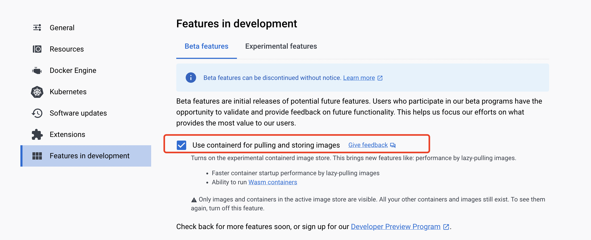

# Docker 快速入門

在本指南中,我們將引導您快速在 Docker Desktop 中執行 WasmEdge 應用程式。由於整個開發與執行環境都由 Docker Desktop 管理,因此不需要其他相依套件。

<!-- prettier-ignore -->
:::note
如果您並未使用 Docker Desktop,請從 [這裡開始](quick_start.md)。
:::

我們將涵蓋以下範例。

- [執行獨立的 WASM 應用程式](#run-a-standalone-wasm-app)
- [執行 HTTP 伺服器](#run-an-http-server)
- [執行 JavaScript 伺服器 (node.js)](#run-a-javascript-based-server)

在本快速入門指南中,我們將說明如何使用 Docker 指令執行 WASM 容器應用程式。如果您有興趣了解如何從原始碼建置、發行並組合 WASM 容器應用程式,請參考 [Docker + wasm 章節](../build-and-run/docker_wasm.md)。

## 先決條件

您必須安裝 Docker Desktop 4.15+。請確認您已在 Docker Desktop 中開啟 containerd 映像檔儲存功能。



## 執行獨立的 WASM 應用程式

Hello world 範例是一個獨立的 Rust 應用程式。其原始碼與建置說明請參考 [此處](https://github.com/second-state/rust-examples/tree/main/hello)。

使用 Docker 執行容器化的 WASM 應用程式。WASM 容器映像檔儲存在 Docker Hub 中,大小僅 500KB。此映像檔可以在 Docker 支援的任何 OS 與 CPU 平台上執行。

```bash
$ docker run --rm --runtime=io.containerd.wasmedge.v1 --platform=wasi/wasm secondstate/rust-example-hello:latest
Hello WasmEdge!
```

了解更多以 Rust 建立 WASM 應用程式的方式

- [WasmEdge 的基本 Rust 範例](https://github.com/second-state/rust-examples)
- [Rust 開發者指南](/category/develop-wasm-apps-in-rust)
  - WASI-NN 搭配 [PyTorch](../../develop/rust/wasinn/pytorch.md)、[OpenVINO](../../develop/rust/wasinn/openvino.md) 或 [Tensorflow Lite](../../develop/rust/wasinn/tensorflow_lite.md) 後端
  - [HTTP 與 HTTPS 用戶端](../../develop/rust/http_service/client.md)
  - [MySQL 資料庫用戶端](../../develop/rust/database/my_sql_driver.md)
  - Redis 用戶端
  - Kafka 用戶端

## 執行 HTTP 伺服器

此範例是一個以 Rust 撰寫的獨立 HTTP 伺服器。它展示了 Rust + WasmEdge 作為微服務輕量堆疊的能力。其原始碼與建置說明請參考 [此處](https://github.com/second-state/rust-examples/tree/main/server)。

使用 Docker 從 Docker Hub 拉取容器映像檔(約 800KB),然後在 WasmEdge 容器中執行。容器會以伺服器形式啟動。請注意,我們將容器的連接埠 8080 對應到本機主機的連接埠 8080,以便從 WASM 容器外部存取伺服器。

```bash
$ docker run -dp 8080:8080 --rm --runtime=io.containerd.wasmedge.v1 --platform=wasi/wasm secondstate/rust-example-server:latest
Listening on http://0.0.0.0:8080
```

從另一個終端機視窗,執行以下指令。

```bash
$ curl http://localhost:8080/
Try POSTing data to /echo such as: `curl localhost:8080/echo -XPOST -d 'hello world'`

$ curl http://localhost:8080/echo -X POST -d "Hello WasmEdge"
Hello WasmEdge
```

了解更多以 Rust 建立 WASM 服務的方式

- [Rust 開發者指南](/category/develop-wasm-apps-in-rust)
- [HTTP 應用程式範例](https://github.com/WasmEdge/wasmedge_hyper_demo)
- [資料庫應用程式範例](https://github.com/WasmEdge/wasmedge-db-examples)
- 以 Rust 與 WasmEdge 建立的輕量微服務
  - [WasmEdge + Nginx + MySQL](https://github.com/second-state/microservice-rust-mysql)
  - [WasmEdge + Kafka + MySQL](https://github.com/docker/awesome-compose/tree/master/wasmedge-kafka-mysql)
  - [Dapr + WasmEdge](https://github.com/second-state/dapr-wasm)

## 執行基於 JavaScript 的伺服器

此範例是一個使用 node.js API 以 JavaScript 撰寫的獨立 HTTP 伺服器。它展示了 WasmEdge 作為零相依、可攜的 node.js 應用程式輕量執行環境的能力。其原始碼請參考 [此處](https://github.com/second-state/wasmedge-quickjs/tree/main/example_js/docker_wasm/server)。

```bash
$ docker run -dp 8080:8080 --rm --runtime=io.containerd.wasmedge.v1 --platform=wasi/wasm secondstate/node-example-server:latest
... ...
```

從另一個終端機視窗,執行以下指令。

```bash
$ curl http://localhost:8080/echo -X POST -d "Hello WasmEdge"
Hello WasmEdge
```

了解更多在 WasmEdge 中執行 JavaScript 應用程式的方式。

- [WasmEdge QuickJS 執行環境](https://github.com/second-state/wasmedge-quickjs)
- [AI 推論應用程式範例](https://github.com/second-state/wasmedge-quickjs/tree/main/example_js/tensorflow_lite_demo)
- [使用 fetch() 的 Web 服務用戶端範例](https://github.com/second-state/wasmedge-quickjs/blob/main/example_js/wasi_http_fetch.js)

## 下一步

- [深入了解如何在 Docker 中建置與管理 WASM 容器](../build-and-run/docker_wasm.md)
- [WasmEdge 的基本 Rust 範例](https://github.com/second-state/rust-examples)
- 使用 Docker Compose 建置基於 Rust 的微服務
  - [WasmEdge / MySQL / Nginx](https://github.com/docker/awesome-compose/tree/master/wasmedge-mysql-nginx) - 範例 Wasm-based 網頁應用程式,具備靜態 HTML 前端,並使用 MySQL (MariaDB) 資料庫。前端連接到以 Rust 撰寫的 WASM 微服務,並使用 WasmEdge 執行環境執行。
  - [WasmEdge / Kafka / MySQL](https://github.com/docker/awesome-compose/tree/master/wasmedge-kafka-mysql) - 範例 Wasm-based 微服務,訂閱 Kafka (Redpanda) 佇列主題,並將任何傳入訊息轉換並儲存到 MySQL (MariaDB) 資料庫中。
- 以您慣用的語言撰寫 WASM 應用程式,例如 [Rust](/category/develop-wasm-apps-in-rust)、[C/C++](/category/develop-wasm-apps-in-cc)、[JavaScript](/category/develop-wasm-apps-in-javascript)、[Go](/category/develop-wasm-apps-in-go) 等多種語言。
