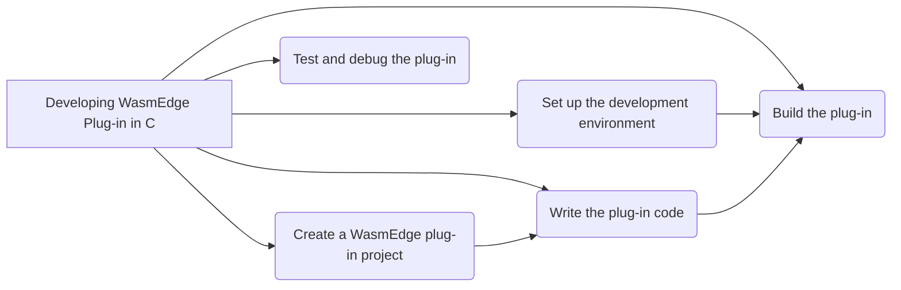

# Develop WasmEdge Plug-in in C API

By developing a plug-in, one can extend the functionality of WasmEdge and customize it to suit specific needs. WasmEdge provides a C based API for registering extension modules and host functions. While the WasmEdge language SDKs allow registering host functions from a host (wrapping) application, the plug-in API allows such extensions to be incorporated into WasmEdge's building and releasing process. Here is a flowchart showing all the steps needed for developing WasmEdge Plug-in -



This flowchart illustrates developing a WasmEdge plug-in, showcasing the steps from choosing a programming language to finalizing and releasing the plug-in.

## Set up the development environment

To start developing WasmEdge plug-ins, it is essential to correctly set up the development environment. This section provides step-by-step instructions for WasmEdge plug-in development -

**Install a WasmEdge runtime**: You can download the latest version of WasmEdge from [GitHub repository](https://github.com/wasmEdge/wasmEdge). Follow the instructions in the [installation guide](../../start/install.md) for your specific operating system.

After installing WasmEdge, you need to set up the build environment. If you're using Linux or other platforms, you can follow the instructions in the [build environment setup guide](../source/os/linux.md).

## Create a WasmEdge plug-in project

To create a WasmEdge plug-in project, follow these steps:

- **Set up the project directory**: Create a directory structure for your plug-in project. You can use a standard structure for the chosen language or create your structure. To create a project directory structure, use the following commands:

  ```bash
  mkdir testplugin
  cd testplugin
  mkdir src include build
  ```

- **Add configuration files**: Add configuration files specifying the plug-in name, version, and dependencies. The specific files and content depend on the chosen programming language and build system.

- **Add any necessary libraries or dependencies**: Include any required libraries or dependencies for your plug-in. Modify the configuration files created in the previous step to include the required dependencies.

## Write the plug-in code

To create a plug-in with host functions and modules, follow these steps:

- **Implement host function definitions**: In this step, you must define the host functions that will be imported when instantiating the WASM module. These functions will perform specific operations and return results.

  Therefore, developers can first implement their plug-in host functions, like the [host functions in WasmEdge C API](/embed/c/reference/latest.md#host-functions).

<!-- prettier-ignore -->
:::note
For more details about the [external data](/embed/c/host_function.md#host-data) and [calling frame context](/embed/c/host_function.md#calling-frame-context), please refer to the host function guide.
:::

Here's an example of two host functions, `HostFuncAdd` and `HostFuncSub`, that add and subtract two `int32_t` numbers, respectively:

```c
#include <wasmedge/wasmedge.h>

/* The host function definitions. */

/* The host function to add 2 int32_t numbers. */
WasmEdge_Result HostFuncAdd(void *Data,
                            const WasmEdge_CallingFrameContext *CallFrameCxt,
                            const WasmEdge_Value *In, WasmEdge_Value *Out) {
  int32_t Val1 = WasmEdge_ValueGetI32(In[0]);
  int32_t Val2 = WasmEdge_ValueGetI32(In[1]);
  Out[0] = WasmEdge_ValueGenI32(Val1 + Val2);
  return WasmEdge_Result_Success;
}

/* The host function to sub 2 int32_t numbers. */
WasmEdge_Result HostFuncSub(void *Data,
                            const WasmEdge_CallingFrameContext *CallFrameCxt,
                            const WasmEdge_Value *In, WasmEdge_Value *Out) {
  int32_t Val1 = WasmEdge_ValueGetI32(In[0]);
  int32_t Val2 = WasmEdge_ValueGetI32(In[1]);
  Out[0] = WasmEdge_ValueGenI32(Val1 - Val2);
  return WasmEdge_Result_Success;
}
```

- **Implement the module creation functions**: In this step, you need to implement the module creation function that creates an instance of the module. This function will be called when the plug-in is loaded.

  Here's an example of a module creation function named `CreateTestModule`:

  ```c
  /* The creation function of creating the module instance. */
  WasmEdge_ModuleInstanceContext *
  CreateTestModule(const struct WasmEdge_ModuleDescriptor *Desc) {
    /*
    * The `Desc` is the const pointer to the module descriptor struct:
    *
    *   typedef struct WasmEdge_ModuleDescriptor {
    *     const char *Name;
    *     const char *Description;
    *     WasmEdge_ModuleInstanceContext *(*Create)(
    *         const struct WasmEdge_ModuleDescriptor *);
    *   } WasmEdge_ModuleDescriptor;
    *
    * Developers can get the name and description from this descriptor.
    */

    /* Exported module name of this module instance. */
    WasmEdge_String ModuleName =
        WasmEdge_StringCreateByCString("wasmedge_plugintest_c_module");
    WasmEdge_ModuleInstanceContext *Mod =
        WasmEdge_ModuleInstanceCreate(ModuleName);
    WasmEdge_StringDelete(ModuleName);

    WasmEdge_String FuncName;
    WasmEdge_FunctionTypeContext *FType;
    WasmEdge_FunctionInstanceContext *FuncCxt;
    enum WasmEdge_ValType ParamTypes[2], ReturnTypes[1];
    ParamTypes[0] = WasmEdge_ValType_I32;
    ParamTypes[1] = WasmEdge_ValType_I32;
    ReturnTypes[0] = WasmEdge_ValType_I32;

    /* Create and add the host function instances into the module instance. */
    FType = WasmEdge_FunctionTypeCreate(ParamTypes, 2, ReturnTypes, 1);
    FuncName = WasmEdge_StringCreateByCString("add");
    FuncCxt = WasmEdge_FunctionInstanceCreate(FType, HostFuncAdd, NULL, 0);
    WasmEdge_ModuleInstanceAddFunction(Mod, FuncName, FuncCxt);
    WasmEdge_StringDelete(FuncName);
    FuncName = WasmEdge_StringCreateByCString("sub");
    FuncCxt = WasmEdge_FunctionInstanceCreate(FType, HostFuncSub, NULL, 0);
    WasmEdge_ModuleInstanceAddFunction(Mod, FuncName, FuncCxt);
    WasmEdge_StringDelete(FuncName);
    WasmEdge_FunctionTypeDelete(FType);

    return Mod;
  }
  ```

  There can be several module instances in a plug-in shared library. Here in the above code snippet, take a module named `wasmedge_plugintest_c_module` for the example.

- **Supply the plug-in descriptions**- In this step, you need to provide the descriptions of the plug-in and the modules it contains. These descriptions will be used for searching and creating the plug-in and module instances.

  Here's an example of the plug-in and module descriptors:

  ```c
  /* The module descriptor array. There can be multiple modules in a plug-in. */
  static WasmEdge_ModuleDescriptor ModuleDesc[] = {{
      /*
      * Module name. This is the name for searching and creating the module
      * instance context by the `WasmEdge_PluginCreateModule()` API.
      */
      .Name = "wasmedge_plugintest_c_module",
      /* Module description. */
      .Description = "This is for the plugin tests in WasmEdge C API.",
      /* Creation function pointer. */
      .Create = CreateTestModule,
  }};

  /* The plug-in descriptor */
  static WasmEdge_PluginDescriptor Desc[] = {{
      /*
      * Plug-in name. This is the name for searching the plug-in context by the
      * `WasmEdge_PluginFind()` API.
      */
      .Name = "wasmedge_plugintest_c",
      /* Plug-in description. */
      .Description = "",
      /* Plug-in API version. */
      .APIVersion = WasmEdge_Plugin_CurrentAPIVersion,
      /* Plug-in version. Developers can define the version of this plug-in. */
      .Version =
          {
              .Major = 0,
              .Minor = 1,
              .Patch = 0,
              .Build = 0,
          },
      /* Module count in this plug-in. */
      .ModuleCount = 1,
      /* Plug-in option description count in this plug-in (Work in progress). */
      .ProgramOptionCount = 0,
      /* Pointer to the module description array. */
      .ModuleDescriptions = ModuleDesc,
      /* Pointer to the plug-in option description array (Work in progress). */
      .ProgramOptions = NULL,
  }};
  ```

  These descriptions define the name, description, version, and creation function of the plug-in and the name and description of the module it contains.

Remember to implement any additional functions or structures your plug-in requires to fulfill its functionality.

Following these steps and implementing the necessary functions and descriptors, you can create a plug-in with host functions and modules in WasmEdge C API. You can continue developing your plug-in by adding functionality and implementing the desired behavior.

- **Plug-in option** - _WORK IN PROGRESS. This section is reserved for the feature in the future._

## Build your plug-in

To build the WasmEdge plug-in shared library, you have two options: build it directly using the compiler or CMake. Here are the instructions for both methods:

- **Build with Command**: if you choose to build the plug-in using the command line, run the following command in the terminal:

  This command compiles the `testplugin.c` file into a shared library named `libwasmedgePluginTest.so`. The `-std=c11` flag sets the C language standard to C11, and the `-DWASMEDGE_PLUGIN` flag defines the WASMEDGE_PLUGIN macro, which can be used in your code.

- **Build with CMake**: If you prefer to use CMake to build the plug-in, create a `CMakeLists.txt` file in the root directory of your project and add the following content to the CMakeLists.txt file:

  ```cmake
  add_library(wasmedgePluginTest
    SHARED
    testplugin.c
  )

  set_target_properties(wasmedgePluginTest PROPERTIES
    C_STANDARD 11
  )

  target_compile_options(wasmedgePluginTest
    PUBLIC
    -DWASMEDGE_PLUGIN
  )

  target_link_libraries(wasmedgePluginTest
    PRIVATE
    wasmedge
  )
  ```

  This CMake configuration sets up a build target called `wasmedgePluginTest`. It compiles the `testplugin.c` file into a shared library. The `C_STANDARD 11` property sets the C language standard to C11. The `target_compile_options` command defines the `WASMEDGE_PLUGIN` macro using the `-DWASMEDGE_PLUGIN` flag. Finally, the `target_link_libraries` command links the wasmedge library to the plug-in.

Once you have set up either the command-line build or the CMake build, you can execute the corresponding build command or generate build files using CMake, which will compile your plug-in source code and produce the shared library file `(libwasmedgePluginTest.so)`.
