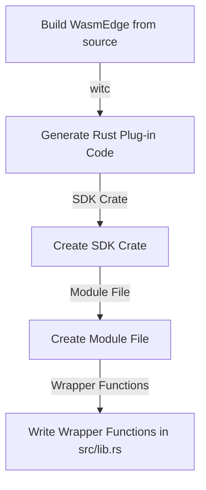

# Develop WasmEdge Plug-in in Rust SDK with witc

By developing a plug-in, one can extend the functionality of WasmEdge and customize it to suit specific needs. WasmEdge provides a Rust-based API for registering extension modules and host functions.



<!-- prettier-ignore -->
:::note
It is recommended that developers choose the WasmEdge [C API](develop_plugin_c.md) for plug-in development because of the support, compatibility, and flexibility the WasmEdge runtime provides.
:::

## Set up the development environment

To start developing WasmEdge plug-ins, it is essential to properly set up the development environment. This section provides step-by-step instructions for WasmEdge plug-in development -

- **Build WasmEdge from source**: For developing the WasmEdge plug-in in C++, you must build WasmEdge from source. Follow the[build WasmEdge from source](../source/build_from_src.md) for instructions. Once you complete the C++ plug-in code, you can use witc[^1] to generate Rust Plug-in SDK.

After installing WasmEdge, you need to set up the build environment. If you're using Linux or other platforms, you can follow the instructions in the [build environment setup guide](../source/os/linux.md).

## Write the plug-in code

To develop a WasmEdge Plug-in in Rust using the witc tool, you can follow these steps:

- **Generate Rust Plug-in Code**: Consider you have a file named `wasmedge_opencvmini.wit` with the following content:

  ```wit
  imdecode: func(buf: list<u8>) -> u32
  imshow: func(window-name: string, mat-key: u32) -> unit
  waitkey: func(delay: u32) -> unit
  ```

  You can use the witc tool to generate Rust plug-in code for it by running the following command:

  ```shell
  witc plugin wasmedge_opencvmini.wit
  ```

- **Create SDK Crate**: You need to create an SDK crate for your plug-in. Run the following command to create a new crate named `opencvmini-sdk`:

  ```shell
  cargo new --lib opencvmini-sdk && cd opencvmini-sdk
  ```

- **Create Module File**: The witc tool puts the Rust code to stdout. To capture the generated code, create a new module file named `src/generated.rs` and run the following command:

  ```shell
  witc plugin wasmedge_opencvmini.wit > src/generated.rs
  ```

- **Write Wrapper Functions**: In the `src/lib.rs` file of your crate, write the following code of `mod generated` to access the generated code and create wrapper functions:

  ```rust
  mod generated;

  pub fn imdecode(buf: &[u8]) -> u32 {
      unsafe { generated::imdecode(buf.as_ptr(), buf.len()) }
  }
  pub fn imshow(window_name: &str, mat_key: u32) -> () {
      unsafe { generated::imshow(window_name.as_ptr(), window_name.len(), mat_key) }
  }
  pub fn waitkey(delay: u32) -> () {
      unsafe { generated::waitkey(delay) }
  }
  ```

  This code imports the generated module and provides safe wrapper functions for each generated function.

[^1]: <https://github.com/second-state/witc>
