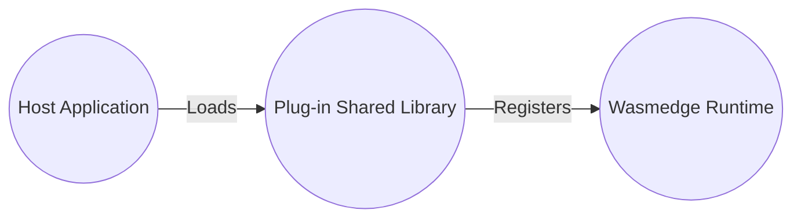
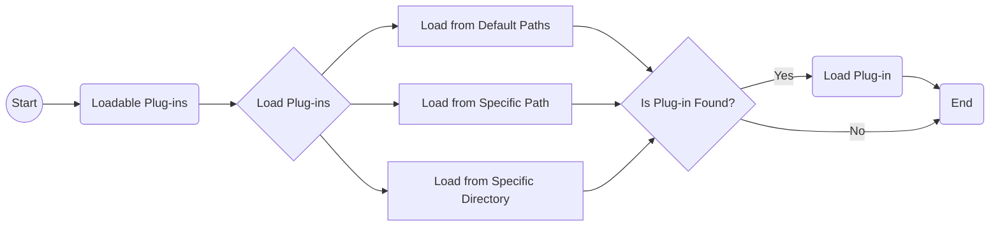

# WasmEdge Plug-in System Introduction

While the WasmEdge language SDKs allow registering host functions from a host (wrapping) application, developers should implement the host functions before compilation. However, for a more flexible and dynamic extension of the host functions, WasmEdge provides a plug-in architecture to load the plug-in shared library.

A WasmEdge plug-in is a software component that extends the functionality of the WasmEdge runtime. Currently, developers can follow the guides to implement the plug-ins in [C API](develop_plugin_c.md) (recommended), [C++](develop_plugin_cpp.md) and [Rust](develop_plugin_rustsdk.md). With the help of the WasmEdge SDKs in the supported languages, developers can load and register the host functions from the plug-in shared libraries, allowing them to seamlessly integrate the plug-ins into the WasmEdge runtime as if they were part of the core runtime.

## Benefits of Using WasmEdge Plug-in

WasmEdge plug-ins are designed to extend the functionality of the WasmEdge runtime and can be helpful for developers and end-users in several ways:

- **Customization:** WasmEdge plug-ins can be customized to suit the specific needs of a project. Developers can create plug-ins that integrate with other systems or tools or provide unique functionality unavailable in the core WasmEdge runtime.

- **Performance:** WasmEdge plug-ins are designed to work seamlessly with the core runtime, minimizing overhead and maximizing performance, which means they can provide additional functionality without sacrificing performance.

- **Ease of use:** WasmEdge plug-ins are easy to use and integrate with the WasmEdge runtime. Developers can load the plug-in into the runtime and use its functions as part of the core runtime.

- **Scalability:** Developers can compile their compute-intensive functions into host functions and package them into a plug-in to provide the better performance as running in native code.

WasmEdge plug-ins can provide developers and users with a versatile, customizable, high-performance, and secure way to extend the functionality of the WasmEdge runtime. WasmEdge plug-ins can also improve scalability and ease of use, making it easier to build and deploy complex applications on edge devices.

## Loadable Plug-in

Loadable plug-ins are standalone shared libraries (`.so`/`.dylib`/`.dll` files) that the WasmEdge runtime environment can load at runtime. These plug-ins can provide additional functionality to the WasmEdge runtime environment, such as new modules that can be imported by WebAssembly modules.

### Creating Loadable Plug-in

To create a loadable plug-in for WasmEdge, developers can use the WasmEdge Plug-in SDK, which provides a set of Rust, C, and C++ APIs for creating and registering plug-ins. The SDK also includes [example code](https://github.com/WasmEdge/WasmEdge/tree/master/examples/plugin/get-string) that demonstrates creating a simple plug-in that returns a string. By following the provided examples and leveraging the SDK's APIs, developers can quickly build custom plug-ins tailored to their specific needs.

### Loading plug-in from paths

To use the loadable plug-ins, developers need to load them from specific paths into the WasmEdge runtime environment. The loading process involves the following steps:

- Loadable plug-ins can be loaded from default paths by calling the `WasmEdge_PluginLoadWithDefaultPaths()` API. The default paths include:

  - The path specified in the environment variable `WASMEDGE_PLUGIN_PATH`.
  - The `./plugin/` directory relative to the WasmEdge installation path.
  - The `./wasmedge/` directory is located under the library path if WasmEdge is installed in a system directory such as `/usr` and `/usr/local`.

- If the plug-ins are located in a specific path or directory, developers can use the `WasmEdge_PluginLoadFromPath("PATH_TO_PLUGIN/plug-in.so")` API to load the plug-ins from that particular location.

The WasmEdge runtime environment will search for the loadable plug-ins in the specified paths and load them if found.

The following flowchart shows the process of loading loadable plug-ins into the WasmEdge runtime environment from specific paths:

The flowchart shows loading loadable plug-ins into the WasmEdge runtime environment. The process involves searching for plug-ins in default paths, a specific path, or a specific directory. If a plug-in is found in any of these locations, it is loaded into the runtime environment. The flowchart enables developers to quickly load plug-ins and extend the capabilities of the WasmEdge runtime.

By following this flowchart, developers can effectively load loadable plug-ins into the WasmEdge runtime environment from specific paths, expanding the runtime's functionality according to their requirements.

## WasmEdge Currently Released Plug-ins

There are several plug-in releases with the WasmEdge official releases. Please check the following table to check the release status and how to build from the source with the plug-ins.

| Plug-in | Rust Crate | Released Platforms | Build Steps |
| --- | --- | --- | --- |
| [WasmEdge-Process](../source/plugin/process.md) | [wasmedge_process_interface][] | `manylinux2014 x86_64`, `manylinux2014 aarch64`, and `ubuntu 20.04 x86_64` (since `0.10.0`) | [Build Wtih WasmEdge-Process](../source/plugin/process.md) |
| [WASI-Crypto][] | [wasi-crypto][] | `manylinux2014 x86_64`, `manylinux2014 aarch64`, and `ubuntu 20.04 x86_64` (since `0.10.1`) | [Build With WASI-Crypto](../source/plugin/wasi_crypto.md) |
| [WASI-NN with OpenVINO backend](../../develop/rust/wasinn/openvino.md) | [wasi-nn][] | `ubuntu 20.04 x86_64` (since `0.10.1`) | [Build With WASI-NN](../source/plugin/wasi_nn.md#build-wasmedge-with-wasi-nn-openvino-backend) |
| [WASI-NN with PyTorch backend](../../develop/rust/wasinn/pytorch.md) | [wasi-nn][] | `ubuntu 20.04 x86_64` (since `0.11.1`) | [Build With WASI-NN](../source/plugin/wasi_nn#build-wasmedge-with-wasi-nn-pytorch-backend) |
| [WASI-NN with TensorFlow-Lite backend](../../develop/rust/wasinn/tensorflow_lite.md) | [wasi-nn][] | `manylinux2014 x86_64`, `manylinux2014 aarch64`, and `ubuntu 20.04 x86_64` (since `0.11.2`) | [Build With WASI-NN](../source/plugin/wasi_nn#build-wasmedge-with-wasi-nn-tensorflow-lite-backend) |
| [WasmEdge-Image](../source/plugin/image.md) | [wasmedge_tensorflow_interface][] | `manylinux2014 x86_64`, `manylinux2014 aarch64`, `ubuntu 20.04 x86_64`, `darwin x86_64`, and `darwin arm64` (since `0.13.0`) | [Build With WasmEdge-Image](../source/plugin/image.md) |
| [WasmEdge-Tensorflow](../source/plugin/tensorflow.md) | [wasmedge_tensorflow_interface][] | `manylinux2014 x86_64`, `manylinux2014 aarch64`, `ubuntu 20.04 x86_64`, `darwin x86_64`, and `darwin arm64` (since `0.13.0`) | [Build With WasmEdge-Tensorflow](../source/plugin/tensorflow.md) |
| [WasmEdge-TensorflowLite](../source/plugin/tensorflowlite.md) | [wasmedge_tensorflow_interface][] | `manylinux2014 x86_64`, `manylinux2014 aarch64`, `ubuntu 20.04 x86_64`, `darwin x86_64`, and `darwin arm64` (since `0.13.0`) | [Build With WasmEdge-TensorflowLite](../source/plugin/tensorflowlite.md) |

<!-- prettier-ignore -->
:::note
Due to the `OpenVINO` dependency, we only release the WASI-NN plug-in for the `OpenVINO` backend on `Ubuntu 20.04 x86_64` now. We'll work with `manylinux2014` versions in the future.
:::

[wasmedge_process_interface]: https://crates.io/crates/wasmedge_process_interface
[wasmedge_tensorflow_interface]: https://crates.io/crates/wasmedge_tensorflow_interface
[wasi-crypto]: https://crates.io/crates/wasi-crypto
[wasi-nn]: https://crates.io/crates/wasi-nn
