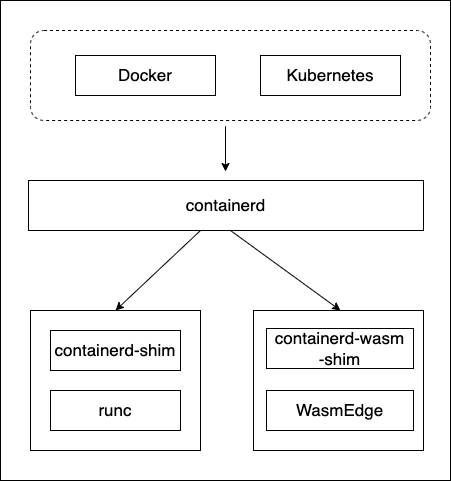
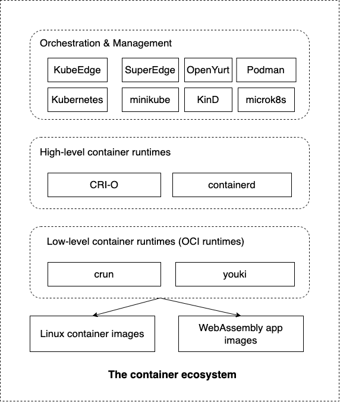

# Introduction

WasmEdge could be integrated with the existing cloud native infra seamlessly. So developers can leverage container tools such as Kubernetes, Docker and CRI-O to deploy, manage, and run lightweight WebAssembly applications. In this chapter, we will demonstrate how Kubernetes ecosystem tools work with WasmEdge WebAssembly applications.

There are several options to manage Wasm apps as “containers” under Kubernetes. Both options will give you a Kubernetes cluster that runs Linux containers and Wasm containers side by side.

## With containerd-shim

Option #1 is to use a containerd-shim to start Wasm "containers" via runwasi. Basically containerd could look at the image’s target platform, it uses runwasi if the image is wasm32 and uses runc if the image is x86 / arm. Currently, Docker and Microsoft prefers this approach. This is also the basis for the [Docker+Wasm preview](https://www.docker.com/blog/docker-wasm-technical-preview/). Based on containerd

The following image shows how it works.

## With crun

Option #2 is to use an OCI runtime called crun (the C version of runc, mainly supported by Red Hat). crun decides whether an OCI image is wasm or Linux based on image annotations. If the image is annotated as wasm32, crun will bypass Linux container setup and just use WasmEdge to run it. Based on crun, we can get the entire Kubernetes stack CRI-O, containerd, Podman, kind, micro k8s, k8s etc to work with Wasm images.

## With youki

Option #3 is to use an OCI runtime called youki (the Rust version of runc). Similar to crun, youki decides whether an OCI image is wasm or Linux based on image annotations. If the image is annotated as wasm32, youki will bypass Linux container setup and just use WasmEdge to run it. Based on youki, we can get the entire Kubernetes stack CRI-O, containerd, Podman, kind, micro k8s, k8s etc to work with Wasm images.

Both crun and youki could use the following image to show how it works.

## Examples we covered

In this section, we will show how to manage Wasm App in the three different ways. The goal is to load and run WebAssembly OCI images side by side with Linux OCI images (e.g., today's Docker containers) across the entire Kubernetes stack.

We will cover two different demos in most cases. We have build them from Rust source code, build OCI images around them, and then publish the images to Docker Hub. You can find the more container example [here](https://github.com/second-state/wasmedge-containers-examples).

- [A simple WASI example](https://github.com/second-state/wasmedge-containers-examples/blob/main/simple_wasi_app.md)
- [A HTTP server example](https://github.com/second-state/wasmedge-containers-examples/blob/main/http_server_wasi_app.md)

Since we have already built and published those demo apps on Docker Hub, you could also pull the images from Docker Hub. If you want to build your own Wasm image, please refer to this article.

Since we have already built and published those demo apps on Docker Hub, you could also just go straight to the container runtime sections to use these images.

Let's get stared.
