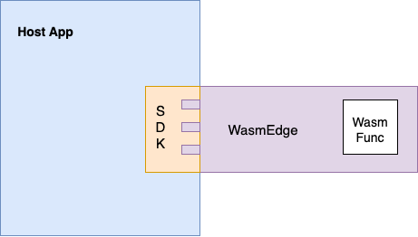

# Embed WasmEdge in Your Apps

As we mentioned before, the most important use case for WasmEdge is to safely execute user-defined or community-contributed code as plug-ins in a software product. It enables third-party developers, vendors, suppliers, and community members to extend and customize the software product.

We could use WasmEdge as a standalone container and deploy WasmEdge using the existing containers tools. The other way is to use WasmEdge as an embedded runtime and manage WasmEdge using the host applications.

WasmEdge provides SDKs for various programming languages. The WasmEdge library allows developers to embed the WasmEdge into their host applications, so that the WebAssembly applications can be executed in the WasmEdge sandbox safely. Furthermore, developers can implement the host functions for the extensions with the WasmEdge library.

In this section, we will walk you through how to embed WasmEdge in different languages. We will cover the following content:

- [Quick Start](/category/quick-start)
- [Passing complex data](/category/passing-complex-data)
- [Developing components using witc](witc.md)
- [Embed WasmEdge in C/C++](/category/c-sdk-for-embedding-wasmedge)
- [Embed WasmEdge in Rust](/category/rust-sdk-for-embedding-wasmedge)
- [Embed WasmEdge in Go](/category/go-sdk-for-embedding-wasmedge)
- [Embed WasmEdge in Java](/category/java-sdk-for-embedding-wasmedge)
- [Embed WasmEdge in Python](/category/python-sdk-for-embedding-wasmedge)
- [Use cases](/category/use-cases)

Besides this, we also have two more guides for [developing WASM apps](../develop/overview.md) and [contributing to WasmEdge](../contribute/overview.md).
