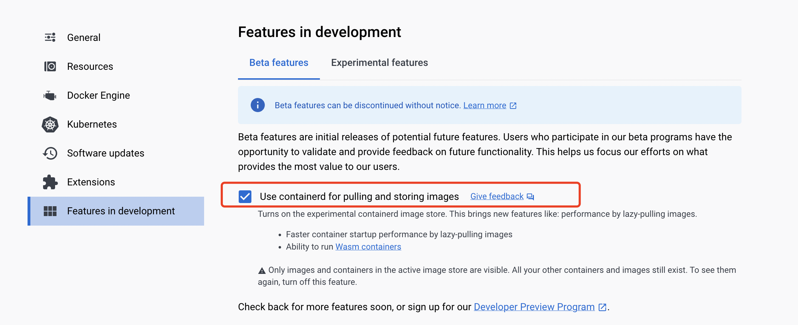
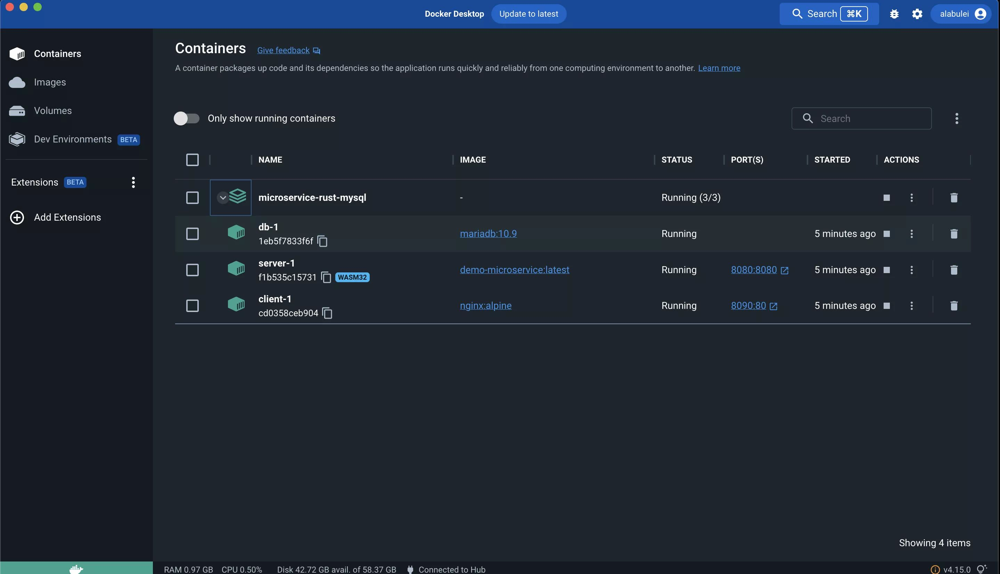

# Docker + WASM

Docker Desktop 分发了内置的 WasmEdge 运行时。这使开发人员可以通过 Docker 工具构建、分享和运行非常轻量的容器（即，只包含 `.wasm` 文件的 `scratch` 空容器，没有任何 Linux 操作系统库或文件）。这些“WASM 容器”完全符合 OCI 标准，因此可以由 Docker Hub 进行管理。它们是跨平台的，可以在 Docker 支持的任何操作系统/CPU 上运行（操作系统和 CPU 平台为 `wasi/wasm`）。但更重要的是，相较于 Linux 容器，它们的体积是其十分之一，因为 WASM 容器不需要捆绑和启动 Linux 库和服务，所以启动时间也是十分之一。

结合 Docker 能够将开发环境和部署环境容器化的能力，你可以创建和部署复杂的应用程序，而无需安装任何依赖。例如，你可以在本地开发机器上设置完整的 Rust 和 WasmEdge 开发环境，而无需安装任何工具。你还可以部署一个复杂的 WasmEdge 应用，该应用需要连接到 MySQL 数据库，而无需在本地安装 MySQL。

在本指南中，我们将介绍如何：

- [创建并运行 Rust 程序](#创建并运行-Rust-程序)
- [创建并运行 Node.js 服务器](#创建并运行-Node.js-服务器)
- [在 Rust 中创建并部署数据库驱动的微服务](#在-Rust-中创建并部署数据库驱动的微服务)

## 环境要求

安装 [Docker Desktop](https://www.docker.com/products/docker-desktop/) 并在 Docker Desktop 设置中打开 containerd 镜像存储功能。



## 创建并运行 Rust 程序

使用 Docker + WASM，你可以在 Docker 容器中使用完整的 Rust 工具链构建 WASM 字节码应用程序，并发布和运行 WASM 应用程序。[这里提供了示例 Rust 源代码和构建说明](https://github.com/second-state/rust-examples/tree/main/hello)。

### 构建 Rust 示例

在项目目录中，运行以下命令，将 Rust 源代码构建为 WASM，并将 WASM 文件打包到一个空容器镜像中。请注意，你无需在此安装 Rust 编译器工具链。

```bash
docker buildx build --platform wasi/wasm -t secondstate/rust-example-hello .
```

[Dockerfile](https://github.com/second-state/rust-examples/blob/main/hello/Dockerfile) 中显示了构建方式。Dockerfile 由三部分组成。第一部分设置了用于 Rust 构建环境的 Docker 容器。

```dockerfile
FROM --platform=$BUILDPLATFORM rust:1.64 AS buildbase
WORKDIR /src
RUN <<EOT bash
    set -ex
    apt-get update
    apt-get install -y \
        git \
        clang
    rustup target add wasm32-wasip1
EOT
```

第二部分使用 Rust 构建环境编译 Rust 源代码并生成 WASM 文件。

```dockerfile
FROM buildbase AS build
COPY Cargo.toml .
COPY src ./src
# Build the WASM binary
RUN cargo build --target wasm32-wasip1 --release
```

第三部分是关键部分。它将 WASM 文件复制到一个空的 `scratch` 容器中，然后将 WASM 文件设置为容器的 `ENTRYPOINT`。`rust-example-hello` 是由本节中的命令构建的容器镜像。

```dockerfile
FROM scratch
ENTRYPOINT [ "hello.wasm" ]
COPY --link --from=build /src/target/wasm32-wasip1/release/hello.wasm /hello.wasm
```

WASM 容器镜像仅为 0.5MB。它比最小 Linux 容器中原生编译的 Rust 程序要小得多。

### 发布 Rust 示例

要将 WASM 容器镜像发布到 Docker Hub，请执行以下操作。

```bash
docker push secondstate/rust-example-hello
```

### 运行 Rust 示例

你可以使用常规的 Docker 的 `run` 命令来运行 WASM 容器应用程序。请注意，你确实需要指定 `runtime` 和 `platform` 标志，告知 Docker 这是一个非 Linux 容器，并且需要 WasmEdge 来运行它。

```bash
$ docker run --rm --runtime=io.containerd.wasmedge.v1 --platform=wasi/wasm secondstate/rust-example-hello:latest
Hello WasmEdge!
```

如上。

### 关于 Rust 示例的更多阅读

要查看更多针对 WasmEdge 的 Docker 化 Rust 示例应用程序，请查看以下内容。

- [使用 Rust 标准库](https://github.com/second-state/rust-examples/tree/main/wasi)
- [在 hyper 和 tokio 中创建 HTTP 服务器](https://github.com/second-state/rust-examples/tree/main/server)

### 创建并运行 Node.js 服务器

WasmEdge 提供与 Node.js 兼容的 JavaScript 运行时。你可以创建轻量级的 WASM 容器镜像来运行 Node.js 应用程序。与标准的 Node.js Linux 容器镜像相比，WASM 镜像体积仅为其 1/100、完全可移植，并且启动时间是其 1/10。

在本指南中，示例应用是一个用 Node.js 编写的 HTTP Web 服务器。其[源代码和构建说明在此处](https://github.com/second-state/wasmedge-quickjs/tree/main/example_js/docker_wasm/server)。

### 构建 Node.js 示例

在项目目录中，运行以下命令，将 WasmEdge JavaScript 运行时和 JS HTTP 服务器程序打包进空容器镜像。

```bash
docker buildx build --platform wasi/wasm -t secondstate/node-example-hello .
```

[Dockerfile](https://github.com/second-state/wasmedge-quickjs/blob/main/example_js/docker_wasm/server/Dockerfile) 中展示了操作是如何完成的。Dockerfile 由三个部分组成。第一部分设置了一个用于构建环境的 Docker 容器，其中包含 `wget` 和 `unzip` 实用程序。

```dockerfile
FROM --platform=$BUILDPLATFORM rust:1.64 AS buildbase
WORKDIR /src
RUN <<EOT bash
    set -ex
    apt-get update
    apt-get install -y \
        wget unzip
EOT
```

第二部分使用 `wget` 和 `unzip` 来下载和解压 WasmEdge JavaScript 运行时文件和 JS 应用文件到用于构建的容器中。

```dockerfile
FROM buildbase AS build
COPY server.js .
RUN wget https://github.com/second-state/wasmedge-quickjs/releases/download/v0.5.0-alpha/wasmedge_quickjs.wasm
RUN wget https://github.com/second-state/wasmedge-quickjs/releases/download/v0.5.0-alpha/modules.zip
RUN unzip modules.zip
```

第三部分是关键。它将 WasmEdge JavaScript 运行时文件和 JS 应用文件复制到空的 `scratch` 容器中，并将 `wasmedge_quickjs.wasm` 设置为 `ENTRYPOINT`。 `node-example-hello` 是本部分的命令构建得到的容器镜像。

```dockerfile
FROM scratch
ENTRYPOINT [ "wasmedge_quickjs.wasm", "server.js" ]
COPY --link --from=build /src/wasmedge_quickjs.wasm /wasmedge_quickjs.wasm
COPY --link --from=build /src/server.js /server.js
COPY --link --from=build /src/modules /modules
```

整个 Node.js 应用的 WASM 容器镜像仅为 1MB。它远比标准 Node.js 镜像小，标准 Node.js 镜像体积为 300+MB。

### 发布 Node.js 示例

要将 WASM 容器镜像发布到 Docker Hub，请执行以下操作。

```bash
docker push secondstate/node-example-hello
```

### 运行和测试 Node.js 示例

你可以使用常规的 Docker 的 `run` 命令来运行 WASM 容器应用程序。请注意，你确实需要指定 `runtime` 和 `platform` 标志，告知 Docker 这是一个非 Linux 容器，并且需要 WasmEdge 来运行它。由于这是一个 HTTP 服务器应用，还需要将容器的端口 8080 映射到主机，以便你可以从主机访问服务器。

```bash
$ docker run -dp 8080:8080 --rm --runtime=io.containerd.wasmedge.v1 --platform=wasi/wasm secondstate/node-example-server:latest
listen 8080 ...
```

启动另一个终端，测试服务器应用。

```bash
$ curl http://localhost:8080/echo -X POST -d "Hello WasmEdge"
Hello WasmEdge
```

以上。

### Node.js 示例相关的进一步阅读

- [使用 fetch() API](https://github.com/second-state/wasmedge-quickjs/blob/main/example_js/wasi_http_fetch.js)
- [使用 Tensorflow Lite 进行图像分类](https://github.com/second-state/wasmedge-quickjs/tree/main/example_js/tensorflow_lite_demo)

### 创建和部署 Rust 驱动的数据库微服务

Docker + WASM 允许我们构建和运行 WASM 容器。然而，在大多数复杂应用中，WASM 容器只是应用的一部分。它需要与系统中的其他 Linux 容器协同工作。[Docker compose](https://docs.docker.com/compose/) 工具广泛用于组合和管理多容器部署，它与 Docker Desktop 一起安装。

在我们的[示例微服务应用程序](https://github.com/second-state/microservice-rust-mysql) 中，包括一个 Nginx Web 服务器和一个 MySQL 数据库。WASM 容器仅用于 Rust 应用，用于访问数据库和处理 HTTP 请求（即应用服务器）。

<!-- prettier-ignore -->
:::note
要了解更多 Docker compose 示例，包括 Linux 容器 + WASM 容器混合部署，请查看 [awesome-compose](https://github.com/docker/awesome-compose) 仓库。
:::

### 构建微服务示例

在项目目录中，运行以下命令以构建所有三个容器：`client`、`server` 和 `db`。

```bash
docker compose up
```

在 [docker-compose.yml](https://github.com/second-state/microservice-rust-mysql/blob/main/docker-compose.yml) 文件中定义了本应用中所需的 3 个容器。

```yaml
services:
  client:
    image: nginx:alpine
    ports:
      - 8090:80
    volumes:
      - ./client:/usr/share/nginx/html
  server:
    image: demo-microservice
    platform: wasi/wasm
    build:
      context: .
    ports:
      - 8080:8080
    environment:
      DATABASE_URL: mysql://root:whalehello@db:3306/mysql
      RUST_BACKTRACE: full
    restart: unless-stopped
    runtime: io.containerd.wasmedge.v1
  db:
    image: mariadb:10.9
    environment:
      MYSQL_ROOT_PASSWORD: whalehello
```

- `client` 容器是一个 Nginx Web 服务器
  - 一个 Linux 容器，映射了 HTTP 端口和用于放置静态 HTML/JS 文件的 Volume
- `server` 容器是一个用于业务逻辑的 Rust 容器
  - 一个 WASM 容器，通过使用此 [Dockerfile](https://github.com/second-state/microservice-rust-mysql/blob/main/Dockerfile) 构建的构建该 [Rust 源码](https://github.com/second-state/microservice-rust-mysql/blob/main/src/main.rs)生成 
  - WASM 容器映射了 Web 服务端口，并设定了用于连接数据库连的环境变量
- `db` 容器是一个 MySQL 数据库
  - 一个 Linux 容器，预设了数据库密码

### 部署微服务示例

使用 `up` 指令依次启动和运行所有三个容器。

```bash
docker compose up
```

返回 Docker Desktop 管理后台，你将看到三个容器正在运行。



### CRUD 测试

打开另一个终端，你可以使用 `curl` 命令与 Web 服务交互。

当微服务接收到 `/init` 终点的 `GET` 请求时，它将用 `orders` 表初始化数据库。

```bash
curl http://localhost:8080/init
```

当微服务接收到 `/create_order` 的 `POST` 请求时，它将从 `POST` 主体中提取 JSON 数据，并将 `Order` 记录插入到数据库表中。对于多个记录，请访问 `/create_orders` 接口，并以 POST 一个 JSON 数组格式的 `Order` 对象。

```bash
curl http://localhost:8080/create_orders -X POST -d @orders.json
```

当微服务接收到 `/orders` 的 `GET` 请求时，它将从 `orders` 表中获取所有行，并在 HTTP 响应中以 JSON 数组的形式返回结果集。

```bash
curl http://localhost:8080/orders
```

当微服务接收到 `/update_order` 的 `POST` 请求时，它将从 `POST` 主体中提取 JSON 数据，并更新数据库表中与输入数据中的 `order_id` 匹配的 `Order` 记录。

```bash
curl http://localhost:8080/update_order -X POST -d @update_order.json
```

当微服务接收到 `/delete_order` 终点的 `GET` 请求时，它将删除与 `id` `GET` 参数匹配的 `orders` 表中的行。

```bash
curl http://localhost:8080/delete_order?id=2
```

以上。

你可以基于此项目创造自己轻量级微服务的模板！

### 微服务示例的进一步阅读

要了解 Docker + WASM 在内部是如何工作的，请访问 [containerd](../../develop/deploy/cri-runtime/containerd.md) 章节了解更多详情。
