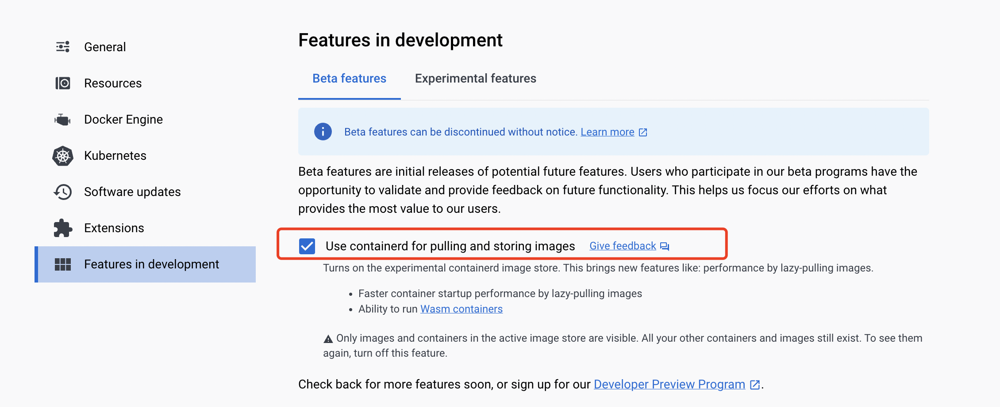

# 使用 Docker 的快速入门

在本指南中，我们将介绍如何在 Docker Desktop 中快速运行 WasmEdge 应用。由于整个开发和运行环境都由 Docker Desktop 管理，因此没有额外的依赖。

<!-- prettier-ignore -->
:::note
如果你没有使用 Docker Desktop，请[从这里开始](quick_start.md)。
:::

我们将介绍以下示例。

- [运行一个独立的 WASM 应用](#run-a-standalone-wasm-app)
- [运行一个 HTTP 服务器](#run-an-http-server)
- [运行一个基于 JavaScript 的服务器 (node.js)](#run-a-javascript-based-server)

在此快速入门指南中，我们将介绍如何使用 Docker 命令运行 WASM 容器应用。如果你对如何从源代码构建、发布和组合 WASM 容器应用感兴趣，请查看[Docker + wasm 章节](../build-and-run/docker_wasm.md)。

## 环境

你必须安装 Docker Desktop 4.15+。确保在 Docker Desktop 中启用了 containerd 镜像存储功能。



## 运行独立的 WASM 应用

Hello World 示例是一个独立的 Rust 应用程序。其源代码和构建说明在[此处](https://github.com/second-state/rust-examples/tree/main/hello)。

使用 Docker 来运行容器化的 WASM 应用。WASM 容器镜像存储在 Docker Hub 中，镜像大小仅为 500KB。该镜像可在 Docker 支持的任何 OS 和 CPU 平台上运行。

```bash
$ docker run --rm --runtime=io.containerd.wasmedge.v1 --platform=wasi/wasm secondstate/rust-example-hello:latest
Hello WasmEdge!
```

了解如何在 Rust 中创建 WASM 应用

- [WasmEdge 的基本 Rust 示例](https://github.com/second-state/rust-examples)
- [Rust 开发者指南](/category/develop-wasm-apps-in-rust)
  - 使用 [PyTorch](../../develop/rust/wasinn/pytorch.md)、[OpenVINO](../../develop/rust/wasinn/openvino.md) 或 [Tensorflow Lite](../../develop/rust/wasinn/tensorflow_lite.md) 后端的 WASI-NN
  - [HTTP 和 HTTPS 客户端](../../develop/rust/http_service/client.md)
  - [MySQL 数据库客户端](../../develop/rust/database/my_sql_driver.md)
  - Redis 客户端
  - Kafka 客户端

## 运行 HTTP 服务器

这个示例是一个用 Rust 编写的独立的 HTTP 服务器。它演示了 Rust + WasmEdge 作为轻量级微服务堆栈。其源代码和构建说明在[此处](https://github.com/second-state/rust-examples/tree/main/server)。

使用 Docker 从 Docker Hub 拉取容器镜像（大约 800KB），然后在 WasmEdge 容器中运行它。该容器作为服务器启动。请注意，我们将容器的端口 8080 映射到本地主机的端口 8080，以便从 WASM 容器外部访问服务器。

```bash
$ docker run -dp 8080:8080 --rm --runtime=io.containerd.wasmedge.v1 --platform=wasi/wasm secondstate/rust-example-server:latest
Listening on http://0.0.0.0:8080
```

在另一个终端窗口中执行以下操作。

```bash
$ curl http://localhost:8080/
Try POSTing data to /echo such as: `curl localhost:8080/echo -XPOST -d 'hello world'`

$ curl http://localhost:8080/echo -X POST -d "Hello WasmEdge"
Hello WasmEdge
```

了解如何在 Rust 中创建 WASM 服务

- [Rust 开发者指南](/category/develop-wasm-apps-in-rust)
- [HTTP 应用程序示例](https://github.com/WasmEdge/wasmedge_hyper_demo)
- [数据库应用程序示例](https://github.com/WasmEdge/wasmedge-db-examples)
- Rust 和 WasmEdge 中的轻量级微服务
  - [WasmEdge + Nginx + MySQL](https://github.com/second-state/microservice-rust-mysql)
  - [WasmEdge + Kafka + MySQL](https://github.com/docker/awesome-compose/tree/master/wasmedge-kafka-mysql)
  - [Dapr + WasmEdge](https://github.com/second-state/dapr-wasm)

## 运行基于 JavaScript 的服务器

这个示例是使用 Node.js API 编写的独立 HTTP 服务器。它演示了将 WasmEdge 作为零依赖和可移植的 Node.js 应用的轻量级运行时。其源代码在[此处](https://github.com/second-state/wasmedge-quickjs/tree/main/example_js/docker_wasm/server)。

```bash
$ docker run -dp 8080:8080 --rm --runtime=io.containerd.wasmedge.v1 --platform=wasi/wasm secondstate/node-example-server:latest
... ...
```

在另一个终端窗口中执行以下操作。

```bash
$ curl http://localhost:8080/echo -X POST -d "Hello WasmEdge"
Hello WasmEdge
```

了解如何在 WasmEdge 中运行 JavaScript 应用。

- [WasmEdge QuickJS runtime](https://github.com/second-state/wasmedge-quickjs)
- [AI 推理应用示例](https://github.com/second-state/wasmedge-quickjs/tree/main/example_js/tensorflow_lite_demo)
- [使用 fetch() 的 Web 服务客户端示例](https://github.com/second-state/wasmedge-quickjs/blob/main/example_js/wasi_http_fetch.js)

## 下一步

- [了解有关在 Docker 中构建和管理 WASM 容器](../build-and-run/docker_wasm.md)
- [WasmEdge 的基本 Rust 示例](https://github.com/second-state/rust-examples)
- 使用 Docker Compose 构建和 Rust 的微服务
  - [WasmEdge / MySQL / Nginx](https://github.com/docker/awesome-compose/tree/master/wasmedge-mysql-nginx) - 示例使用静态 HTML 前端的 Wasm-based Web 应用，使用 MySQL（MariaDB）数据库。前端连接到使用 WasmEdge runtime 运行的用 Rust 编写的 WASM 微服务。
  - [WasmEdge / Kafka / MySQL](https://github.com/docker/awesome-compose/tree/master/wasmedge-kafka-mysql) - 示例 Wasm-based 微服务订阅 Kafka（Redpanda）队列主题，并将任何传入的消息转换并保存到 MySQL（MariaDB）数据库中。
- 用你喜欢的语言编写 WASM 应用，比如 [Rust](/category/develop-wasm-apps-in-rust)、[C/C++](/category/develop-wasm-apps-in-cc)、[JavaScript](/category/develop-wasm-apps-in-javascript)、[Go](/category/develop-wasm-apps-in-go) 和许多其他语言。
